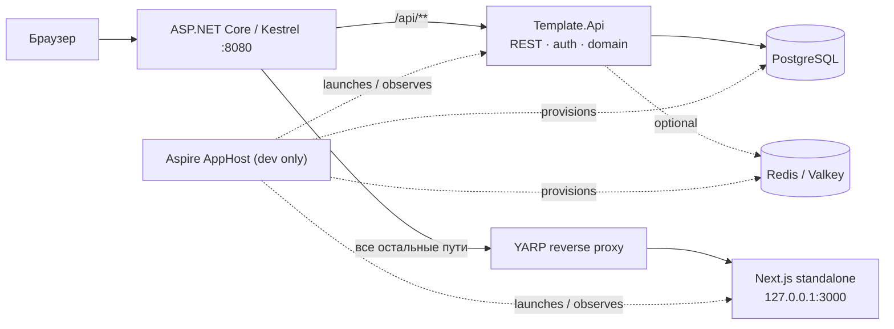

# Поэтапная миграция: Next.js template → ASP.NET Core 10 API + Next.js UI

**Статус:** активная дорожная карта.
**Текущая итерация:** 3 — persistence, Identity и базовая аутентификация (завершена 2026-07-24).
**Принцип:** это план серии независимых итераций, а не задача на единоразовый перенос всего приложения.

## 1. Границы и зафиксированные решения

- `template/` — неизменяемый референс прежнего full-stack Next.js приложения. Его можно читать, искать и сравнивать с ним поведение, но нельзя редактировать, перемещать или использовать как рабочую часть нового приложения.
- Новая система стартует **с чистой базы и чистой аутентификации**: production-окружения, пользователей, OAuth-связок и данных для миграции нет.
- ASP.NET Core 10 владеет всеми маршрутами `/api/**`, бизнес-логикой, доступом к данным, аутентификацией и внешним API.
- Next.js остаётся UI-приложением. После миграции он не содержит серверных действий, Prisma, Better Auth или прямого доступа к БД; он общается с API по REST.
- Production будет одним контейнером приложения: Kestrel принимает внешний трафик, локально запущенный Next.js обслуживает UI, а reverse proxy в ASP.NET Core направляет не-API запросы во frontend.
- Aspire применяется только для локальной разработки, интеграционных проверок и наблюдаемости. Он не является production-рантаймом и не заменяет Docker-образ с двумя процессами.
- OpenSpec в корне только инициализирован. На этой итерации активные OpenSpec-изменения и спеки не создаются.

## 2. Целевая архитектура



### Backend

- **`Template.Domain`** — сущности, value objects, доменные правила и контракты без зависимостей от HTTP/EF Core.
- **`Template.Application`** — use cases, команды/запросы, DTO и интерфейсы портов.
- **`Template.Infrastructure`** — EF Core/PostgreSQL, Identity, OAuth-адаптеры, кэш, файловое хранилище и реализации портов.
- **`Template.Api`** — minimal APIs или endpoint-модули, REST-политику, auth middleware, OpenAPI, health/readiness и reverse proxy.

Зависимости направлены только внутрь: `Api → Application`, `Infrastructure → Application/Domain`, `Application → Domain`. Domain не зависит от остальных слоёв.

### Frontend

- Будущий код живёт в `apps/web` и сохраняет подход feature slices для UI.
- Серверный рендеринг Next.js допустим только для представления UI; запросы данных идут к REST API через типизированный клиент.
- Контракт API публикуется как OpenAPI. Из него генерируются TypeScript-типы/клиент в `contracts/` или внутри `apps/web`.
- Browser использует один origin. Сессионная cookie остаётся `HttpOnly` и не читается JavaScript; frontend не хранит bearer-token в `localStorage`.

## 3. Целевая структура репозитория

```text
.
├── AGENTS.md                         # правила новой кодовой базы
├── CLAUDE.md -> AGENTS.md             # единый набор инструкций для агентов
├── Template.sln                       # корневой Rider/.NET entry point
├── global.json                        # .NET 10 SDK baseline
├── Directory.Build.props              # общие свойства C#-проектов
├── Directory.Packages.props           # централизованные версии NuGet
├── apps/
│   ├── api/
│   │   ├── src/
│   │   │   ├── Template.Api/
│   │   │   ├── Template.Application/
│   │   │   ├── Template.Domain/
│   │   │   └── Template.Infrastructure/
│   │   └── tests/
│   │       └── Template.Api.Tests/
│   └── web/                           # создаётся как чистый Next.js UI в итерации 2
├── contracts/
│   └── openapi/                       # экспорт спецификаций и generation config
├── deploy/                            # Docker, entrypoint, reverse-proxy конфигурация
├── docs/
│   └── aspnetcore-migration-plan.md   # этот документ
├── openspec/                          # только инициализация на текущем этапе
├── orchestration/                     # будущий Aspire AppHost и ServiceDefaults
└── template/                          # immutable reference, не изменять
```

Префикс `Template` — техническое имя bootstrap-проектов. Если будет утверждено продуктовое имя, переименование solution и namespace делается отдельной малой итерацией до появления доменного кода.

## 4. Общий протокол каждой будущей итерации

Каждая строка из раздела 6 выполняется отдельной веткой/PR и заканчивается полностью проверяемым вертикальным срезом. Нельзя начинать перенос следующей предметной области только потому, что предыдущая «почти готова».

### Definition of Ready

Перед началом итерации исполнитель обязан:

1. Найти в `template/` исходные routes, feature-модули, Server Actions/API handlers, Prisma-модели, тесты и пользовательские документы, относящиеся к срезу.
2. Зафиксировать таблицу соответствий «reference → новый API → новый UI» в PR/плане итерации.
3. Согласовать REST-контракт, права доступа, коды ошибок, pagination/filtering и необходимость транзакций до начала UI-работы.
4. Определить, нужны ли schema migration, seed, cache invalidation, аудит и фоновые задачи.
5. Выбрать проверяемые сценарии из `template/e2e/` и `template/test/`, которые должны быть воспроизведены в новом API/UI.

### Definition of Done

Итерация завершена только если:

1. Новый код создан вне `template/`; reference не изменён.
2. API имеет контракт, авторизацию и валидацию на границе HTTP, а бизнес-правила покрыты unit/integration тестами.
3. OpenAPI обновлён, а TypeScript-клиент сгенерирован и использован UI без hand-written дублирования DTO.
4. Соответствующий UI-сценарий работает через REST, не использует Server Actions/Prisma/Better Auth и имеет E2E-проверку.
5. Обновлены документы пользователя, если изменился видимый сценарий, маршрут, разрешение или API.
6. Пройдены `dotnet test`, сборка UI, contract checks и выбранные E2E-тесты; результаты приложены к PR.
7. В migration register этой страницы отмечены перенесённые routes/сценарии и оставшиеся расхождения.

## 5. Реестр исходного функционала

| Исходная область в `template/`                          | Основные маршруты/контракты                                                                      | Целевой срез                                  |
| ------------------------------------------------------- | ------------------------------------------------------------------------------------------------ | --------------------------------------------- |
| `src/features/accounts`, Better Auth                    | `/auth/*`, `/user/*`, сессии, OAuth connections                                                  | Identity и account lifecycle                  |
| `src/features/organizations`, `src/features/workspaces` | `/workspaces`, `/w/[organizationKey]/*`, роли, members                                           | organizations, membership, teams, invitations |
| `src/features/api-keys`                                 | personal/organization API keys, `/api/v1/**`                                                     | machine API and API-key management            |
| `src/features/documents-system`                         | `/docs/**`, search, OG endpoint                                                                  | public documentation and search               |
| `src/features/application`, `dashboard`                 | app shell, dashboard, theme, navigation                                                          | shared UI shell and dashboard                 |
| `prisma/schema.prisma`                                  | User, Session, Account, Verification, Organization, Member, Team, TeamMember, Invitation, ApiKey | EF Core schema, Identity, domain model        |
| `src/app/api/**`, `src/proxy.ts`                        | health, auth, local automation, v1 endpoints, route protection                                   | API modules, auth policies, BFF/proxy rules   |
| `e2e/**`, `test/**`                                     | reference behavior and acceptance evidence                                                       | new .NET, contract and Playwright test suites |

## 6. Очередь итераций

Порядок ниже определяет зависимости. Каждая итерация — самостоятельная поставка; оценка и детальный технический план уточняются только перед её началом.

### Итерация 0 — Bootstrap репозитория **(сейчас)**

**Цель:** создать безопасную стартовую точку, не мигрируя продуктовый функционал.

**Состав:**

- перенести прежнее содержимое репозитория в `template/` через Git rename;
- создать новую корневую структуру и пустые будущие области;
- создать .NET 10 solution и минимальный API с `GET /api/health`;
- добавить единые инструкции агента, SDK/package conventions и этот документ;
- инициализировать OpenSpec без активной спеки.

**Вход:** repository с исходным Next.js template.
**Выход:** `dotnet build Template.sln` и `dotnet test Template.sln` проходят; `template/` не менялся после переноса.
**Не входит:** БД, authentication, Next.js UI, Docker, Aspire AppHost, перенесённые routes.

### Итерация 1 — API foundation и контрактная дисциплина

**Цель:** сделать API предсказуемой платформой до появления предметных endpoints.

**Состав:** ProblemDetails/error envelope, validation pipeline, API versioning policy, endpoint modules, OpenAPI document, auth/authorization extension points, structured logging, correlation IDs, health/readiness, integration-test fixture.

**Вход:** итерация 0.
**Выход:** один демонстрационный protected/unprotected endpoint подтверждает единый формат ошибок и OpenAPI; API contract можно экспортировать и проверять в CI.
**Зависимости:** нет продуктовых данных.

### Итерация 2 — Чистый Next.js UI foundation

**Цель:** отделить UI от бывшего full-stack Next.js runtime.

**Состав:** новый `apps/web`, TypeScript/Tailwind/shadcn baseline, i18n/theme/navigation primitives, REST client generation from OpenAPI, error/loading conventions, browser E2E harness. UI показывает health/API-status только как технический smoke scenario.

**Вход:** итерация 1.
**Выход:** `apps/web` собирается standalone, использует только generated REST client для данных и проходит smoke test против API.
**Не входит:** перенос страницы логина или продуктовых компонентов.

### Итерация 3 — Persistence, Identity и базовая аутентификация

**Цель:** заменить Prisma/Better Auth новым источником правды без переноса старых записей.

**Состав:** PostgreSQL 18.4, EF Core migration, ASP.NET Core Identity Core, чистая схема пользователя/сессии, persistent `ITicketStore`, current-session/logout REST, secure HttpOnly same-origin cookie, explicit CSRF, local-only automation scenario/sign-in/cleanup, rate limits/lockout, database readiness, OpenAPI/generated SDK и login/dashboard UI.

**Вход:** итерации 1–2; `ConnectionStrings:Postgres` и environment/user-secrets conventions.
**Выход:** в opted-in Development/Test одна кнопка создаёт local credential user и persistent browser session; credentials позволяют automation-вход во вторую независимую сессию; logout/cleanup/current-session работают только через REST; Production password auth недоступен.
**Отложено:** внешний OAuth и account/session management — итерация 4; API keys/`x-api-key` — итерация 7; реальный Bearer требует отдельного issuer/consumer contract.

### Итерация 4 — Accounts и внешний OAuth

**Цель:** восстановить пользовательский lifecycle из `template/src/features/accounts`.

**Состав:** profile update, password/security settings, active sessions and revoke, delete account, external provider connect/disconnect, OAuth provider priority agreed before implementation, account pages and matching E2E scenarios.

**Вход:** итерация 3.
**Выход:** функциональные сценарии `/user/*` воспроизведены через REST без Better Auth; security-sensitive paths имеют authorization и audit/telemetry coverage.
**Reference:** `template/src/features/accounts`, `template/src/app/(protected)/(global)/user/**`.

### Итерация 5 — Organizations, membership и onboarding

**Цель:** перенести core workspace behavior с новыми явными domain boundaries.

**Состав:** Organization, membership, roles/permissions, active organization context, create/update/delete organization, slug/key routing, zero-organization onboarding, users list, API and UI flows.

**Вход:** итерация 3; решения о role model и organization identifiers.
**Выход:** пользователь может создать/select organization и управлять членами в пределах разрешений; маршруты `/workspaces` и `/w/[organizationKey]/**` работают через API.
**Reference:** `template/src/features/organizations`, `template/src/features/workspaces` (organization-related actions and repositories).

### Итерация 6 — Teams и invitations

**Цель:** восстановить collaboration workflows как отдельный вертикальный срез.

**Состав:** teams, team membership, invitations, accept/reject lifecycle, role changes, invitation security/expiry, notifications/email adapter boundary, settings UI and E2E coverage.

**Вход:** итерация 5.
**Выход:** owner/admin может приглашать и управлять member/team composition с теми же видимыми правилами, что зафиксированы в reference tests.
**Reference:** `template/src/features/workspaces/actions/*invitation*`, `*team*`, `template/e2e/specs/workspace-*`.

### Итерация 7 — API keys и public `/api/v1`

**Цель:** отделить machine-to-machine API от browser session и воспроизвести существующую внешнюю поверхность осознанно.

**Состав:** secure key generation/storage/hash/reveal-once, scopes/permissions, personal and organization keys, revoke/rotate, API-key authentication handler, rate limiting/audit, versioned v1 endpoints, OpenAPI consumer documentation and contract tests.

**Вход:** итерации 3, 5 и при необходимости 6.
**Выход:** все поддерживаемые `/api/v1/**` scenarios проходят без cookie, а management UI работает через session-authenticated REST endpoints.
**Reference:** `template/src/features/api-keys`, `template/src/app/api/v1/**`.

### Итерация 8 — Public documentation system

**Цель:** перенести documentation surface и поиск, не смешивая его с account/workspace доменом.

**Состав:** MD/MDX content pipeline в `apps/web`, locale-aware rendering, documentation navigation, search API/indexing boundary, OG metadata route, publication state and link validation.

**Вход:** итерация 2; решение, где хранятся и индексируются documents.
**Выход:** `/docs/**` и public search воспроизводят нужные published страницы и локали; content validation включена в CI.
**Reference:** `template/src/features/documents-system`, `template/src/app/(public)/(documents-system)/docs/**`.

### Итерация 9 — Application shell, dashboard и frontend parity

**Цель:** закончить общие UI composition patterns и удалить остаточные зависимости нового UI от reference assumptions.

**Состав:** protected shell, sidebar, dashboard, settings navigation, responsive states, theme, localization messages, metadata, error/loading pages, route-by-route visual/behavioral parity review.

**Вход:** итерации 4–8 для соответствующих data sources.
**Выход:** все нужные UI routes работают с уже мигрированными API modules; нет Server Actions, Prisma или Better Auth в `apps/web`.
**Reference:** `template/src/features/application`, `template/src/features/dashboard`, `template/src/messages/**`.

### Итерация 10 — Aspire и локальная интеграционная среда

**Цель:** ускорить разработку и сделать локальный distributed application наблюдаемым.

**Состав:** `orchestration/` AppHost and ServiceDefaults, PostgreSQL/Redis resources, API and frontend launch wiring, OpenTelemetry dashboard, service discovery/configuration, local secrets and seeded developer data.

**Вход:** independently runnable API, Next.js UI, PostgreSQL; Redis only if a migrated slice needs it.
**Выход:** одна команда поднимает полный local stack с logs/traces/health. `AddNextJsApp` или custom executable integration выбирается после проверки актуальной версии Aspire и стабильности API.
**Не входит:** production hosting through Aspire.

### Итерация 11 — Один production container и reverse proxy

**Цель:** реализовать обещанную topology без изменения клиентских URL.

**Состав:** multi-stage Dockerfile, `next build` standalone output, Kestrel host, YARP rules (`/api/**` local, остальные пути → `127.0.0.1:3000`), process supervisor/entrypoint, signal handling, log streams, health/readiness probes, static assets and websocket/streaming validation.

**Вход:** итерации 2, 3 и минимум один migrated protected UI slice.
**Выход:** один image запускает оба процесса, браузер использует один origin, `/api/health` и UI probes стабильно работают, а test deployment проходит end-to-end suite.
**Rollback:** предыдущий tagged image; DB changes выполняются backward-compatible миграциями из отдельных релизных шагов.

### Итерация 12 — Parity audit, hardening и архивирование reference

**Цель:** доказать product parity и принять отдельное решение о судьбе `template/`.

**Состав:** route inventory reconciliation, API contract diff, permissions/security review, performance/load checks, accessibility/SEO review, backup/restore drill, documentation audit, license/dependency review, final E2E matrix.

**Вход:** все выбранные feature slices и production topology.
**Выход:** signed-off matrix не содержит необъяснённых gaps; только после этого отдельным решением `template/` может остаться как archive или быть удалён из рабочей ветки.
**Важно:** эта итерация не удаляет `template/` автоматически.

## 7. Контроль качества и безопасность

- **Unit tests:** domain and application behavior; no HTTP/database unless the test is integration.
- **Integration tests:** `WebApplicationFactory`, PostgreSQL test resource/containers, EF migrations, auth handlers and endpoint contracts.
- **Contract tests:** OpenAPI validation plus generation check; breaking REST changes require explicit versioning/deprecation decision.
- **E2E tests:** Playwright against the single-origin host; reference `template/e2e/specs/` supplies scenarios, but new tests are created outside `template/`.
- **Security gates:** authorization by default, role/policy tests, antiforgery for cookie mutations, no browser bearer storage, secure API-key hashing, secret scanning, dependency updates.
- **Data gates:** every persistent change has EF migration, rollback/compatibility note, index review and a test for tenant/organization isolation.

## 8. Журнал выполнения

| Итерация                                           | Состояние | Примечание                                                                                                                                              |
| -------------------------------------------------- | --------- | ------------------------------------------------------------------------------------------------------------------------------------------------------- |
| 0 — bootstrap                                      | Завершена | Reference перенесён, .NET 10 solution и health probe созданы; продуктовый код не переносился.                                                           |
| 1 — API foundation                                 | Завершена | Problem Details, validation, cookie auth boundary, correlation/logging, live/ready health, OpenAPI 3.1 export и integration contract tests приняты.     |
| 2 — чистый Next.js UI foundation                   | Завершена | Standalone Next.js, fixed en/ru locale, theme/navigation/boundaries, generated REST SDK, isolated browser/SSR clients and full-stack smoke приняты.     |
| 3 — persistence, Identity и базовая аутентификация | Завершена | PostgreSQL 18.4, EF migration, Identity Core, persistent cookie sessions, CSRF, local credential automation, login/dashboard/logout REST slice приняты. |
| 4–12                                               | Не начаты | Следующий dependency gate — внешний OAuth/accounts; API keys и `x-api-key` остаются итерацией 7.                                                        |

## Acceptance evidence: итерация 1

**Scope:** только `Template.Api`, `Template.Api.Tests`, корневая dependency/build
configuration (`Directory.Packages.props`), `contracts/openapi` и документация
(включая корневой `AGENTS.md`). `Template.Domain`, `Template.Application`,
`Template.Infrastructure`, `apps/web` и persistent schema не менялись.

| Reference                                                                      | Новый API                                              | Новый UI          | Test/evidence                                                                     |
| ------------------------------------------------------------------------------ | ------------------------------------------------------ | ----------------- | --------------------------------------------------------------------------------- |
| `template/src/app/api/health/route.ts`, `template/e2e/support/config.ts`       | `/api/health`, `/api/health/live`, `/api/health/ready` | N/A до итерации 2 | `HealthEndpointTests`                                                             |
| `template/src/features/routes.ts`, `template/src/proxy.ts`                     | public status и protected authenticated probe          | N/A               | `SystemEndpointTests`, `ProblemDetailsTests`                                      |
| `template/src/lib/actions.ts`, `template/src/types/actions.ts`, API-key errors | `{ data }`, validation и RFC Problem Details           | N/A               | 400/401/403/404/405/500 и incompatible-`Accept` contract cases                    |
| `template/src/lib/logger.ts`                                                   | `ILogger`, correlation scope, completion events        | N/A               | `ObservabilityTests`, including correlation parity for handled 400/500 exceptions |
| reference API auth tests                                                       | cookie/policy extension points без API-key domain      | N/A               | test-only authentication and deny policy                                          |
| `template/prisma/schema.prisma`                                                | schema отсутствует в scope                             | N/A               | нет EF packages/migrations                                                        |

**Проверки 2026-07-23:**

| Команда                                                                 | Результат                                       |
| ----------------------------------------------------------------------- | ----------------------------------------------- |
| `dotnet restore Template.sln`                                           | PASS                                            |
| `dotnet build Template.sln --no-restore`                                | PASS                                            |
| `dotnet test Template.sln --no-restore`                                 | PASS; 35/35 tests                               |
| OpenAPI export with `-p:OpenApiGenerateDocuments=true`                  | PASS; deterministic `contracts/openapi/v1.json` |
| OpenAPI semantic drift test                                             | PASS                                            |
| `git diff --exit-code -- contracts/openapi/v1.json` after second export | PASS                                            |
| `git diff -- template/`                                                 | empty                                           |
| UI build / Playwright E2E                                               | N/A: `apps/web` starts in iteration 2           |

**Известные расхождения с reference:** ошибки используют RFC Problem Details
вместо `{ "error": ... }`; health использует `{ "data": ... }`; live/ready,
system probes, correlation ID и OpenAPI являются новой foundation surface.
Product routes, user session projection and UI parity intentionally remain
outside iteration 1.

**Следующий gate:** iteration 2 may consume `/api/v1/system/status` and the
committed OpenAPI document. Identity, issuing the cookie, and
`GET /api/v1/auth/session` remain blocked on iteration 3; no iteration-2 code
may simulate them with browser bearer storage or direct database access.

## Acceptance evidence: итерация 2

**Scope:** `apps/web`, `docs/web-conventions.md`, design
`docs/superpowers/specs/2026-07-23-nextjs-ui-foundation-design.md`, plan
`docs/superpowers/plans/2026-07-24-nextjs-ui-foundation.md`, этот migration plan
и реестр итераций. API source, persistent schema и `template/` не менялись.
Committed OpenAPI contract и generated SDK остались byte-identical после
экспорта и регенерации.

| Reference                                                                           | Новый API                                       | Новый UI                                              | Test/evidence                                       |
| ----------------------------------------------------------------------------------- | ----------------------------------------------- | ----------------------------------------------------- | --------------------------------------------------- |
| `template/src/app/layout.tsx`, `globals.css`, `app-providers.tsx`                   | N/A                                             | root layout, providers, Tailwind/shadcn tokens        | layout/component tests, standalone production build |
| `template/src/i18n/**`, `common.{en,ru}.json`                                       | N/A                                             | fixed deployment locale with common/system bundles    | locale fallback and bundle-shape tests              |
| `template/src/components/application/theme/theme-switcher.tsx`                      | N/A                                             | hydration-safe theme switcher                         | SSR markup, click, and keyboard E2E                 |
| `template/src/features/application/application-routes.ts`, public header primitives | N/A                                             | typed `/` and minimal header                          | route/header tests                                  |
| `template/src/app/api/health/route.ts`, `template/e2e/support/config.ts`            | existing `/api/health`, `/api/v1/system/status` | SSR and browser status regions over one generated SDK | adapter tests and full-stack Playwright             |
| `template/src/app/global-error.tsx`, `not-found.tsx`, error components              | existing RFC Problem Details                    | loading/error/not-found/global boundaries             | boundary and intercepted-error tests                |
| reference public home account/workspace loaders                                     | outside scope                                   | not copied                                            | source/dependency guard                             |
| all reference Prisma models                                                         | no schema change                                | no data access                                        | source/dependency guard                             |

**Проверки 2026-07-24 (fresh clean-lock acceptance, final-review refresh):**

Результаты web/npm ниже заново получены после final-review hardening и заменяют
раннее наблюдение о 10 уязвимостях после `npm ci`. .NET/OpenAPI evidence
сохранён без изменения из исходной acceptance-проверки: эти команды не
перезапускались в final-review fix wave.

| Команда                                                                                                              | Наблюдаемый результат                                                                                                                                                                                   |
| -------------------------------------------------------------------------------------------------------------------- | ------------------------------------------------------------------------------------------------------------------------------------------------------------------------------------------------------- |
| `dotnet restore Template.sln`                                                                                        | PASS; все проекты up-to-date                                                                                                                                                                            |
| `dotnet build Template.sln --no-restore`                                                                             | PASS; 0 warnings, 0 errors                                                                                                                                                                              |
| `dotnet test Template.sln --no-restore`                                                                              | PASS; 35/35 tests, 0 failed, 0 skipped                                                                                                                                                                  |
| `dotnet build apps/api/src/Template.Api/Template.Api.csproj --no-restore -p:OpenApiGenerateDocuments=true`           | PASS; OpenAPI export build, 0 warnings, 0 errors                                                                                                                                                        |
| `git diff --exit-code -- contracts/openapi/v1.json`                                                                  | PASS; empty                                                                                                                                                                                             |
| `npm ci`                                                                                                             | PASS; 978 packages added, 979 audited, 0 vulnerabilities                                                                                                                                                |
| `npm audit --json`                                                                                                   | PASS; 0 total vulnerabilities (0 info/low/moderate/high/critical)                                                                                                                                       |
| `npm audit --omit=dev --json`                                                                                        | PASS; production tree has 0 total vulnerabilities                                                                                                                                                       |
| `npm run audit:prod`                                                                                                 | PASS; `npm audit --omit=dev` reported 0 vulnerabilities                                                                                                                                                 |
| `npm ls next postcss sharp js-yaml @hono/node-server shadcn --all`                                                   | PASS; Next 16.2.11 resolves PostCSS 8.5.22 and sharp 0.35.3; JavaScript YAML 4 consumers resolve js-yaml 4.3.0; shadcn 4.14.1 is development-only and its MCP stack resolves `@hono/node-server` 2.0.11 |
| `npx --no-install shadcn --help` and `shadcn info`                                                                   | PASS; CLI loads, recognizes Next 16.2.11/Tailwind v4/radix-lyra, and finds the four installed primitives                                                                                                |
| MCP/Hono HTTP adapter probe                                                                                          | PASS; SDK `StreamableHTTPServerTransport` with Hono 2.0.11 returned the expected HTTP 406 negotiation response and terminated                                                                           |
| `npm run api:check`                                                                                                  | PASS; generated REST tree deterministic and current (4 files)                                                                                                                                           |
| `npm run boundaries:check`                                                                                           | PASS; focused Node tests 2/2 and dependency/source boundaries clean for all eight enabled JS/TS forms                                                                                                   |
| `npm run format:check`                                                                                               | PASS; all matched files use Prettier style                                                                                                                                                              |
| `npm run lint`                                                                                                       | PASS; ESLint exited 0                                                                                                                                                                                   |
| `npm run typecheck`                                                                                                  | PASS; Next route types generated and `tsc --noEmit` exited 0                                                                                                                                            |
| `npm test -- --runInBand`                                                                                            | PASS; 15/15 suites, 46/46 tests, 0 snapshots                                                                                                                                                            |
| `node -e "require('node:fs').rmSync('.next', { recursive: true, force: true })"`                                     | PASS; prior build output removed                                                                                                                                                                        |
| `env -u API_INTERNAL_BASE_URL -u API_PROXY_TARGET PUBLIC_DEFAULT_LOCALE=en npm run build`                            | PASS; Next.js 16.2.11 compiled and completed the production build without a live API                                                                                                                    |
| `test -f .next/standalone/server.js`                                                                                 | PASS; standalone artifact exists                                                                                                                                                                        |
| Standalone runtime probe on `127.0.0.1:3130`                                                                         | PASS; HTTP 200 and expected heading; listener terminated                                                                                                                                                |
| `npm run e2e:install`                                                                                                | PASS; Chromium installation gate exited 0                                                                                                                                                               |
| `npm run e2e`                                                                                                        | PASS; Playwright 3/3 tests in 11.0s; API and Next E2E listeners terminated                                                                                                                              |
| Generated TypeScript metadata check                                                                                  | PASS; `next-env.d.ts` and `tsconfig.tsbuildinfo` regenerated, remained ignored/untracked, and typecheck/dev/E2E/build did not change tracked state                                                      |
| `git diff --exit-code HEAD -- template contracts/openapi apps/api apps/web/src/lib/api/generated` (checked per path) | PASS; all protected/reference/contract/API/generated trees empty                                                                                                                                        |

Final review originally identified `@hono/node-server` 2.0.5 as a patched
candidate, but the live audit now marks 2.0.0–2.0.9 vulnerable; exact 2.0.11 was
therefore selected and validated instead. The exact override policy and removal
gate are recorded in `docs/web-conventions.md`.

**Intentional differences from reference:** новый `/` — техническая smoke home,
а не product landing; data flow использует generated ASP.NET REST SDK вместо
Server Actions; failures используют RFC Problem Details; язык deployment
фиксирован через `PUBLIC_DEFAULT_LOCALE` (`en`/`ru`) и switcher отсутствует.
Authentication, account/workspace/product data и соответствующий UI не
переносились.

Browser обращается к `/api/**` same-origin с `credentials: "same-origin"`;
SSR использует только server-side absolute `API_INTERNAL_BASE_URL`. В dev/E2E
внешний Next rewrite включается через `API_PROXY_TARGET`, но это не production
proxy: конечная production topology с Kestrel/YARP остаётся отдельной итерацией.

В этом срезе нет данных, schema migrations, транзакций или pagination.
**Gate итерации 3:** PostgreSQL, EF Core migrations, ASP.NET Core Identity,
register/login/logout/current-user, выдача secure HttpOnly same-origin cookie и
antiforgery. До него persistence, Identity, cookie issuance, account/workspace/
product UI и auth-dependent parity остаются известными gaps.

## Acceptance evidence: итерация 3

**Scope:** `Template.Domain`, `Template.Application`,
`Template.Infrastructure`, `Template.Api`, Application/API integration tests и
`Template.E2EHost`; initial EF migration чистой PostgreSQL `auth` schema;
OpenAPI и generated TypeScript SDK; `/auth/login` и временный `/dashboard`;
Jest/Testcontainers/Playwright acceptance; operations, API, web и migration
documentation. `template/` не менялся, Prisma/Better Auth data не переносились,
активный OpenSpec change/spec не создавался.

| Reference                                                            | Новый API/данные                                             | Новый UI                                | Test/evidence                                                       |
| -------------------------------------------------------------------- | ------------------------------------------------------------ | --------------------------------------- | ------------------------------------------------------------------- |
| `prisma/schema.prisma`: `User`, `Session`, `Account`, `Verification` | Identity users/logins/tokens plus persistent session tickets | N/A                                     | migration, indexes, uniqueness and cascade tests against PostgreSQL |
| `src/server/auth.ts`, `/api/auth/[...all]` session lookup            | `GET /api/v1/auth/session`                                   | protected `/dashboard` session proof    | anonymous/authenticated API and Playwright cases                    |
| Better Auth `signOut`                                                | `POST /api/v1/auth/logout`                                   | logout control                          | current-session removal, cookie expiry and browser redirect         |
| `POST /api/local-auth/scenario`                                      | same route with new envelope/Problem Details                 | one-click automation panel              | API, component and E2E create cases                                 |
| `/api/auth/sign-in/email`                                            | `POST /api/local-auth/sign-in`                               | no visible form; automation helper only | second-browser-context sign-in                                      |
| `DELETE /api/local-auth/scenario`                                    | same route; user/session cleanup                             | no product control; E2E helper only     | local-user authorization and cross-context invalidation             |
| `/auth/login`, `LoginForm`, local automation panel                   | capabilities/session REST composition                        | reference-like `/auth/login`            | capability, rendering, navigation and failure tests                 |
| `proxy.ts` protected-page redirect                                   | session projection remains API-owned                         | `/dashboard` server-side auth gate      | safe redirect and anonymous navigation E2E                          |
| account session list/revoke actions and tests                        | persistent-session foundation only                           | no `/user/security`                     | explicitly deferred to iteration 4                                  |
| API key auth and `/api/v1/**` reference tests                        | no runtime implementation                                    | none                                    | future policies cannot be accidentally satisfied by browser cookie  |

**Проверки 2026-07-24 (fresh full matrix):**

Integration and E2E fixtures used disposable Testcontainers databases from
PostgreSQL image `postgres:18.4`. EF design-time commands intentionally use
`Template.Infrastructure.csproj` as both project and startup project because
its factory owns the private EF Design package; `Template.Api` remains the only
HTTP host.

| Команда                                                                                                                                                                                                                                                                           | Наблюдаемый результат                                                                                                                                                                                                                               |
| --------------------------------------------------------------------------------------------------------------------------------------------------------------------------------------------------------------------------------------------------------------------------------- | --------------------------------------------------------------------------------------------------------------------------------------------------------------------------------------------------------------------------------------------------- |
| `dotnet tool restore`                                                                                                                                                                                                                                                             | PASS; `dotnet-ef` 10.0.10 restored                                                                                                                                                                                                                  |
| `dotnet restore Template.sln`                                                                                                                                                                                                                                                     | PASS; all projects up-to-date                                                                                                                                                                                                                       |
| `dotnet build Template.sln --no-restore`                                                                                                                                                                                                                                          | PASS; 0 warnings, 0 errors                                                                                                                                                                                                                          |
| `dotnet test Template.sln --no-restore`                                                                                                                                                                                                                                           | PASS; Application 17/17 and API 93/93: 110/110 total, 0 failed, 0 skipped                                                                                                                                                                           |
| `dotnet build apps/api/src/Template.Api/Template.Api.csproj --no-restore -p:OpenApiGenerateDocuments=true`                                                                                                                                                                        | PASS; OpenAPI 3.1 export build, 0 warnings, 0 errors                                                                                                                                                                                                |
| `git diff --exit-code -- contracts/openapi/v1.json`                                                                                                                                                                                                                               | PASS; empty after export                                                                                                                                                                                                                            |
| `dotnet ef migrations has-pending-model-changes --project apps/api/src/Template.Infrastructure/Template.Infrastructure.csproj --startup-project apps/api/src/Template.Infrastructure/Template.Infrastructure.csproj --context AuthDbContext`                                      | PASS; no model changes since the migration                                                                                                                                                                                                          |
| `dotnet ef migrations script --idempotent --project apps/api/src/Template.Infrastructure/Template.Infrastructure.csproj --startup-project apps/api/src/Template.Infrastructure/Template.Infrastructure.csproj --context AuthDbContext --output /tmp/template-auth-idempotent.sql` | PASS; design-time build succeeded                                                                                                                                                                                                                   |
| `test -s /tmp/template-auth-idempotent.sql`                                                                                                                                                                                                                                       | PASS; non-empty, 6,199 bytes and 172 lines                                                                                                                                                                                                          |
| `cd apps/web`                                                                                                                                                                                                                                                                     | PASS; subsequent npm commands ran from `apps/web`                                                                                                                                                                                                   |
| `npm ci`                                                                                                                                                                                                                                                                          | PASS; 978 packages added, 979 audited, 0 vulnerabilities                                                                                                                                                                                            |
| `npm audit --json`                                                                                                                                                                                                                                                                | PASS; 0 info, 0 low, 0 moderate, 0 high, 0 critical, 0 total findings                                                                                                                                                                               |
| `npm run audit:prod`                                                                                                                                                                                                                                                              | PASS; production audit found 0 vulnerabilities                                                                                                                                                                                                      |
| `npm run api:check`                                                                                                                                                                                                                                                               | PASS; generated SDK deterministic and current, 4 files                                                                                                                                                                                              |
| `npm run boundaries:check`                                                                                                                                                                                                                                                        | PASS; 3/3 focused boundary tests and source/dependency guard                                                                                                                                                                                        |
| `npm run format:check`                                                                                                                                                                                                                                                            | PASS; all matched files use Prettier style                                                                                                                                                                                                          |
| `npm run lint`                                                                                                                                                                                                                                                                    | PASS; ESLint exited 0                                                                                                                                                                                                                               |
| `npm run typecheck`                                                                                                                                                                                                                                                               | PASS; route types generated and `tsc --noEmit` exited 0                                                                                                                                                                                             |
| `npm test -- --runInBand`                                                                                                                                                                                                                                                         | PASS; Jest 23/23 suites, 91/91 tests, 0 snapshots                                                                                                                                                                                                   |
| clean `.next` before the production build                                                                                                                                                                                                                                         | PASS; the Codex command policy rejected literal `rm -rf .next` before process launch, so the approved non-shell equivalent `node -e "require('node:fs').rmSync('.next', { recursive: true, force: true })"` removed it and `test ! -e .next` passed |
| `env -u API_INTERNAL_BASE_URL -u API_PROXY_TARGET PUBLIC_DEFAULT_LOCALE=en npm run build`                                                                                                                                                                                         | PASS; Next.js 16.2.11 production build completed without API/database configuration                                                                                                                                                                 |
| `test -f .next/standalone/server.js`                                                                                                                                                                                                                                              | PASS; standalone artifact exists                                                                                                                                                                                                                    |
| `npm run e2e:install`                                                                                                                                                                                                                                                             | PASS; Chromium installation gate exited 0                                                                                                                                                                                                           |
| `npm run e2e`                                                                                                                                                                                                                                                                     | PASS; Playwright 4/4 tests in 13.0s                                                                                                                                                                                                                 |
| `cd ../..`                                                                                                                                                                                                                                                                        | PASS; repository-root guards ran from the root                                                                                                                                                                                                      |
| `git diff --check`                                                                                                                                                                                                                                                                | PASS; no whitespace errors                                                                                                                                                                                                                          |
| `git diff --exit-code -- template/`                                                                                                                                                                                                                                               | PASS; working-tree reference diff empty                                                                                                                                                                                                             |
| `git diff --exit-code origin/main...HEAD -- template/`                                                                                                                                                                                                                            | PASS; branch-range reference diff empty                                                                                                                                                                                                             |
| `git status --short`                                                                                                                                                                                                                                                              | PASS; clean before evidence editing; final documentation pass contained only the four Task 15 docs                                                                                                                                                  |

**Post-review repair 2026-07-24:** the final whole-branch audit added explicit
regressions for cookie-bearing liveness, SSR/browser sliding renewal, required
local credentials, and unsafe-operation `400` variants.

| Команда                                                                                                                                                                                                                                                                                                                                                                           | Наблюдаемый результат                                                                                                 |
| --------------------------------------------------------------------------------------------------------------------------------------------------------------------------------------------------------------------------------------------------------------------------------------------------------------------------------------------------------------------------------- | --------------------------------------------------------------------------------------------------------------------- |
| focused API health/sliding/OpenAPI RED                                                                                                                                                                                                                                                                                                                                            | FAIL as intended: 4/4 new regressions exposed ticket-store liveness access, invisible SSR renewal, and contract drift |
| focused Jest RED                                                                                                                                                                                                                                                                                                                                                                  | FAIL as intended: missing browser refresh plus SSR-marker and contract/SDK drift                                      |
| `dotnet test apps/api/tests/Template.Api.Tests/Template.Api.Tests.csproj --no-restore --filter "FullyQualifiedName~HealthEndpointTests\|FullyQualifiedName~DatabaseReadinessTests\|FullyQualifiedName~BrowserSessionSlidingExpirationTests\|FullyQualifiedName~BrowserSessionCookieRotationTests\|FullyQualifiedName~AuthEndpointTests\|FullyQualifiedName~OpenApiContractTests"` | PASS; 43/43 focused API regressions                                                                                   |
| `dotnet restore Template.sln && dotnet build Template.sln --no-restore && dotnet test Template.sln --no-restore`                                                                                                                                                                                                                                                                  | PASS; build 0 warnings/errors, Application 17/17 and API 98/98: 115/115 total                                         |
| `dotnet build apps/api/src/Template.Api/Template.Api.csproj --no-restore -p:OpenApiGenerateDocuments=true`                                                                                                                                                                                                                                                                        | PASS; regenerated OpenAPI 3.1 contract                                                                                |
| `npm run api:check && npm run boundaries:check && npm test -- --runInBand`                                                                                                                                                                                                                                                                                                        | PASS; deterministic SDK, clean boundaries, Jest 24/24 suites and 94/94 tests                                          |
| `npm run format:check && npm run lint && npm run typecheck`                                                                                                                                                                                                                                                                                                                       | PASS; Prettier, ESLint, Next route generation and `tsc --noEmit`                                                      |
| `env -u API_INTERNAL_BASE_URL -u API_PROXY_TARGET PUBLIC_DEFAULT_LOCALE=en npm run build`                                                                                                                                                                                                                                                                                         | PASS; Next.js 16.2.11 production build                                                                                |
| `git diff --exit-code -- template/ && git diff --exit-code 37b860c -- template/ && git diff --check`                                                                                                                                                                                                                                                                              | PASS; immutable reference and whitespace checks remained clean                                                        |

The primary browser scheme is `Template.Session`; the internal write-only
issuer is `Template.Session.Issuer`. Both use the same cookie/ticket-store
format and Data Protection purpose for safe session replacement and key
rotation. Only `cookieAuth` is advertised in OpenAPI. There is no Bearer or
API-key runtime.

**Intentional differences from reference:**

- success uses the typed `{ "data": ... }` envelope and failures use RFC
  Problem Details with stable `code`/`traceId`;
- production password login is absent; the two-part-gated credential flow is
  local automation only;
- social/external login is deferred to iteration 4;
- persistence starts from a clean Identity Core `auth` schema rather than
  migrating Prisma/Better Auth records;
- `/dashboard` is a temporary session proof, not the product dashboard;
- cleanup reports zero deleted organizations because organization persistence
  starts in iteration 5;
- PostgreSQL tickets are authoritative and no session JWT cache exists;
- API-key/`x-api-key` remains iteration 7 and no API-key or Bearer scheme is
  registered.

**Следующий gate:** agree external-provider priority, credentials and callback
URLs; define provider email-verification mapping; design persistent/encrypted
production Data Protection key storage; and approve the exact iteration-4
account/session-management scope. Until that gate, production password/social
login remains unavailable and iteration-4/5/7 product domains are not pulled
forward.

Both immutable-reference checks were explicitly empty:
`git diff --exit-code -- template/` and
`git diff --exit-code origin/main...HEAD -- template/`.

## 9. Правило обновления этого документа

Перед стартом очередной итерации уточняются только её scope, зависимости, risks и acceptance criteria. Изменение порядка или архитектурных решений фиксируется здесь отдельной записью с причиной; незавершённые задачи не «перепрыгивают» в следующую итерацию без явного решения.
