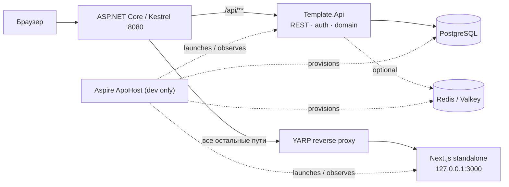

# Поэтапная миграция: Next.js template → ASP.NET Core 10 API + Next.js UI

**Статус:** активная дорожная карта.
**Текущая итерация:** 5 — organizations, membership и onboarding — завершена
для наблюдаемого reviewed implementation state
`0ffdd7dc810e7d6b1b003c4e2b930abf0861c984`. Iteration 6 разблокирована, но
ещё не начата и должна выполняться отдельным planned slice. Документационное
closure ниже не заявляет ни свой будущий hash, ни результат будущего automatic
review: после controller push требуется fresh automatic review.
**Принцип:** это план серии независимых итераций, а не задача на единоразовый перенос всего приложения.

## 1. Границы и зафиксированные решения

- `template/` — неизменяемый референс прежнего full-stack Next.js приложения. Его можно читать, искать и сравнивать с ним поведение, но нельзя редактировать, перемещать или использовать как рабочую часть нового приложения.
- Новая система стартует **с чистой базы и чистой аутентификации**: production-окружения, пользователей, OAuth-связок и данных для миграции нет.
- ASP.NET Core 10 владеет всеми маршрутами `/api/**`, бизнес-логикой, доступом к данным, аутентификацией и внешним API.
- Next.js остаётся UI-приложением. После миграции он не содержит серверных действий, Prisma, Better Auth или прямого доступа к БД; он общается с API по REST.
- Production будет одним контейнером приложения: Kestrel принимает внешний трафик, локально запущенный Next.js обслуживает UI, а reverse proxy в ASP.NET Core направляет не-API запросы во frontend.
- Aspire применяется только для локальной разработки, интеграционных проверок и наблюдаемости. Он не является production-рантаймом и не заменяет Docker-образ с двумя процессами.
- OpenSpec в корне только инициализирован. На этой итерации активные OpenSpec-изменения и спеки не создаются.

## 2. Целевая архитектура



### Backend

- **`Template.Domain`** — сущности, value objects, доменные правила и контракты без зависимостей от HTTP/EF Core.
- **`Template.Application`** — use cases, команды/запросы, DTO и интерфейсы портов.
- **`Template.Infrastructure`** — EF Core/PostgreSQL, Identity, OAuth-адаптеры, кэш, файловое хранилище и реализации портов.
- **`Template.Api`** — minimal APIs или endpoint-модули, REST-политику, auth middleware, OpenAPI, health/readiness и reverse proxy.

Зависимости направлены только внутрь: `Api → Application`, `Infrastructure → Application/Domain`, `Application → Domain`. Domain не зависит от остальных слоёв.

### Frontend

- Будущий код живёт в `apps/web` и сохраняет подход feature slices для UI.
- Серверный рендеринг Next.js допустим только для представления UI; запросы данных идут к REST API через типизированный клиент.
- Контракт API публикуется как OpenAPI. Из него генерируются TypeScript-типы/клиент в `contracts/` или внутри `apps/web`.
- Browser использует один origin. Сессионная cookie остаётся `HttpOnly` и не читается JavaScript; frontend не хранит bearer-token в `localStorage`.

## 3. Целевая структура репозитория

```text
.
├── AGENTS.md                         # правила новой кодовой базы
├── CLAUDE.md -> AGENTS.md             # единый набор инструкций для агентов
├── Template.sln                       # корневой Rider/.NET entry point
├── global.json                        # .NET 10 SDK baseline
├── Directory.Build.props              # общие свойства C#-проектов
├── Directory.Packages.props           # централизованные версии NuGet
├── apps/
│   ├── api/
│   │   ├── src/
│   │   │   ├── Template.Api/
│   │   │   ├── Template.Application/
│   │   │   ├── Template.Domain/
│   │   │   └── Template.Infrastructure/
│   │   └── tests/
│   │       └── Template.Api.Tests/
│   └── web/                           # создаётся как чистый Next.js UI в итерации 2
├── contracts/
│   └── openapi/                       # экспорт спецификаций и generation config
├── deploy/                            # Docker, entrypoint, reverse-proxy конфигурация
├── docs/
│   └── aspnetcore-migration-plan.md   # этот документ
├── openspec/                          # только инициализация на текущем этапе
├── orchestration/                     # будущий Aspire AppHost и ServiceDefaults
└── template/                          # immutable reference, не изменять
```

Префикс `Template` — техническое имя bootstrap-проектов. Если будет утверждено продуктовое имя, переименование solution и namespace делается отдельной малой итерацией до появления доменного кода.

## 4. Общий протокол каждой будущей итерации

Каждая строка из раздела 6 выполняется отдельной веткой/PR и заканчивается полностью проверяемым вертикальным срезом. Нельзя начинать перенос следующей предметной области только потому, что предыдущая «почти готова».

### Definition of Ready

Перед началом итерации исполнитель обязан:

1. Найти в `template/` исходные routes, feature-модули, Server Actions/API handlers, Prisma-модели, тесты и пользовательские документы, относящиеся к срезу.
2. Зафиксировать таблицу соответствий «reference → новый API → новый UI» в PR/плане итерации.
3. Согласовать REST-контракт, права доступа, коды ошибок, pagination/filtering и необходимость транзакций до начала UI-работы.
4. Определить, нужны ли schema migration, seed, cache invalidation, аудит и фоновые задачи.
5. Выбрать проверяемые сценарии из `template/e2e/` и `template/test/`, которые должны быть воспроизведены в новом API/UI.

### Definition of Done

Итерация завершена только если:

1. Новый код создан вне `template/`; reference не изменён.
2. API имеет контракт, авторизацию и валидацию на границе HTTP, а бизнес-правила покрыты unit/integration тестами.
3. OpenAPI обновлён, а TypeScript-клиент сгенерирован и использован UI без hand-written дублирования DTO.
4. Соответствующий UI-сценарий работает через REST, не использует Server Actions/Prisma/Better Auth и имеет E2E-проверку.
5. Обновлены документы пользователя, если изменился видимый сценарий, маршрут, разрешение или API.
6. Пройдены `dotnet test`, сборка UI, contract checks и выбранные E2E-тесты; результаты приложены к PR.
7. В migration register этой страницы отмечены перенесённые routes/сценарии и оставшиеся расхождения.

## 5. Реестр исходного функционала

| Исходная область в `template/`                          | Основные маршруты/контракты                                                                      | Целевой срез                                  |
| ------------------------------------------------------- | ------------------------------------------------------------------------------------------------ | --------------------------------------------- |
| `src/features/accounts`, Better Auth                    | `/auth/*`, `/user/*`, сессии, OAuth connections                                                  | Identity и account lifecycle                  |
| `src/features/organizations`, `src/features/workspaces` | `/workspaces`, `/w/[organizationKey]/*`, роли, members                                           | organizations, membership, teams, invitations |
| `src/features/api-keys`                                 | personal/organization API keys, `/api/v1/**`                                                     | machine API and API-key management            |
| `src/features/documents-system`                         | `/docs/**`, search, OG endpoint                                                                  | public documentation and search               |
| `src/features/application`, `dashboard`                 | app shell, dashboard, theme, navigation                                                          | shared UI shell and dashboard                 |
| `prisma/schema.prisma`                                  | User, Session, Account, Verification, Organization, Member, Team, TeamMember, Invitation, ApiKey | EF Core schema, Identity, domain model        |
| `src/app/api/**`, `src/proxy.ts`                        | health, auth, local automation, v1 endpoints, route protection                                   | API modules, auth policies, BFF/proxy rules   |
| `e2e/**`, `test/**`                                     | reference behavior and acceptance evidence                                                       | new .NET, contract and Playwright test suites |

## 6. Очередь итераций

Порядок ниже определяет зависимости. Каждая итерация — самостоятельная поставка; оценка и детальный технический план уточняются только перед её началом.

### Итерация 0 — Bootstrap репозитория

**Цель:** создать безопасную стартовую точку, не мигрируя продуктовый функционал.

**Состав:**

- перенести прежнее содержимое репозитория в `template/` через Git rename;
- создать новую корневую структуру и пустые будущие области;
- создать .NET 10 solution и минимальный API с `GET /api/health`;
- добавить единые инструкции агента, SDK/package conventions и этот документ;
- инициализировать OpenSpec без активной спеки.

**Вход:** repository с исходным Next.js template.
**Выход:** `dotnet build Template.sln` и `dotnet test Template.sln` проходят; `template/` не менялся после переноса.
**Не входит:** БД, authentication, Next.js UI, Docker, Aspire AppHost, перенесённые routes.

### Итерация 1 — API foundation и контрактная дисциплина

**Цель:** сделать API предсказуемой платформой до появления предметных endpoints.

**Состав:** ProblemDetails/error envelope, validation pipeline, API versioning policy, endpoint modules, OpenAPI document, auth/authorization extension points, structured logging, correlation IDs, health/readiness, integration-test fixture.

**Вход:** итерация 0.
**Выход:** один демонстрационный protected/unprotected endpoint подтверждает единый формат ошибок и OpenAPI; API contract можно экспортировать и проверять в CI.
**Зависимости:** нет продуктовых данных.

### Итерация 2 — Чистый Next.js UI foundation

**Цель:** отделить UI от бывшего full-stack Next.js runtime.

**Состав:** новый `apps/web`, TypeScript/Tailwind/shadcn baseline, i18n/theme/navigation primitives, REST client generation from OpenAPI, error/loading conventions, browser E2E harness. UI показывает health/API-status только как технический smoke scenario.

**Вход:** итерация 1.
**Выход:** `apps/web` собирается standalone, использует только generated REST client для данных и проходит smoke test против API.
**Не входит:** перенос страницы логина или продуктовых компонентов.

### Итерация 3 — Persistence, Identity и базовая аутентификация **(функциональный scope завершён; dev-tooling audit blocker зафиксирован)**

**Цель:** заменить Prisma/Better Auth новым источником правды без переноса старых записей.

**Состав:** PostgreSQL 18.4, EF Core migration, ASP.NET Core Identity Core, чистая схема пользователя/сессии, persistent `ITicketStore`, current-session/logout REST, secure HttpOnly same-origin cookie, explicit CSRF, local-only automation scenario/sign-in/cleanup, rate limits/lockout, database readiness, OpenAPI/generated SDK и login/dashboard UI.

**Вход:** итерации 1–2; `ConnectionStrings:Postgres` и environment/user-secrets conventions.
**Выход:** в opted-in Development/Test одна кнопка создаёт local credential user и persistent browser session; credentials позволяют automation-вход во вторую независимую сессию; logout/cleanup/current-session работают только через REST; Production password auth недоступен.
**Отложено:** внешний OAuth и account/session management — итерация 4; API keys/`x-api-key` — итерация 7; реальный Bearer требует отдельного issuer/consumer contract.

### Итерация 4 — Accounts и внешний OAuth **(функциональный scope завершён; live authorization-screen smoke частичный; live callbacks не выполнялись)**

**Цель:** восстановить пользовательский lifecycle из `template/src/features/accounts`.

**Состав:** profile update; primary/secondary verified-email ownership;
active-session list with opaque cursor, revoke one/revoke all others; hard
account deletion; Google/GitHub/GitLab/VK/Yandex sign-in and
connect/disconnect; OpenIddict Client state/replay protection; PostgreSQL Data
Protection key ring with mandatory production RSA PFX; REST/OpenAPI/generated
SDK; `/auth/login`, `/auth/error` and `/user/{profile,connections,security,danger}`;
deterministic callback/browser E2E and opt-in authorization-screen smoke.

**Вход:** итерация 3.
**Выход:** согласованный lifecycle `/user/*` работает через REST без Better
Auth; browser auth остаётся secure HttpOnly cookie; mutations защищены CSRF,
authorization и safe audit telemetry; provider tokens не сохраняются.
Production password lifecycle намеренно не перенесён. Детерминированные
callbacks проверены fake-provider integration tests; live успешный callback не
выполнялся и не заявляется.
**Reference:** `template/src/features/accounts`, `template/src/app/(protected)/(global)/user/**`.

### Итерация 5 — Organizations, membership и onboarding **(round 14 historical clean; round 20 local fix pending push/re-review)**

**Цель:** перенести core workspace behavior с новыми явными domain boundaries.

**Состав:** Organization, membership, roles/permissions, active organization context, create/update/delete organization, slug/key routing, zero-organization onboarding, users list, API and UI flows.

**Вход:** итерация 3; решения о role model и organization identifiers.
**Выход:** пользователь может создать/select organization и управлять членами в пределах разрешений; маршруты `/workspaces` и `/w/[organizationKey]/**` работают через API.
**Reference:** `template/src/features/organizations`, `template/src/features/workspaces` (organization-related actions and repositories).

### Итерация 6 — Teams и invitations

**Цель:** восстановить collaboration workflows как отдельный вертикальный срез.

**Состав:** teams, team membership, invitations, accept/reject lifecycle, role changes, invitation security/expiry, notifications/email adapter boundary, settings UI and E2E coverage.

**Вход:** итерация 5.
**Выход:** owner/admin может приглашать и управлять member/team composition с теми же видимыми правилами, что зафиксированы в reference tests.
**Reference:** `template/src/features/workspaces/actions/*invitation*`, `*team*`, `template/e2e/specs/workspace-*`.

### Итерация 7 — API keys и public `/api/v1`

**Цель:** отделить machine-to-machine API от browser session и воспроизвести существующую внешнюю поверхность осознанно.

**Состав:** secure key generation/storage/hash/reveal-once, scopes/permissions, personal and organization keys, revoke/rotate, API-key authentication handler, rate limiting/audit, versioned v1 endpoints, OpenAPI consumer documentation and contract tests.

**Вход:** итерации 3, 5 и при необходимости 6.
**Выход:** все поддерживаемые `/api/v1/**` scenarios проходят без cookie, а management UI работает через session-authenticated REST endpoints.
**Reference:** `template/src/features/api-keys`, `template/src/app/api/v1/**`.

### Итерация 8 — Public documentation system

**Цель:** перенести documentation surface и поиск, не смешивая его с account/workspace доменом.

**Состав:** MD/MDX content pipeline в `apps/web`, locale-aware rendering, documentation navigation, search API/indexing boundary, OG metadata route, publication state and link validation.

**Вход:** итерация 2; решение, где хранятся и индексируются documents.
**Выход:** `/docs/**` и public search воспроизводят нужные published страницы и локали; content validation включена в CI.
**Reference:** `template/src/features/documents-system`, `template/src/app/(public)/(documents-system)/docs/**`.

### Итерация 9 — Application shell, dashboard и frontend parity

**Цель:** закончить общие UI composition patterns и удалить остаточные зависимости нового UI от reference assumptions.

**Состав:** protected shell, sidebar, dashboard, settings navigation, responsive states, theme, localization messages, metadata, error/loading pages, route-by-route visual/behavioral parity review.

**Вход:** итерации 4–8 для соответствующих data sources.
**Выход:** все нужные UI routes работают с уже мигрированными API modules; нет Server Actions, Prisma или Better Auth в `apps/web`.
**Reference:** `template/src/features/application`, `template/src/features/dashboard`, `template/src/messages/**`.

### Итерация 10 — Aspire и локальная интеграционная среда

**Цель:** ускорить разработку и сделать локальный distributed application наблюдаемым.

**Состав:** `orchestration/` AppHost and ServiceDefaults, PostgreSQL/Redis resources, API and frontend launch wiring, OpenTelemetry dashboard, service discovery/configuration, local secrets and seeded developer data.

**Вход:** independently runnable API, Next.js UI, PostgreSQL; Redis only if a migrated slice needs it.
**Выход:** одна команда поднимает полный local stack с logs/traces/health. `AddNextJsApp` или custom executable integration выбирается после проверки актуальной версии Aspire и стабильности API.
**Не входит:** production hosting through Aspire.

### Итерация 11 — Один production container и reverse proxy

**Цель:** реализовать обещанную topology без изменения клиентских URL.

**Состав:** multi-stage Dockerfile, `next build` standalone output, Kestrel host, YARP rules (`/api/**` local, остальные пути → `127.0.0.1:3000`), process supervisor/entrypoint, signal handling, log streams, health/readiness probes, static assets and websocket/streaming validation.

**Вход:** итерации 2, 3 и минимум один migrated protected UI slice.
**Выход:** один image запускает оба процесса, браузер использует один origin, `/api/health` и UI probes стабильно работают, а test deployment проходит end-to-end suite.
**Rollback:** предыдущий tagged image; DB changes выполняются backward-compatible миграциями из отдельных релизных шагов.

### Итерация 12 — Parity audit, hardening и архивирование reference

**Цель:** доказать product parity и принять отдельное решение о судьбе `template/`.

**Состав:** route inventory reconciliation, API contract diff, permissions/security review, performance/load checks, accessibility/SEO review, backup/restore drill, documentation audit, license/dependency review, final E2E matrix.

**Вход:** все выбранные feature slices и production topology.
**Выход:** signed-off matrix не содержит необъяснённых gaps; только после этого отдельным решением `template/` может остаться как archive или быть удалён из рабочей ветки.
**Важно:** эта итерация не удаляет `template/` автоматически.

## 7. Контроль качества и безопасность

- **Unit tests:** domain and application behavior; no HTTP/database unless the test is integration.
- **Integration tests:** `WebApplicationFactory`, PostgreSQL test resource/containers, EF migrations, auth handlers and endpoint contracts.
- **Contract tests:** OpenAPI validation plus generation check; breaking REST changes require explicit versioning/deprecation decision.
- **E2E tests:** Playwright against the single-origin host; reference `template/e2e/specs/` supplies scenarios, but new tests are created outside `template/`.
- **Security gates:** authorization by default, role/policy tests, antiforgery for cookie mutations, no browser bearer storage, secure API-key hashing, secret scanning, dependency updates.
- **Data gates:** every persistent change has EF migration, rollback/compatibility note, index review and a test for tenant/organization isolation.

## 8. Журнал выполнения

| Итерация                                           | Состояние | Примечание                                                                                                                                                                                                                                                                                                                     |
| -------------------------------------------------- | --------- | ------------------------------------------------------------------------------------------------------------------------------------------------------------------------------------------------------------------------------------------------------------------------------------------------------------------------------ |
| 0 — bootstrap                                      | Завершена | Reference перенесён, .NET 10 solution и health probe созданы; продуктовый код не переносился.                                                                                                                                                                                                                                  |
| 1 — API foundation                                 | Завершена | Problem Details, validation, cookie auth boundary, correlation/logging, live/ready health, OpenAPI 3.1 export и integration contract tests приняты.                                                                                                                                                                            |
| 2 — чистый Next.js UI foundation                   | Завершена | Standalone Next.js, fixed en/ru locale, theme/navigation/boundaries, generated REST SDK, isolated browser/SSR clients and full-stack smoke приняты.                                                                                                                                                                            |
| 3 — persistence, Identity и базовая аутентификация | Завершена | PostgreSQL 18.4, EF migration, Identity Core, persistent cookie sessions, CSRF, typed local-identity validation, local credential automation и login/dashboard/logout REST slice приняты.                                                                                                                                      |
| 4 — accounts и внешний OAuth                       | Завершена | Functional scope принят; five-provider OAuth/account lifecycle, verified emails, sessions, hard delete, Data Protection, REST/UI/E2E реализованы; live screen smoke частичный, callbacks не выполнялись.                                                                                                                       |
| 5 — organizations, membership и onboarding         | Завершена | Final observed implementation/review closure для `0ffdd7dc810e7d6b1b003c4e2b930abf0861c984`: automatic review `5148491672` не нашёл major issues; 38/38 review threads resolved, 0 unresolved; Task 14 Steps 5–6 complete для этого observed state. Post-documentation controller push всё ещё требует fresh automatic review. |
| 6–12                                               | Не начаты | Iteration 6 разблокирована и должна начаться только отдельным planned Teams/Invitations vertical slice; API keys и `x-api-key` остаются итерацией 7, product dashboard — iteration 9, proxy/deployment/Aspire — later/out of scope.                                                                                            |

## Acceptance evidence: итерация 1

**Scope:** только `Template.Api`, `Template.Api.Tests`, корневая dependency/build
configuration (`Directory.Packages.props`), `contracts/openapi` и документация
(включая корневой `AGENTS.md`). `Template.Domain`, `Template.Application`,
`Template.Infrastructure`, `apps/web` и persistent schema не менялись.

| Reference                                                                      | Новый API                                              | Новый UI          | Test/evidence                                                                     |
| ------------------------------------------------------------------------------ | ------------------------------------------------------ | ----------------- | --------------------------------------------------------------------------------- |
| `template/src/app/api/health/route.ts`, `template/e2e/support/config.ts`       | `/api/health`, `/api/health/live`, `/api/health/ready` | N/A до итерации 2 | `HealthEndpointTests`                                                             |
| `template/src/features/routes.ts`, `template/src/proxy.ts`                     | public status и protected authenticated probe          | N/A               | `SystemEndpointTests`, `ProblemDetailsTests`                                      |
| `template/src/lib/actions.ts`, `template/src/types/actions.ts`, API-key errors | `{ data }`, validation и RFC Problem Details           | N/A               | 400/401/403/404/405/500 и incompatible-`Accept` contract cases                    |
| `template/src/lib/logger.ts`                                                   | `ILogger`, correlation scope, completion events        | N/A               | `ObservabilityTests`, including correlation parity for handled 400/500 exceptions |
| reference API auth tests                                                       | cookie/policy extension points без API-key domain      | N/A               | test-only authentication and deny policy                                          |
| `template/prisma/schema.prisma`                                                | schema отсутствует в scope                             | N/A               | нет EF packages/migrations                                                        |

**Проверки 2026-07-23:**

| Команда                                                                 | Результат                                       |
| ----------------------------------------------------------------------- | ----------------------------------------------- |
| `dotnet restore Template.sln`                                           | PASS                                            |
| `dotnet build Template.sln --no-restore`                                | PASS                                            |
| `dotnet test Template.sln --no-restore`                                 | PASS; 35/35 tests                               |
| OpenAPI export with `-p:OpenApiGenerateDocuments=true`                  | PASS; deterministic `contracts/openapi/v1.json` |
| OpenAPI semantic drift test                                             | PASS                                            |
| `git diff --exit-code -- contracts/openapi/v1.json` after second export | PASS                                            |
| `git diff -- template/`                                                 | empty                                           |
| UI build / Playwright E2E                                               | N/A: `apps/web` starts in iteration 2           |

**Известные расхождения с reference:** ошибки используют RFC Problem Details
вместо `{ "error": ... }`; health использует `{ "data": ... }`; live/ready,
system probes, correlation ID и OpenAPI являются новой foundation surface.
Product routes, user session projection and UI parity intentionally remain
outside iteration 1.

**Следующий gate:** iteration 2 may consume `/api/v1/system/status` and the
committed OpenAPI document. Identity, issuing the cookie, and
`GET /api/v1/auth/session` remain blocked on iteration 3; no iteration-2 code
may simulate them with browser bearer storage or direct database access.

## Acceptance evidence: итерация 2

**Scope:** `apps/web`, `docs/web-conventions.md`, design
`docs/superpowers/specs/2026-07-23-nextjs-ui-foundation-design.md`, plan
`docs/superpowers/plans/2026-07-24-nextjs-ui-foundation.md`, этот migration plan
и реестр итераций. API source, persistent schema и `template/` не менялись.
Committed OpenAPI contract и generated SDK остались byte-identical после
экспорта и регенерации.

| Reference                                                                           | Новый API                                       | Новый UI                                              | Test/evidence                                       |
| ----------------------------------------------------------------------------------- | ----------------------------------------------- | ----------------------------------------------------- | --------------------------------------------------- |
| `template/src/app/layout.tsx`, `globals.css`, `app-providers.tsx`                   | N/A                                             | root layout, providers, Tailwind/shadcn tokens        | layout/component tests, standalone production build |
| `template/src/i18n/**`, `common.{en,ru}.json`                                       | N/A                                             | fixed deployment locale with common/system bundles    | locale fallback and bundle-shape tests              |
| `template/src/components/application/theme/theme-switcher.tsx`                      | N/A                                             | hydration-safe theme switcher                         | SSR markup, click, and keyboard E2E                 |
| `template/src/features/application/application-routes.ts`, public header primitives | N/A                                             | typed `/` and minimal header                          | route/header tests                                  |
| `template/src/app/api/health/route.ts`, `template/e2e/support/config.ts`            | existing `/api/health`, `/api/v1/system/status` | SSR and browser status regions over one generated SDK | adapter tests and full-stack Playwright             |
| `template/src/app/global-error.tsx`, `not-found.tsx`, error components              | existing RFC Problem Details                    | loading/error/not-found/global boundaries             | boundary and intercepted-error tests                |
| reference public home account/workspace loaders                                     | outside scope                                   | not copied                                            | source/dependency guard                             |
| all reference Prisma models                                                         | no schema change                                | no data access                                        | source/dependency guard                             |

**Проверки 2026-07-24 (fresh clean-lock acceptance, final-review refresh):**

Результаты web/npm ниже заново получены после final-review hardening и заменяют
раннее наблюдение о 10 уязвимостях после `npm ci`. .NET/OpenAPI evidence
сохранён без изменения из исходной acceptance-проверки: эти команды не
перезапускались в final-review fix wave.

| Команда                                                                                                              | Наблюдаемый результат                                                                                                                                                                                   |
| -------------------------------------------------------------------------------------------------------------------- | ------------------------------------------------------------------------------------------------------------------------------------------------------------------------------------------------------- |
| `dotnet restore Template.sln`                                                                                        | PASS; все проекты up-to-date                                                                                                                                                                            |
| `dotnet build Template.sln --no-restore`                                                                             | PASS; 0 warnings, 0 errors                                                                                                                                                                              |
| `dotnet test Template.sln --no-restore`                                                                              | PASS; 35/35 tests, 0 failed, 0 skipped                                                                                                                                                                  |
| `dotnet build apps/api/src/Template.Api/Template.Api.csproj --no-restore -p:OpenApiGenerateDocuments=true`           | PASS; OpenAPI export build, 0 warnings, 0 errors                                                                                                                                                        |
| `git diff --exit-code -- contracts/openapi/v1.json`                                                                  | PASS; empty                                                                                                                                                                                             |
| `npm ci`                                                                                                             | PASS; 978 packages added, 979 audited, 0 vulnerabilities                                                                                                                                                |
| `npm audit --json`                                                                                                   | PASS; 0 total vulnerabilities (0 info/low/moderate/high/critical)                                                                                                                                       |
| `npm audit --omit=dev --json`                                                                                        | PASS; production tree has 0 total vulnerabilities                                                                                                                                                       |
| `npm run audit:prod`                                                                                                 | PASS; `npm audit --omit=dev` reported 0 vulnerabilities                                                                                                                                                 |
| `npm ls next postcss sharp js-yaml @hono/node-server shadcn --all`                                                   | PASS; Next 16.2.11 resolves PostCSS 8.5.22 and sharp 0.35.3; JavaScript YAML 4 consumers resolve js-yaml 4.3.0; shadcn 4.14.1 is development-only and its MCP stack resolves `@hono/node-server` 2.0.11 |
| `npx --no-install shadcn --help` and `shadcn info`                                                                   | PASS; CLI loads, recognizes Next 16.2.11/Tailwind v4/radix-lyra, and finds the four installed primitives                                                                                                |
| MCP/Hono HTTP adapter probe                                                                                          | PASS; SDK `StreamableHTTPServerTransport` with Hono 2.0.11 returned the expected HTTP 406 negotiation response and terminated                                                                           |
| `npm run api:check`                                                                                                  | PASS; generated REST tree deterministic and current (4 files)                                                                                                                                           |
| `npm run boundaries:check`                                                                                           | PASS; focused Node tests 2/2 and dependency/source boundaries clean for all eight enabled JS/TS forms                                                                                                   |
| `npm run format:check`                                                                                               | PASS; all matched files use Prettier style                                                                                                                                                              |
| `npm run lint`                                                                                                       | PASS; ESLint exited 0                                                                                                                                                                                   |
| `npm run typecheck`                                                                                                  | PASS; Next route types generated and `tsc --noEmit` exited 0                                                                                                                                            |
| `npm test -- --runInBand`                                                                                            | PASS; 15/15 suites, 46/46 tests, 0 snapshots                                                                                                                                                            |
| `node -e "require('node:fs').rmSync('.next', { recursive: true, force: true })"`                                     | PASS; prior build output removed                                                                                                                                                                        |
| `env -u API_INTERNAL_BASE_URL -u API_PROXY_TARGET PUBLIC_DEFAULT_LOCALE=en npm run build`                            | PASS; Next.js 16.2.11 compiled and completed the production build without a live API                                                                                                                    |
| `test -f .next/standalone/server.js`                                                                                 | PASS; standalone artifact exists                                                                                                                                                                        |
| Standalone runtime probe on `127.0.0.1:3130`                                                                         | PASS; HTTP 200 and expected heading; listener terminated                                                                                                                                                |
| `npm run e2e:install`                                                                                                | PASS; Chromium installation gate exited 0                                                                                                                                                               |
| `npm run e2e`                                                                                                        | PASS; Playwright 3/3 tests in 11.0s; API and Next E2E listeners terminated                                                                                                                              |
| Generated TypeScript metadata check                                                                                  | PASS; `next-env.d.ts` and `tsconfig.tsbuildinfo` regenerated, remained ignored/untracked, and typecheck/dev/E2E/build did not change tracked state                                                      |
| `git diff --exit-code HEAD -- template contracts/openapi apps/api apps/web/src/lib/api/generated` (checked per path) | PASS; all protected/reference/contract/API/generated trees empty                                                                                                                                        |

Final review originally identified `@hono/node-server` 2.0.5 as a patched
candidate, but the live audit now marks 2.0.0–2.0.9 vulnerable; exact 2.0.11 was
therefore selected and validated instead. The exact override policy and removal
gate are recorded in `docs/web-conventions.md`.

**Intentional differences from reference:** новый `/` — техническая smoke home,
а не product landing; data flow использует generated ASP.NET REST SDK вместо
Server Actions; failures используют RFC Problem Details; язык deployment
фиксирован через `PUBLIC_DEFAULT_LOCALE` (`en`/`ru`) и switcher отсутствует.
Authentication, account/workspace/product data и соответствующий UI не
переносились.

Browser обращается к `/api/**` same-origin с `credentials: "same-origin"`;
SSR использует только server-side absolute `API_INTERNAL_BASE_URL`. В dev/E2E
внешний Next rewrite включается через `API_PROXY_TARGET`, но это не production
proxy: конечная production topology с Kestrel/YARP остаётся отдельной итерацией.

В этом срезе нет данных, schema migrations, транзакций или pagination.
**Gate итерации 3:** PostgreSQL, EF Core migrations, ASP.NET Core Identity,
register/login/logout/current-user, выдача secure HttpOnly same-origin cookie и
antiforgery. До него persistence, Identity, cookie issuance, account/workspace/
product UI и auth-dependent parity остаются известными gaps.

## Acceptance evidence: итерация 3

**Scope:** `Template.Domain`, `Template.Application`,
`Template.Infrastructure`, `Template.Api`, Application/API integration tests и
`Template.E2EHost` как non-hosting E2E orchestrator; initial EF migration чистой
PostgreSQL `auth` schema;
OpenAPI и generated TypeScript SDK; `/auth/login` и временный `/dashboard`;
Jest/Testcontainers/Playwright acceptance; operations, API, web и migration
documentation. `template/` не менялся, Prisma/Better Auth data не переносились,
активный OpenSpec change/spec не создавался.

**Состояние:** функциональный scope реализован и повторно проверен. Полный
dev-dependency audit сейчас остаётся внешним blocker: опубликованный 2026-07-23
и обновлённый 2026-07-24 `GHSA-mh99-v99m-4gvg` помечает транзитивные ветви
ESLint/Jest, для которых
стабильные upstream-пакеты ещё не выпустили совместимый patched путь. Это не
ослабляет gate: мажорные несовместимые overrides намеренно не подменяются;
production dependency tree при этом остаётся без findings. Подробное решение и
повторная проверка зафиксированы в `docs/web-conventions.md` и финальной
матрице ниже.

| Reference                                                            | Новый API/данные                                             | Новый UI                                | Test/evidence                                                       |
| -------------------------------------------------------------------- | ------------------------------------------------------------ | --------------------------------------- | ------------------------------------------------------------------- |
| `prisma/schema.prisma`: `User`, `Session`, `Account`, `Verification` | Identity users/logins/tokens plus persistent session tickets | N/A                                     | migration, indexes, uniqueness and cascade tests against PostgreSQL |
| `src/server/auth.ts`, `/api/auth/[...all]` session lookup            | `GET /api/v1/auth/session`                                   | protected `/dashboard` session proof    | anonymous/authenticated API and Playwright cases                    |
| Better Auth `signOut`                                                | `POST /api/v1/auth/logout`                                   | logout control                          | current-session removal, cookie expiry and browser redirect         |
| `POST /api/local-auth/scenario`                                      | same route with new envelope/Problem Details                 | one-click automation panel              | API, component and E2E create cases                                 |
| `/api/auth/sign-in/email`                                            | `POST /api/local-auth/sign-in`                               | no visible form; automation helper only | second-browser-context sign-in                                      |
| `DELETE /api/local-auth/scenario`                                    | same route; user/session cleanup                             | no product control; E2E helper only     | local-user authorization and cross-context invalidation             |
| `/auth/login`, `LoginForm`, local automation panel                   | capabilities/session REST composition                        | reference-like `/auth/login`            | capability, rendering, navigation and failure tests                 |
| `proxy.ts` protected-page redirect                                   | session projection remains API-owned                         | `/dashboard` server-side auth gate      | safe redirect and anonymous navigation E2E                          |
| account session list/revoke actions and tests                        | persistent-session foundation only                           | no `/user/security`                     | explicitly deferred to iteration 4                                  |
| API key auth and `/api/v1/**` reference tests                        | no runtime implementation                                    | none                                    | future policies cannot be accidentally satisfied by browser cookie  |

**Проверки 2026-07-24 (fresh full matrix):**

Integration and E2E fixtures used disposable Testcontainers databases from
PostgreSQL image `postgres:18.4`. EF design-time commands intentionally use
`Template.Infrastructure.csproj` as both project and startup project because
its factory owns the private EF Design package; `Template.Api` remains the only
HTTP host.

| Команда                                                                                                                                                                                                                                                                           | Наблюдаемый результат                                                                                                                                                                                                                               |
| --------------------------------------------------------------------------------------------------------------------------------------------------------------------------------------------------------------------------------------------------------------------------------- | --------------------------------------------------------------------------------------------------------------------------------------------------------------------------------------------------------------------------------------------------- |
| `dotnet tool restore`                                                                                                                                                                                                                                                             | PASS; `dotnet-ef` 10.0.10 restored                                                                                                                                                                                                                  |
| `dotnet restore Template.sln`                                                                                                                                                                                                                                                     | PASS; all projects up-to-date                                                                                                                                                                                                                       |
| `dotnet build Template.sln --no-restore`                                                                                                                                                                                                                                          | PASS; 0 warnings, 0 errors                                                                                                                                                                                                                          |
| `dotnet test Template.sln --no-restore`                                                                                                                                                                                                                                           | PASS; Application 17/17 and API 93/93: 110/110 total, 0 failed, 0 skipped                                                                                                                                                                           |
| `dotnet build apps/api/src/Template.Api/Template.Api.csproj --no-restore -p:OpenApiGenerateDocuments=true`                                                                                                                                                                        | PASS; OpenAPI 3.1 export build, 0 warnings, 0 errors                                                                                                                                                                                                |
| `git diff --exit-code -- contracts/openapi/v1.json`                                                                                                                                                                                                                               | PASS; empty after export                                                                                                                                                                                                                            |
| `dotnet ef migrations has-pending-model-changes --project apps/api/src/Template.Infrastructure/Template.Infrastructure.csproj --startup-project apps/api/src/Template.Infrastructure/Template.Infrastructure.csproj --context AuthDbContext`                                      | PASS; no model changes since the migration                                                                                                                                                                                                          |
| `dotnet ef migrations script --idempotent --project apps/api/src/Template.Infrastructure/Template.Infrastructure.csproj --startup-project apps/api/src/Template.Infrastructure/Template.Infrastructure.csproj --context AuthDbContext --output /tmp/template-auth-idempotent.sql` | PASS; design-time build succeeded                                                                                                                                                                                                                   |
| `test -s /tmp/template-auth-idempotent.sql`                                                                                                                                                                                                                                       | PASS; non-empty, 6,199 bytes and 172 lines                                                                                                                                                                                                          |
| `cd apps/web`                                                                                                                                                                                                                                                                     | PASS; subsequent npm commands ran from `apps/web`                                                                                                                                                                                                   |
| `npm ci`                                                                                                                                                                                                                                                                          | PASS; 978 packages added, 979 audited, 0 vulnerabilities                                                                                                                                                                                            |
| `npm audit --json`                                                                                                                                                                                                                                                                | PASS; 0 info, 0 low, 0 moderate, 0 high, 0 critical, 0 total findings                                                                                                                                                                               |
| `npm run audit:prod`                                                                                                                                                                                                                                                              | PASS; production audit found 0 vulnerabilities                                                                                                                                                                                                      |
| `npm run api:check`                                                                                                                                                                                                                                                               | PASS; generated SDK deterministic and current, 4 files                                                                                                                                                                                              |
| `npm run boundaries:check`                                                                                                                                                                                                                                                        | PASS; 3/3 focused boundary tests and source/dependency guard                                                                                                                                                                                        |
| `npm run format:check`                                                                                                                                                                                                                                                            | PASS; all matched files use Prettier style                                                                                                                                                                                                          |
| `npm run lint`                                                                                                                                                                                                                                                                    | PASS; ESLint exited 0                                                                                                                                                                                                                               |
| `npm run typecheck`                                                                                                                                                                                                                                                               | PASS; route types generated and `tsc --noEmit` exited 0                                                                                                                                                                                             |
| `npm test -- --runInBand`                                                                                                                                                                                                                                                         | PASS; Jest 23/23 suites, 91/91 tests, 0 snapshots                                                                                                                                                                                                   |
| clean `.next` before the production build                                                                                                                                                                                                                                         | PASS; the Codex command policy rejected literal `rm -rf .next` before process launch, so the approved non-shell equivalent `node -e "require('node:fs').rmSync('.next', { recursive: true, force: true })"` removed it and `test ! -e .next` passed |
| `env -u API_INTERNAL_BASE_URL -u API_PROXY_TARGET PUBLIC_DEFAULT_LOCALE=en npm run build`                                                                                                                                                                                         | PASS; Next.js 16.2.11 production build completed without API/database configuration                                                                                                                                                                 |
| `test -f .next/standalone/server.js`                                                                                                                                                                                                                                              | PASS; standalone artifact exists                                                                                                                                                                                                                    |
| `npm run e2e:install`                                                                                                                                                                                                                                                             | PASS; Chromium installation gate exited 0                                                                                                                                                                                                           |
| `npm run e2e`                                                                                                                                                                                                                                                                     | PASS; Playwright 4/4 tests in 13.0s                                                                                                                                                                                                                 |
| `cd ../..`                                                                                                                                                                                                                                                                        | PASS; repository-root guards ran from the root                                                                                                                                                                                                      |
| `git diff --check`                                                                                                                                                                                                                                                                | PASS; no whitespace errors                                                                                                                                                                                                                          |
| `git diff --exit-code -- template/`                                                                                                                                                                                                                                               | PASS; working-tree reference diff empty                                                                                                                                                                                                             |
| `git diff --exit-code origin/main...HEAD -- template/`                                                                                                                                                                                                                            | PASS; branch-range reference diff empty                                                                                                                                                                                                             |
| `git status --short`                                                                                                                                                                                                                                                              | PASS; clean before evidence editing; final documentation pass contained only the four Task 15 docs                                                                                                                                                  |

**Post-review repairs 2026-07-24:** the final whole-branch audit added explicit
regressions for cookie-bearing liveness, SSR/browser sliding renewal, required
local credentials, and unsafe-operation `400` variants. The subsequent SSR
capability repair isolated anonymous capabilities from the browser cookie and
aligned the optional scenario request body, manual JSON reader, OpenAPI, and
generated SDK. The final strict-boundary repair rejects malformed UTF-8 before
JSON validation, publishes the normalized scenario-name/email constraints,
regenerates the SDK, and rejects case variants of protected `/api/**` and
`/auth/**` redirect targets. The final Identity-result classification repair
preserves the approved local namespace while classifying only non-empty,
homogeneous built-in Identity result sets: duplicate-only codes retain `409`,
and recognized input-validation-only codes use the transactional
`400 validation_failed` path. Unknown/custom codes and mixed categories,
including duplicate plus custom, remain non-disclosing `500 internal_error`
failures with no persisted user/session or issued cookie.

| Команда                                                                                                                                                                                                                                                                                                                                                                           | Наблюдаемый результат                                                                                                                                                   |
| --------------------------------------------------------------------------------------------------------------------------------------------------------------------------------------------------------------------------------------------------------------------------------------------------------------------------------------------------------------------------------- | ----------------------------------------------------------------------------------------------------------------------------------------------------------------------- |
| focused API health/sliding/OpenAPI RED                                                                                                                                                                                                                                                                                                                                            | FAIL as intended: 4/4 new regressions exposed ticket-store liveness access, invisible SSR renewal, and contract drift                                                   |
| focused Jest RED                                                                                                                                                                                                                                                                                                                                                                  | FAIL as intended: missing browser refresh plus SSR-marker and contract/SDK drift                                                                                        |
| focused SSR/API-body/OpenAPI RED                                                                                                                                                                                                                                                                                                                                                  | FAIL as intended: 3 failed and 28 passed; cookie-bearing capability reuse, runtime `415` for non-JSON auth bodies, and required scenario body were exposed              |
| focused SSR/generated-SDK Jest RED                                                                                                                                                                                                                                                                                                                                                | FAIL as intended: 3 failed and 5 passed; two direct contract/client failures plus one queued-mock cascade, which was removed by resetting the client mock between tests |
| `dotnet test apps/api/tests/Template.Api.Tests/Template.Api.Tests.csproj --no-restore --filter FullyQualifiedName~InvalidUtf8AuthJsonUsesStableInvalidRequest`                                                                                                                                                                                                                    | FAIL as intended: 2/2 malformed UTF-8 regressions returned `201`/`401` after replacement decoding rather than stable `400 invalid_request`                              |
| `dotnet test apps/api/tests/Template.Api.Tests/Template.Api.Tests.csproj --no-restore --filter FullyQualifiedName~ScenarioSchemaPublishesNormalizedInputConstraints`                                                                                                                                                                                                              | FAIL as intended: generated OpenAPI lacked the normalized scenario name/email constraints                                                                               |
| `npm test -- --runInBand test/features/sanitize-auth-redirect.test.ts -t "rejects case-variant protected path"`                                                                                                                                                                                                                                                                   | FAIL as intended: 4/4 case-variant `/api/**` and `/auth/**` targets remained redirectable                                                                               |
| `dotnet test apps/api/tests/Template.Api.Tests/Template.Api.Tests.csproj --no-restore --filter "FullyQualifiedName~AuthEndpointTests\|FullyQualifiedName~OpenApiContractTests"`                                                                                                                                                                                                   | PASS; 31/31 focused endpoint/OpenAPI tests                                                                                                                              |
| `npm test -- --runInBand test/lib/api/auth-api.test.ts test/contracts/generated-sdk.test.ts`                                                                                                                                                                                                                                                                                      | PASS; 2/2 suites and 8/8 focused SSR/SDK tests                                                                                                                          |
| `dotnet test apps/api/tests/Template.Api.Tests/Template.Api.Tests.csproj --no-restore --filter "FullyQualifiedName~HealthEndpointTests\|FullyQualifiedName~DatabaseReadinessTests\|FullyQualifiedName~BrowserSessionSlidingExpirationTests\|FullyQualifiedName~BrowserSessionCookieRotationTests\|FullyQualifiedName~AuthEndpointTests\|FullyQualifiedName~OpenApiContractTests"` | PASS; 48/48 focused API regressions                                                                                                                                     |
| focused strict UTF-8/normalized-contract API covering run                                                                                                                                                                                                                                                                                                                         | PASS; 6/6 focused malformed UTF-8, padded normalized runtime, OpenAPI, and committed-contract regressions                                                               |
| `npm test -- --runInBand test/features/sanitize-auth-redirect.test.ts`                                                                                                                                                                                                                                                                                                            | PASS; 30/30 redirect-policy tests                                                                                                                                       |
| `dotnet restore Template.sln && dotnet build Template.sln --no-restore && dotnet test Template.sln --no-restore`                                                                                                                                                                                                                                                                  | PASS; build 0 warnings/errors, Application 17/17 and API 110/110: 127/127 total                                                                                         |
| repeat OpenAPI export with `-p:OpenApiGenerateDocuments=true` and compare SHA-256                                                                                                                                                                                                                                                                                                 | PASS; deterministic OpenAPI 3.1 artifact, SHA-256 `0470424bdd4e1e942b5fddafd950f32b65321db7e35a45fd839fcf55896d80de`                                                    |
| `npm run api:check && npm run boundaries:check`                                                                                                                                                                                                                                                                                                                                   | PASS; deterministic generated SDK, 3/3 focused boundary tests, and clean dependency/source boundaries                                                                   |
| `npm run format:check && npm run lint && npm run typecheck && npm test -- --runInBand`                                                                                                                                                                                                                                                                                            | PASS; Prettier, ESLint, Next route generation, `tsc --noEmit`, Jest 24/24 suites and 98/98 tests                                                                        |
| targeted Prettier check for the updated durable Markdown files                                                                                                                                                                                                                                                                                                                    | PASS; `docs/api-conventions.md` and this migration plan use Prettier formatting                                                                                         |
| clean `.next`, `env -u API_INTERNAL_BASE_URL -u API_PROXY_TARGET PUBLIC_DEFAULT_LOCALE=en npm run build`, and standalone check                                                                                                                                                                                                                                                    | PASS; Next.js 16.2.11 production build and `.next/standalone/server.js`                                                                                                 |
| `npm run e2e`                                                                                                                                                                                                                                                                                                                                                                     | PASS; Playwright 4/4 tests                                                                                                                                              |
| `git diff --exit-code -- template/ && git diff --exit-code 9c39993 -- template/ && git diff --check`                                                                                                                                                                                                                                                                              | PASS; immutable reference and whitespace checks remained clean                                                                                                          |
| focused local Identity-validation Application/API RED                                                                                                                                                                                                                                                                                                                             | FAIL as intended: the typed condition was absent and actual `local-agent+foo!@local-agent.test` scenario creation returned `500 internal_error`                         |
| focused unknown Identity-result RED                                                                                                                                                                                                                                                                                                                                               | FAIL as intended: the injected custom validator code returned `400 validation_failed` rather than `500 internal_error`                                                  |
| focused mixed duplicate/custom Identity-result RED                                                                                                                                                                                                                                                                                                                                | FAIL as intended: a real API-host duplicate plus injected custom validator result returned `409 local_auth_user_exists` rather than `500 internal_error`                |
| focused local Identity-result GREEN and covering checks                                                                                                                                                                                                                                                                                                                           | PASS; recognized/default and injected/unknown 2/2; Application typed/duplicate 3/3; API creation/duplicate/unexpected 5/5                                               |
| final `dotnet restore Template.sln && dotnet build Template.sln --no-restore && dotnet test Template.sln --no-restore`                                                                                                                                                                                                                                                            | PASS; build 0 warnings/errors, Application 19/19 and API 112/112: 131/131 total                                                                                         |
| OpenAPI export, `npm --prefix apps/web run api:check`, targeted durable-doc Prettier, `git diff --check`, and working-tree/branch-range `template/` checks                                                                                                                                                                                                                        | PASS; contract/generated SDK unchanged, docs formatted, and immutable reference remained untouched                                                                      |
| focused mixed duplicate/custom API Identity regression                                                                                                                                                                                                                                                                                                                            | PASS; 1/1 returned non-disclosing `500`, issued no cookie, and preserved the seeded user with no session                                                                |
| covering endpoint and gateway Identity regressions                                                                                                                                                                                                                                                                                                                                | PASS; 34/34 preserved duplicate-only `409`, known-input `400`, and unexpected-result rollback                                                                           |
| final .NET verification after mixed-result repair                                                                                                                                                                                                                                                                                                                                 | PASS; build 0 warnings/errors, Application 19/19 and API 113/113: 132/132 total                                                                                         |

**Финальный refresh 2026-07-24:** эта матрица заменяет более ранние
same-date результаты там, где они расходятся. В частности, full npm audit
изменился после публикации нового advisory, без изменения application source или
lockfile.

| Команда / проверка                                                                                           | Наблюдаемый результат                                                                                                                                                                                                                                                                                                                                         |
| ------------------------------------------------------------------------------------------------------------ | ------------------------------------------------------------------------------------------------------------------------------------------------------------------------------------------------------------------------------------------------------------------------------------------------------------------------------------------------------------- |
| `dotnet tool restore`                                                                                        | PASS; `dotnet-ef` 10.0.10 restored                                                                                                                                                                                                                                                                                                                            |
| `dotnet restore Template.sln`                                                                                | PASS                                                                                                                                                                                                                                                                                                                                                          |
| `dotnet build Template.sln --no-restore`                                                                     | PASS; 0 warnings, 0 errors                                                                                                                                                                                                                                                                                                                                    |
| `dotnet test Template.sln --no-restore`                                                                      | PASS; Application 19/19 and API 113/113: 132/132 total                                                                                                                                                                                                                                                                                                        |
| OpenAPI export, committed-contract comparison, EF model-drift check and idempotent migration script          | PASS; `contracts/openapi/v1.json` SHA-256 `e319dd504210aa0eedabc8c710153e79f1f71fc9d320e5bdf449c44539f61a59`, no drift, script non-empty (6,199 bytes)                                                                                                                                                                                                        |
| `npm ci`                                                                                                     | PASS; 978 packages added; npm reported the currently known 26 high dev-only findings                                                                                                                                                                                                                                                                          |
| `npm audit --json`                                                                                           | **EXTERNAL BLOCKER**; 26 high, all dev-only transitive findings from `GHSA-mh99-v99m-4gvg` through the stable ESLint/Jest toolchain. `npm audit fix --dry-run --json` proposed 0 changes. `brace-expansion` 5.0.8 is the only published patched line; forcing it into old CJS `minimatch` consumers changes their callable API and is intentionally rejected. |
| `npm audit --omit=dev --json` and `npm run audit:prod`                                                       | PASS; 0 info/low/moderate/high/critical production findings                                                                                                                                                                                                                                                                                                   |
| `npm run api:check`, `npm run boundaries:check`, `npm run format:check`, `npm run lint`, `npm run typecheck` | PASS; generated SDK current, 3/3 boundary tests, formatting/lint/typecheck clean                                                                                                                                                                                                                                                                              |
| `npm test -- --runInBand`                                                                                    | PASS; 24/24 suites, 98/98 tests                                                                                                                                                                                                                                                                                                                               |
| clean `.next`, standalone build, `npm run e2e:install`, `npm run e2e`                                        | PASS; standalone server exists; Playwright 4/4                                                                                                                                                                                                                                                                                                                |
| `git diff --check`, working-tree and branch-range `template/` diffs                                          | PASS; whitespace clean and immutable reference untouched                                                                                                                                                                                                                                                                                                      |

**PR #4 review hardening 2026-07-25:** four unresolved review findings were
verified against the implementation and repaired without expanding iteration
scope. The API now consumes one originating client address only from the
trusted loopback Next.js proxy before auth rate limiting; browser session reads
complete a due sliding renewal before projecting timestamps; a definitively
invalid server-side ticket expires the corresponding browser cookie; and the
historically named `Template.E2EHost` now only orchestrates PostgreSQL and
launches `Template.Api`, which remains the sole HTTP host.

| Команда / проверка                                                                                           | Наблюдаемый результат                                                                                                                                                         |
| ------------------------------------------------------------------------------------------------------------ | ----------------------------------------------------------------------------------------------------------------------------------------------------------------------------- |
| focused architecture, stale-cookie, proxy-partition, renewal-projection and E2E-boundary RED tests           | FAIL as intended; each regression exposed the reviewed behavior before production changes                                                                                     |
| focused covering API run                                                                                     | PASS; 33/33 architecture, HTTP-boundary, ticket-store, cookie-rotation, cleanup and sliding-renewal tests                                                                     |
| changed-file `dotnet format --verify-no-changes`                                                             | PASS; every changed C# file uses configured formatting                                                                                                                        |
| `dotnet restore Template.sln`                                                                                | PASS; all seven solution projects restored or up-to-date                                                                                                                      |
| `dotnet build Template.sln --no-restore`                                                                     | PASS; 0 warnings, 0 errors                                                                                                                                                    |
| `dotnet test Template.sln --no-restore`                                                                      | PASS; Application 19/19 and API 117/117: 136/136 total                                                                                                                        |
| OpenAPI export build and `git diff --exit-code -- contracts/openapi/v1.json`                                 | PASS; build 0 warnings/errors and committed OpenAPI contract unchanged                                                                                                        |
| `npm ci`                                                                                                     | PASS; 978 packages added; reproduced the already documented 26 high dev-only findings                                                                                         |
| `npm run api:check`, `npm run boundaries:check`, `npm run format:check`, `npm run lint`, `npm run typecheck` | PASS; generated SDK deterministic, 3/3 boundary tests, formatting, lint and typecheck clean                                                                                   |
| `npm test -- --runInBand`                                                                                    | PASS; 24/24 suites and 98/98 tests                                                                                                                                            |
| `npm run e2e`                                                                                                | PASS; Playwright 4/4 in 20.5s; the orchestration process, child API, Next listener and disposable database terminated, leaving no listener on the configured API or web ports |

**PR #4 dashboard-renewal follow-up 2026-07-26:** the browser-owned session
read now applies a successful sliding-renewal result to the visible dashboard
through an App Router refresh. The refreshed Server Component performs its
uncached, renewal-suppressed read and projects the timestamps already committed
by the browser request; failed browser reads do not trigger a route refresh.

| Команда / проверка                                                                      | Наблюдаемый результат                                                                          |
| --------------------------------------------------------------------------------------- | ---------------------------------------------------------------------------------------------- |
| focused `browser-session-refresh` Jest RED                                              | FAIL as intended; the successful API response was discarded and `router.refresh()` had 0 calls |
| `npm test -- --runInBand test/components/browser-session-refresh.test.tsx`              | PASS; 2/2 success and failure-path component tests                                             |
| `npm ci`                                                                                | PASS; 978 packages added; reproduced the already documented 26 high dev-only findings          |
| `npm run boundaries:check`, `npm run format:check`, `npm run lint`, `npm run typecheck` | PASS; 3/3 boundary tests, formatting, lint and generated-route/type checks clean               |
| `npm test -- --runInBand`                                                               | PASS; 24/24 suites and 99/99 tests                                                             |
| `npm run build`                                                                         | PASS; Next.js 16.2.11 production build completed with `/`, `/auth/login`, and `/dashboard`     |
| `npm run e2e`                                                                           | PASS; Playwright 4/4 in 15.4s                                                                  |

`Template.Session.Selector` is the default authenticate scheme: it forwards
ordinary paths to the primary `Template.Session` handler and the canonical
liveness path plus its route-equivalent trailing-slash form to the process-only
no-result handler. The primary remains the default challenge, forbid, and
sign-out scheme and the sole scheme named by `Api.BrowserSession`; the internal
write-only issuer is `Template.Session.Issuer`. Both cookie handlers use the
same cookie/ticket-store format and Data Protection purpose for safe session
replacement and key rotation. Only `cookieAuth` is advertised in OpenAPI.
There is no Bearer or API-key runtime.

**Intentional differences from reference на момент acceptance итерации 3:**

- success uses the typed `{ "data": ... }` envelope and failures use RFC
  Problem Details with stable `code`/`traceId`;
- production password login is absent; the two-part-gated credential flow is
  local automation only;
- social/external login is deferred to iteration 4;
- persistence starts from a clean Identity Core `auth` schema rather than
  migrating Prisma/Better Auth records;
- `/dashboard` is a temporary session proof, not the product dashboard;
- cleanup reports zero deleted organizations because organization persistence
  starts in iteration 5;
- PostgreSQL tickets are authoritative and no session JWT cache exists;
- API-key/`x-api-key` remains iteration 7 and no API-key or Bearer scheme is
  registered.

**Исторический gate после итерации 3 закрыт:** provider set/callbacks,
email-verification mapping, persistent/encrypted Data Protection keys и точный
account/session scope были согласованы и реализованы в итерации 4 ниже.
Production password login остаётся намеренно недоступен; iteration-5/7 domains
не подтягивались вперёд.

Both immutable-reference checks were explicitly empty:
`git diff --exit-code -- template/` and
`git diff --exit-code origin/main...HEAD -- template/`.

## Acceptance evidence: итерация 4

**Scope:** account Domain/Application policies; additive EF account,
OpenIddict-state, Data Protection and session-method persistence; OpenIddict
Client for Google, GitHub, GitLab, VK and Yandex; versioned external-challenge
and account REST; stable unversioned protocol callbacks; OpenAPI/generated SDK;
external-login/error and protected account UI; Jest, PostgreSQL integration and
Playwright coverage; durable API/web/auth/migration documentation.
`template/` остался immutable. Prisma/Better Auth records, provider tokens и
secrets не переносились; активный OpenSpec change/spec не создавался.

**Состояние:** функциональный согласованный scope завершён 2026-07-29; live
authorization-screen smoke частичный, live callbacks не выполнялись.
Детерминированные callback/state/replay/provider-normalization сценарии
проверены integration tests; обычный full-stack E2E использует synthetic
provider configuration. Live authorization-screen smoke открыл официальные
hosts Google, GitHub и GitLab, не открыл его для Yandex в ограниченный timeout,
а VK был пропущен из-за incomplete local credential pair. Credentials не
отправлялись, callback не выполнялся, и live callback/login success не
заявляется.

### Реализованный contract и architecture

| Область            | Реализованное решение                                                                                                                                                                                                                                                               |
| ------------------ | ----------------------------------------------------------------------------------------------------------------------------------------------------------------------------------------------------------------------------------------------------------------------------------- |
| HTTP ownership     | ASP.NET Core остаётся единственным владельцем `/api/**`; Next.js использует generated REST SDK и не содержит Route Handlers, Server Actions, Prisma, Better Auth или direct database access                                                                                         |
| Browser auth       | только `__Host-template.session` secure HttpOnly same-origin cookie; no Bearer/browser token storage; все unsafe browser mutations и external challenge требуют fresh CSRF                                                                                                          |
| External start     | `POST /api/v1/auth/external/{provider}/challenge`; `signIn` только anonymous, `connect` только current session; unsafe path encodings fail closed while encoded query/fragment data survives; Production Google uses `prompt=select_account`                                        |
| Protocol callbacks | Google `/api/auth/callback/google`; GitHub `/api/auth/callback/github`; GitLab `/api/auth/callback/gitlab`; VK `/api/auth/callback/vk`; Yandex `/api/auth/oauth2/callback/yandex`; GET/POST, unversioned, excluded from OpenAPI/generated SDK                                       |
| Account REST       | `GET /account`, `PATCH /account/profile`, `GET/DELETE /account/connections`, `GET /account/sessions`, revoke one/others и `DELETE /account`, все под `/api/v1` и `Cache-Control: no-store`                                                                                          |
| Account UI         | `/user` → `/user/profile`; ровно Profile, Connections, Security, Danger; `/auth/error` отображает только allow-listed stable codes                                                                                                                                                  |
| Persistence        | global unique verified-email ownership, one primary/user, one provider/user, stable provider-subject ownership, anonymous implicit link only for a currently vouched email, relational session authentication method, OpenIddict client-state rows, PostgreSQL Data Protection keys |
| Layering           | Domain не зависит от HTTP/Infrastructure; Application владеет use cases/ports; Infrastructure реализует Identity/EF/OpenIddict; API валидирует/авторизует на boundary                                                                                                               |

Provider email mapping:

| Provider | Subject               | Email acceptance                                                        |
| -------- | --------------------- | ----------------------------------------------------------------------- |
| Google   | `sub`                 | ровно один `email_verified=true` и email                                |
| GitHub   | positive numeric `id` | ровно один primary+verified email из bounded `/user/emails` backchannel |
| GitLab   | `sub`                 | ровно один `email_verified=true` и email                                |
| VK       | `user_id`             | user-info email считается provider-confirmed по согласованной mapping   |
| Yandex   | string `id`           | `default_email` считается provider-confirmed по согласованной mapping   |

Anonymous sign-in с новым subject не создаёт duplicate user, если primary или
secondary normalized verified email уже принадлежит существующему user и хотя
бы один его remaining provider login всё ещё ссылается на этот exact email row.
Исторический primary email без текущего provider vouch не используется для
anonymous implicit linking и даёт email conflict. Explicit connect по-прежнему
может переиспользовать email текущего user или создать свободный secondary
email; чужой owner даёт conflict. Новая connection может обновить display
name/HTTPS avatar.

Для известного `(provider, subject)` changed email другого user даёт conflict
без перемещения login. Email того же user переиспользуется, а свободный
создаётся как secondary. Первый existing-login read блокирует actual
`(provider, subject)` row через `FOR UPDATE` и читает его текущий email в той же
authentication transaction. Поэтому ownership validation и reassociation
сериализуются от первого snapshot. Update path сохраняет defensive lock/reload,
а реально заменённый non-primary email удаляется только когда на него больше не
ссылается ни один login; primary/shared rows сохраняются. Повторный sign-in с
неизменным email обновляет только `lastUsedAt` и не применяет profile data
повторно. Connect, включая reassociation email, сохраняет прежний `lastUsedAt`.

Disconnect выполняется локально и атомарно. Он удаляет provider login и удаляет
его non-primary secondary email только когда ни одна remaining connection
больше не подтверждает этот row. Primary email сохраняется. Current provider не
отключается; после любого удаления должен остаться хотя бы один connected
provider с complete startup runtime configuration. Stored login
runtime-unconfigured provider остаётся видимым, но не считается usable
survivor. Один и тот же startup-stable configured set передаётся через
Application use-case/persistence port и проверяется под login locks без
Application → Infrastructure dependency. Provider-side consent/token не
отзывается, потому что provider access/refresh tokens нигде не сохраняются.
Production callback владеет mutable ephemeral token bag и очищает его в
`finally`; normalization дополнительно делает best-effort clear, если
`IReadOnlyDictionary` фактически mutable. Для immutable/read-only caller
остаётся владельцем cleanup.

OpenIddict state cleanup удаляет только expired/terminal redeemed records
bounded batches. Non-cancellation tick failure логируется без token material,
не останавливает hosted service и повторяется на следующем interval;
host-stop cancellation продолжает распространяться.

Session list сортируется `(lastSeenAt DESC, id DESC)`, default limit `20`,
границы `1..100`. Cursor — opaque versioned canonical base64url tuple с
checksum для format/corruption detection, а не MAC/authorization token.
Account listing не загружает protected ticket/hash. Single revoke использует
ownership-qualified delete и запрещает current id; revoke-others одним
set-based delete сохраняет current session.

После successful disconnect browser reload-ит и заменяет весь connections
projection через generated SDK, поэтому survivor-dependent permissions не
остаются stale. После revoke-others browser reload-ит fresh first session page
и сохраняет current session видимой, даже когда до mutation она не была
загружена.

External reconciliation использует одну transaction на попытку и один
bounded retry после classified unique race. Disconnect locks/revalidates
snapshot и rollback-ит login/email вместе. Hard delete commit-ит Identity user
transaction, database cascades удаляют verified emails, logins, Identity
children и все sessions, затем cookie expires. Organization/API-key cleanup
counts не фабрикуются, поскольку этих domains ещё нет.

External reconciliation commit-ится до того, как callback выпускает новую
provider-authenticated browser session для sign-in или rotates существующий
session principal для connect. Session issuance/rotation намеренно находится
вне account transaction.

Structured OAuth audit содержит только closed operation/provider, stable
outcome, correlation id и post-auth user id там, где он применим. Account audit
содержит closed operation, stable outcome, user id и optional closed provider
id или opaque session id; correlation приходит из существующего trace scope.
Оба контракта исключают email, subject, raw profile/provider error, code, state,
access/refresh token, cookie, protected ticket, lookup hash и credential
material. Производные metrics могут использовать только bounded
operation/outcome и closed provider labels; correlation/user/session ids не
являются metric labels. Отдельный metrics backend в итерации 4 не добавлен.

Data Protection key ring persist-ится в `auth.data_protection_keys` со stable
application discriminator `Template`. Production требует mounted RSA PFX path
и password, encrypts key XML at rest и fail-closed при invalid configuration.
Development может использовать shared database key ring без certificate.
Ignored `appsettings.Local.json` загружается последним только в Development,
имеет mode `0600`, не попадает в build/publish и вручную заполняется без runtime
чтения `template/.env`.

### Fresh verification 2026-07-30

| Команда / проверка                                                                                                                                                  | Наблюдаемый результат                                                                                                                                                                         |
| ------------------------------------------------------------------------------------------------------------------------------------------------------------------- | --------------------------------------------------------------------------------------------------------------------------------------------------------------------------------------------- |
| `dotnet restore Template.sln`                                                                                                                                       | PASS; все projects up-to-date                                                                                                                                                                 |
| `dotnet build Template.sln --no-restore`                                                                                                                            | PASS; 0 warnings, 0 errors                                                                                                                                                                    |
| `dotnet test Template.sln --no-restore`                                                                                                                             | PASS; Application 100/100, API 304/304, total 404/404, 0 failed/skipped; API suite применила migrations к disposable PostgreSQL и проверила transactions/state/Data Protection/callbacks      |
| `dotnet ef migrations has-pending-model-changes --project apps/api/src/Template.Infrastructure --startup-project apps/api/src/Template.Api --context AuthDbContext` | PASS; build succeeded, model changes отсутствуют                                                                                                                                              |
| exact OpenAPI export build, повторный export/hash и `git diff --exit-code -- contracts/openapi/v1.json`                                                             | PASS; 0 warnings/errors; SHA-256 до/после `05831e17145a9dcdb95cc725592ee45c6dff7ad8175997202102767c9de56cbb`; committed contract unchanged                                                    |
| `cd apps/web && npm run api:check`                                                                                                                                  | PASS; 4 generated files regenerated/byte-compared, SDK deterministic/current                                                                                                                  |
| clean `npm ci`                                                                                                                                                      | PASS; 978 packages added, 979 audited; reproduced known 26 high dev-only findings                                                                                                             |
| `npm audit --omit=dev`                                                                                                                                              | PASS; 0 production vulnerabilities                                                                                                                                                            |
| `npm audit --json`                                                                                                                                                  | expected external tooling blocker; 26 high, 0 other severities, all in documented development-only ESLint/Jest graph                                                                          |
| `dotnet list Template.sln package --vulnerable --include-transitive`                                                                                                | PASS; no vulnerable direct/transitive NuGet packages in seven projects                                                                                                                        |
| `npm run boundaries:check`                                                                                                                                          | PASS; 3/3 harness tests and full source/dependency scan                                                                                                                                       |
| `npm run format:check`, `npm run lint`, `npm run typecheck`                                                                                                         | PASS; Prettier, ESLint, Next route type generation and `tsc --noEmit`                                                                                                                         |
| `npm test -- --runInBand`                                                                                                                                           | PASS; Jest 34/34 suites, 162/162 tests, 0 snapshots                                                                                                                                           |
| clean `.next`; `env -u API_INTERNAL_BASE_URL -u API_PROXY_TARGET PUBLIC_DEFAULT_LOCALE=en npm run build`; standalone existence                                      | PASS; Next.js 16.2.11, 11/11 static generation units, all auth/account routes, `.next/standalone/server.js` present                                                                           |
| `npm run e2e`                                                                                                                                                       | PASS; 14 discovered, 9 deterministic passed, 5 opt-in live cases skipped, 0 failed                                                                                                            |
| exact local-value collision, private-key marker, runtime `template/.env`, ignored-overlay mode/artifact guards                                                      | PASS; 9 nonempty local OAuth values checked with values suppressed; no non-reference tracked collision/private key/runtime reference; local overlay ignored, `0600`, absent from build output |
| documentation Prettier, `git diff --check`, exact four-file scope, working-tree `template/` diff and `origin/main...HEAD -- template/`                              | PASS; docs formatted/whitespace-clean; only four durable docs changed before commit; immutable reference diffs empty                                                                          |

### PR #5 review round 1 verification 2026-07-30

Review hardening added deterministic coverage for cleanup tick failure
containment/cancellation, browser/API UTF-16 display-name parity, authoritative
post-disconnect and post-revoke-others reloads, Production-only Google account
selection, and safe encoded query/fragment OAuth return targets.

| Команда / проверка                                                                                                            | Наблюдаемый результат                                                                                                                                                                                    |
| ----------------------------------------------------------------------------------------------------------------------------- | -------------------------------------------------------------------------------------------------------------------------------------------------------------------------------------------------------- |
| focused API review regressions                                                                                                | PASS; 40/40 cleanup, return-target, Google challenge and provider-configuration tests                                                                                                                    |
| focused Jest account-component regressions                                                                                    | PASS; 24/24 profile, connections and sessions tests                                                                                                                                                      |
| `dotnet restore Template.sln`; `dotnet build Template.sln --no-restore`; `dotnet test Template.sln --no-restore`              | PASS; build 0 warnings/errors; Application 100/100, API 317/317, total 417/417                                                                                                                           |
| EF pending-model check and nonempty idempotent script                                                                         | PASS; no pending model changes; generated script 17,791 bytes                                                                                                                                            |
| two exact OpenAPI exports, hash comparison, committed-contract diff and `npm run api:check`                                   | PASS; both exports and committed artifact SHA-256 `05831e17145a9dcdb95cc725592ee45c6dff7ad8175997202102767c9de56cbb`; generated SDK deterministic/current                                                |
| clean `npm ci`; production/full npm audit; NuGet vulnerability audit                                                          | PASS production: 0 npm and 0 NuGet vulnerabilities; known full development audit remains 26 high and 0 other severities                                                                                  |
| `npm run boundaries:check`; web/docs Prettier; lint; typecheck; full Jest                                                     | PASS; boundaries harness 3/3; formatting/lint/types clean; Jest 34/34 suites, 167/167 tests                                                                                                              |
| clean production web build, standalone check and `npm run e2e`                                                                | PASS; Next.js 16.2.11 built 11/11 static generation units; standalone server present; Playwright 9 deterministic passed, 5 opt-in live skipped                                                           |
| credential collision, private-key marker, runtime `template/.env`, ignored overlay, whitespace and immutable-reference guards | PASS; 9 local values suppressed/no collision; no marker/runtime reference; overlay ignored, `0600`, absent from output; working-tree and `251382016e0534103443822dc5ca19d505877b32` template diffs empty |
| `dotnet format Template.sln --no-restore --verify-no-changes`                                                                 | pre-existing baseline blocker in unchanged `Template.Application.Tests/Accounts/ExternalIdentityServiceTests.cs:438`; all review-modified C# files pass the same scoped format guard                     |

### PR #5 review round 1b verification 2026-07-30

Partial-success recovery now distinguishes a committed account mutation from a
failed follow-up projection reload. Disconnect retains a conservative local
projection and recomputed survivor policy until generated-SDK retry succeeds.
Revoke-others suppresses stale rows and the normal empty state while first-page
recovery is pending, and retry never repeats either mutation.

| Команда / проверка                                                     | Наблюдаемый результат                                                                                                          |
| ---------------------------------------------------------------------- | ------------------------------------------------------------------------------------------------------------------------------ |
| deferred disconnect and revoke-others regressions                      | RED reproduced false mutation-failure copy and false session empty state; GREEN verifies conservative/pending state and retry  |
| focused account components plus en/ru path parity                      | PASS; 26/26 tests                                                                                                              |
| `npm run format:check`; `npm run lint`; `npm run typecheck`            | PASS                                                                                                                           |
| `npm run boundaries:check`                                             | PASS; harness 3/3 and generated-SDK/no-raw-transport source scan                                                               |
| `npm test -- --runInBand`                                              | PASS; Jest 34/34 suites, 169/169 tests                                                                                         |
| clean production `npm run build` and standalone existence              | PASS; Next.js 16.2.11, 11/11 static generation units, standalone server present                                                |
| .NET, EF and OpenAPI gates                                             | not rerun because round 1b changes only web/tests/docs; round 1 evidence above remains at 417/417 with deterministic contracts |
| documentation Prettier, `git diff --check` and both `template/` guards | PASS                                                                                                                           |

### PR #5 review round 2 verification 2026-07-30

Anonymous implicit linking now requires another login owned by the matched user
to reference the exact verified-email row. A retained historical primary email
without a current provider vouch returns the existing safe email-conflict
result; authenticated connect still reuses an email already owned by the
current user. Cookie-bearing account Server Component reads mark all three
account projections as non-renewing, so an internal API `Set-Cookie` cannot
silently extend only the PostgreSQL ticket. Unmarked browser GET requests keep
normal sliding expiration. The account-shell Suspense fallback is sourced from
the fixed en/ru message catalogue.

| Команда / проверка                                                               | Наблюдаемый результат                                                                                                                            |
| -------------------------------------------------------------------------------- | ------------------------------------------------------------------------------------------------------------------------------------------------ |
| stale-primary implicit-link regression                                           | RED linked a new anonymous subject through an unvouched historical primary; GREEN returns `external_email_conflict` without login/profile writes |
| marked account SSR renewal regressions                                           | RED emitted renewal cookies for profile, connections and sessions GET; GREEN preserves persisted timestamps and emits no session cookie          |
| account-shell locale regression                                                  | RED rendered English under the Russian catalogue; GREEN renders the localized fallback                                                           |
| `dotnet restore Template.sln`; `dotnet build Template.sln --no-restore`          | PASS; restore current; build has 0 warnings and 0 errors                                                                                         |
| `dotnet test Template.sln --no-restore`                                          | PASS; Application 101/101 and API 320/320                                                                                                        |
| `dotnet format Template.sln --no-restore --verify-no-changes`                    | PASS                                                                                                                                             |
| generated SDK check; Prettier; lint; typecheck; boundaries; full Jest            | PASS; deterministic SDK, harness 3/3, Jest 34/34 suites and 169/169 tests                                                                        |
| clean production `npm run build`; standalone check; deterministic Playwright E2E | PASS; Next.js 16.2.11 generated 11/11 units; standalone server present; Playwright 9 passed and 5 opt-in live-provider checks skipped            |
| `git diff --check` and both immutable `template/` guards                         | PASS                                                                                                                                             |

Live credentials were read only from the user-authorized ignored local JSON
into per-provider child-process environment in memory. Inherited
`ExternalAuthentication__*` values were scrubbed; only one complete pair ran at
a time; values and authorization query URLs were not printed or written.

| Provider | Live authorization-screen result                                                                                                                                   |
| -------- | ------------------------------------------------------------------------------------------------------------------------------------------------------------------ |
| Google   | PASS; official authorization host reached; callback not attempted                                                                                                  |
| GitHub   | PASS; official authorization host reached; callback not attempted                                                                                                  |
| GitLab   | PASS; official authorization host reached; callback not attempted                                                                                                  |
| VK       | **SKIP_INCOMPLETE**; local credential pair incomplete                                                                                                              |
| Yandex   | **FAIL_NOT_VERIFIED**; official host was not reached within the sanitized smoke timeout; local value/registration/provider/network cause intentionally not exposed |

### Intentional differences, known limitations, and next gate

- Reference implicit linking is disabled; the approved target intentionally
  enables linking by matching provider-confirmed normalized primary/secondary
  email.
- Target persists secondary verified emails; reference projects one user email.
- Production password registration/login/reset/change, 2FA, email delivery and
  manual verification are not implemented. Existing password flow is local
  automation only.
- Problem Details replaces Better Auth/Server Action error shapes. ASP.NET Core
  owns callbacks even though stable callback paths remain reference-compatible.
- Provider tokens, remote refresh/API calls and remote consent revocation are
  out of scope. The target stores only state-token bookkeeping. Immutable or
  read-only normalization callers retain in-memory token cleanup ownership;
  direct evidence for that caller contract is deferred.
- Invitations, organizations, teams and API keys are absent from account
  navigation and deletion until iterations 5–7. `/dashboard` remains the
  iteration-3 proof until iteration 9.
- KMS/Vault, certificate rotation orchestration, Redis, Aspire, YARP and final
  one-container topology remain later work.
- Full npm development audit remains blocked by the known 26-high upstream
  ESLint/Jest advisory graph; production npm and NuGet vulnerability gates are
  clean.
- Current readiness probes the required `auth.users` and
  `organizations.organizations` relations rather than the exact expected
  migration or Data Protection key table. Relative production certificate-path
  resolution is not specified; operators should use an explicit mounted path.
- The cursor checksum detects format/corruption but is not cryptographic
  tamper authorization. UI recovery after `invalid_cursor` retries the rejected
  cursor instead of refreshing page one.
- `VerifiedEmail` rejects an empty value, but its current Domain exception says
  only that email must contain at most 254 characters; validation-message
  precision is deferred.
- OpenAPI publishes the session `limit` min/max/default, but canonical
  cursor/`nextCursor` length/pattern and collection `maxItems` are not yet fully
  machine-readable.
- Direct PostgreSQL evidence remains incomplete for equal-`lastSeenAt`
  `id DESC` tie-breaking and several valid/foreign cursor boundary cases;
  ordering and validation are covered by the existing layers.
- Live Yandex authorization-host reachability and VK credential completeness
  remain external acceptance gaps. No successful live callback was attempted.

**Следующий product gate:** iteration 5 organizations, membership и onboarding:
согласовать organization identifiers, role/permission model, active
organization context, transaction/isolation rules и route/API contract. Перед
production deployment отдельно требуются operator secrets/PFX, exact provider
console callbacks, HTTPS same-origin/proxy configuration, backup/restore drill
и повторный provider smoke в целевой среде.

## Acceptance evidence: итерация 5

**Текущее наблюдаемое состояние:** round 14 остаётся историческим clean-state
для implementation head `a59cda75d5040e151f965094e4dcdcf2669b04f0`:
automatic review issue comment `5146005055` не нашёл major issues, а тогдашний
snapshot фиксировал **27/27 resolved и 0 unresolved**. Automatic-review round 15
открыл новый actionable thread `PRRT_kwDOThDXX86VgCIZ` (REST comment
`3692506665`) о stale local organization identity при переиспользовании slug.
Локальный web/docs fix выполнен, но Task 14 Steps 5–6 снова pending до
controller push, thread resolution и свежего automatic-review результата. Эта
запись не переносит historical round-14 clean claim на текущий локальный head.

### Reference → API → UI → test mapping

| Reference                                                             | Новый API                                                                                                                     | Новый UI                                                               | Test/evidence                                                                             |
| --------------------------------------------------------------------- | ----------------------------------------------------------------------------------------------------------------------------- | ---------------------------------------------------------------------- | ----------------------------------------------------------------------------------------- |
| `template/src/features/organizations`, workspace repositories/actions | `/api/v1/organizations`, detail-by-key, update/delete, active-session context                                                 | `/welcome`, `/workspaces`, `/dashboard`, `/w/[organizationKey]/**`     | organization Application/API tests; `organization-routing`; Playwright onboarding/routing |
| reference organization access guard and active-organization helper    | `POST /organizations` atomically creates/sets context; `GET .../by-key/{key}`, `PUT /api/v1/auth/session/active-organization` | canonical UUID→slug guard and explicit header switcher                 | API isolation/context tests; route/switcher Jest; organization E2E                        |
| workspace update/delete actions                                       | `PATCH`/`DELETE /api/v1/organizations/{id}`                                                                                   | workspace settings and exact-name delete dialog                        | persistence/concurrency/API tests; settings Jest; E2E last-workspace guard                |
| membership role/update actions                                        | member list, direct-add and role `PATCH` endpoints                                                                            | Users/roles settings, domain acknowledgement and read-only member view | membership/security tests; member Jest; multi-user E2E                                    |
| onboarding guard                                                      | paged accessible organization projection                                                                                      | zero-org `/welcome` and first-workspace create                         | route/component Jest and zero-org Playwright scenario                                     |

### Delivered contract, boundaries, and intentional differences

Organizations have UUID IDs and canonical non-UUID-shaped slugs in disjoint
namespaces. UUID keys resolve only by id, name generation prefixes a
UUID-shaped base, and both workspace-root and direct dashboard deep links
canonicalize to the slug UI route. The active organization is a nullable
FK-backed preference on the persistent `auth.sessions` row, not a ticket claim. `POST
/api/v1/organizations` atomically creates the organization and owner membership
and sets the actor's current session preference; `PUT
/api/v1/auth/session/active-organization` explicitly changes that preference
for an existing accessible organization. `DELETE /organizations/{id}` may clear
session preferences that reference the deleted organization through the FK
`SET NULL`; organization `PATCH` and membership mutations do not change active
context. The switcher persists an explicit routed selection whenever the
persistent session preference differs, so a later `/dashboard` resolves the
selection. Owner/admin/member is a closed role matrix: owner has all
organization/membership mutations, admin may update and assign member/admin roles,
and member is read-only; self edits, admin-to-owner mutation and loss of the last
owner are blocked. Missing and foreign resources share non-disclosing results.
Organization and member lists use opaque checksummed cursor continuation (`50`,
range `1..100`), not unbounded lists. `/workspaces` renders the authoritative
first page at its canonical URL and advances only through generated browser GETs;
refresh and old cursor bookmarks restart at page one without losing an
intermediate page from a misleading advanced URL.

The target intentionally strengthens the reference: checked single roles replace
CSV-compatible parsing, the active context has a real FK and transactional
create/update, collections are paged, locks/transactions prevent orphan owners,
and RFC Problem Details plus generated REST SDK replace Server Actions/Better
Auth shapes. The reference onboarding invitation CTA is intentionally omitted;
Teams and Invitations remain iteration 6. API Keys remain iteration 7. The
minimal organization context page is not the product dashboard, which remains
iteration 9.

Transactions serialize create through the actor, atomically create owner/context,
lock/recheck update/delete/member changes, use unique indexes for races, and
clear active FK references by `SET NULL`. Account deletion/local cleanup uses
the same transaction and lock order: delete sole-member organizations, remove
safe memberships, reject a sole owner of a multi-member organization, and return
the true cleanup count. Member-list reads use a non-locking repeatable-read
snapshot so concurrent GETs progress while delete/access races remain stable;
mutation locks remain unchanged. SSR organization projections suppress session
renewal; browser reads keep ordinary renewal. Client mutation recovery keeps
confirmed responses through a failed refresh and retries only the later GET.
Workspace settings validate the disjoint slug namespace before transport and
PATCH only normalized dirty fields against the latest confirmed response, so
stale administrators do not overwrite unrelated settings. Workspace list
reconciliation gives incoming server entries precedence over accumulated
duplicates while retaining confirmed deletion tombstones and local tail pages.
The account-deletion dialog gives localized promote/share-owner guidance only
for the exact ownership-transfer blocker and otherwise retains generic safe copy
plus any safe trace id.

### Initial verification 2026-07-30 (historical; superseded by later review-round evidence)

| Command / gate                                                       | Observed result                                                                                                                                                                 |
| -------------------------------------------------------------------- | ------------------------------------------------------------------------------------------------------------------------------------------------------------------------------- |
| `dotnet restore Template.sln`                                        | PASS; all projects up to date.                                                                                                                                                  |
| `dotnet build Template.sln --no-restore`                             | PASS; 0 warnings, 0 errors.                                                                                                                                                     |
| `dotnet test Template.sln --no-restore`                              | PASS; `Template.Application.Tests` 168/168, `Template.Api.Tests` 412/412; total 580/580, 0 failed/skipped.                                                                      |
| `dotnet format Template.sln --no-restore --verify-no-changes`        | PASS.                                                                                                                                                                           |
| EF pending-model command (`TemplateDbContext`)                       | PASS; “No changes have been made to the model since the last migration.”                                                                                                        |
| idempotent EF script + nonempty guard                                | PASS; `/tmp/template-iteration5-final.sql` is 22,799 bytes.                                                                                                                     |
| `dotnet list Template.sln package --vulnerable --include-transitive` | PASS; no vulnerable direct/transitive package in all 7 projects.                                                                                                                |
| two OpenAPI export builds + hash diff                                | PASS; 0 warnings/errors in both builds; deterministic SHA-256 `7f7088906c070f25d6067612ca5db24a705c2b0b0eaad12cd7d3fd5a6520b8d4`.                                               |
| `cd apps/web && npm run api:check`                                   | PASS; generated SDK reports 4 files and is deterministic/current.                                                                                                               |
| clean `npm ci`                                                       | PASS; 978 packages added, 979 audited; install reports the documented 26 high development-only findings.                                                                        |
| `npm audit --omit=dev`                                               | PASS; 0 production vulnerabilities.                                                                                                                                             |
| full `npm audit --json`                                              | Not clean by design: 26 high, 0 info/low/moderate/critical; development-only ESLint/Jest `minimatch`/`glob`/`brace-expansion` advisory graph.                                   |
| boundaries, Prettier, ESLint, typecheck                              | PASS; boundary harness 3/3, formatting/lint/types clean.                                                                                                                        |
| `npm test -- --runInBand`                                            | PASS; 51/51 suites, 319/319 tests, 0 snapshots.                                                                                                                                 |
| clean production build + standalone guard                            | PASS; Next.js 16.2.11; 19/19 static-generation units; `.next/standalone/server.js` exists.                                                                                      |
| `npm run e2e`                                                        | PASS; 12 passed, 5 opt-in live-provider tests skipped, 0 failed (17 discovered).                                                                                                |
| whitespace and reference guards                                      | PASS; `git diff --check`, `git diff --check origin/main...HEAD`, working-tree `template/`, `origin/main...HEAD -- template/`, and `git status --short -- template/` were empty. |

### PR #6 auto-review round 1 verification 2026-07-31

The four confirmed findings were repaired test-first without expanding iteration
5 scope. Slug and UUID namespaces are now disjoint across Domain, runtime,
OpenAPI, generated SDK, and store resolution. Member-list GETs use a non-locking
repeatable-read snapshot while mutation locks remain unchanged. Direct dashboard
deep links canonicalize after lookup. The account deletion UI maps only the
exact ownership-transfer Problem Details code to actionable localized guidance.
Task 14 final automatic-review steps remain pending until the controller pushes
this commit and receives the next review state.

| Command / gate                                                                                                        | Observed result                                                                                                               |
| --------------------------------------------------------------------------------------------------------------------- | ----------------------------------------------------------------------------------------------------------------------------- |
| finding 1 focused RED                                                                                                 | Expected 3 Domain failures plus store collision, HTTP 200-vs-400, and 3 OpenAPI contract failures                             |
| finding 1 focused GREEN                                                                                               | PASS; Domain 36/36 and API/store/contract 5/5                                                                                 |
| finding 2 focused RED                                                                                                 | Expected 3 integration failures: concurrent reads timed out and both delete/access races could not progress                   |
| finding 2 focused GREEN                                                                                               | PASS; 6/6 member-list pagination, exact-id, concurrency, and delete/access-race tests                                         |
| finding 3 focused RED → GREEN                                                                                         | Expected 2 dashboard canonicalization failures; then route suite PASS 23/23                                                   |
| finding 4 focused RED → GREEN                                                                                         | Expected component and i18n failures; then component/i18n suites PASS 17/17                                                   |
| consolidated focused Application/API/web                                                                              | PASS; organization Application 63/63, organization API/integration 80/80, route/account/i18n Jest 40/40                       |
| `dotnet restore Template.sln`                                                                                         | PASS; all projects up to date                                                                                                 |
| `dotnet build Template.sln --no-restore`                                                                              | PASS; 0 warnings, 0 errors                                                                                                    |
| `dotnet test Template.sln --no-restore`                                                                               | PASS; `Template.Application.Tests` 171/171, `Template.Api.Tests` 412/412; total 583/583, 0 failed/skipped                     |
| `dotnet format Template.sln --no-restore --verify-no-changes`                                                         | PASS                                                                                                                          |
| EF pending-model check and idempotent script                                                                          | PASS; no pending model changes; `/tmp/template-pr-review-round-1.sql` 22,799 bytes                                            |
| `dotnet list Template.sln package --vulnerable --include-transitive`                                                  | PASS; no vulnerable direct/transitive packages in all 7 projects                                                              |
| two OpenAPI export builds, SHA-256 comparison, and `npm run api:check`                                                | PASS; deterministic SHA-256 `dc2a10e2da80545c30e4e8db16bff86c3a285fc90da4abf1cb0c93fe4becc524`; generated SDK 4 files current |
| `npm audit --omit=dev`                                                                                                | PASS; 0 production vulnerabilities                                                                                            |
| boundaries, Prettier, ESLint, and typecheck                                                                           | PASS; boundary harness 3/3 and all source/format/type gates clean                                                             |
| `npm test -- --runInBand`                                                                                             | PASS; 51/51 suites, 322/322 tests, 0 snapshots                                                                                |
| clean production build and standalone guard                                                                           | PASS; Next.js 16.2.11, 19/19 static-generation units, `.next/standalone/server.js` exists                                     |
| focused `organizations.spec.ts account-settings.spec.ts account-security.spec.ts`                                     | PASS; 8/8 using 3 workers                                                                                                     |
| default full 5-worker `npm run e2e`                                                                                   | PASS; 12 passed, 5 opt-in live-provider tests skipped, 0 failed (17 discovered)                                               |
| final whitespace, generated-metadata, working-tree template, and `949a549... -- template/` immutable-reference guards | PASS; no whitespace errors, no generated metadata drift, and no `template/` changes (recorded after this evidence update)     |

### PR #6 auto-review round 2 verification 2026-07-31

All five confirmed UI findings were repaired test-first without adding a Route
Handler, Server Action, raw fetch, handwritten organization transport DTO, or
browser credential storage. Explicit deep-link selection now persists the active
preference; UUID-shaped slugs fail at the field boundary; `/workspaces`
continuations accumulate through the generated browser GET at a canonical URL;
settings PATCH contains only dirty fields and refreshes its response baseline;
and incoming list entries immediately replace stale identity/role/capability
duplicates. Task 14's final clean-review step remains pending until the controller
pushes this commit and receives the next automatic review state.

| Command / gate                                                        | Observed result                                                                                                                                                                                                     |
| --------------------------------------------------------------------- | ------------------------------------------------------------------------------------------------------------------------------------------------------------------------------------------------------------------- |
| five focused RED cycles                                               | Expected failures: routed-current selection skipped transport; UUID-shaped slug reached transport; stale cursor bookmark loaded only one continuation; PATCH sent all fields/no-op; incoming duplicate stayed stale |
| focused switcher/settings/list/route/i18n Jest                        | PASS; 5/5 suites, 68/68 tests                                                                                                                                                                                       |
| focused organization Playwright                                       | PASS after correcting the test's endpoint predicate; 5/5 scenarios, including deep-link selection, two-admin PATCH, and canonical three-page accumulation                                                           |
| `dotnet restore/build/test/format`                                    | PASS; build 0 warnings/errors; Application 171/171, API 412/412, total 583/583; format clean                                                                                                                        |
| two OpenAPI exports, committed-contract diff, and generated SDK check | PASS; deterministic SHA-256 `dc2a10e2da80545c30e4e8db16bff86c3a285fc90da4abf1cb0c93fe4becc524`; generated SDK 4 files current                                                                                       |
| boundaries, Prettier, ESLint, and typecheck                           | PASS; boundary harness 3/3 and all format/lint/type gates clean                                                                                                                                                     |
| `npm test -- --runInBand`                                             | PASS; 51/51 suites, 329/329 tests, 0 snapshots                                                                                                                                                                      |
| clean production build and standalone guard                           | PASS; Next.js 16.2.11, 19/19 static-generation units, `.next/standalone/server.js` exists                                                                                                                           |
| default full 5-worker E2E                                             | PASS; 14 passed, 5 opt-in live-provider tests skipped, 0 failed (19 discovered)                                                                                                                                     |

### PR #6 auto-review round 3 verification 2026-07-31

All four confirmed consistency findings were repaired test-first without
expanding iteration 5. Set-active no longer takes an exclusive organization
lock and maps only its exact deletion FK race to non-disclosing not-found.
Organization detail reads use one non-locking repeatable-read snapshot. Decoded
organization cursor names share the runtime Application name policy. One
fail-closed renewal component now belongs to the shared authenticated site
header guard; page-local dashboard copies are removed and the transient
`/dashboard` resolver defers to its protected destination. Task 14's final
clean-review step remains pending until the controller pushes this commit and
receives the next automatic review state.

| Command / gate                                                       | Observed result                                                                                                                                                                                       |
| -------------------------------------------------------------------- | ----------------------------------------------------------------------------------------------------------------------------------------------------------------------------------------------------- |
| four focused RED cycles                                              | Expected failures reproduced exclusive set-active blocking/exact-FK classification gaps, invalid decoded names reaching PostgreSQL, torn organization detail, and missing/duplicate protected renewal |
| focused organization Application/API/web                             | PASS; organization Application 71/71, API/integration 85/85, selected web suites 67/67; final browser-renewal regression 3/3                                                                          |
| focused organization Playwright                                      | PASS; 5/5 using one worker, including one unmarked session read per protected hard navigation and no redirect/refresh loop                                                                            |
| `dotnet restore/build/test/format`                                   | PASS; build 0 warnings/errors; Application 179/179, API 417/417, total 596/596; format clean                                                                                                          |
| EF pending-model check and idempotent script                         | PASS; no pending model changes; `/tmp/template-pr-review-round-3.sql` 22,767 bytes                                                                                                                    |
| `dotnet list Template.sln package --vulnerable --include-transitive` | PASS; no vulnerable direct/transitive package in all 7 projects                                                                                                                                       |
| two OpenAPI exports, reviewed-contract diff, and generated SDK check | PASS; deterministic unchanged SHA-256 `dc2a10e2da80545c30e4e8db16bff86c3a285fc90da4abf1cb0c93fe4becc524`; generated SDK 4 files current                                                               |
| clean `npm ci`, production and full audits                           | PASS install; 0 production vulnerabilities; known full development audit remains 26 high and 0 info/low/moderate/critical                                                                             |
| boundaries, Prettier, ESLint, and typecheck                          | PASS; boundary harness 3/3 and all format/lint/type gates clean                                                                                                                                       |
| `npm test -- --runInBand`                                            | PASS; 51/51 suites, 331/331 tests, 0 snapshots                                                                                                                                                        |
| clean production build and standalone guard                          | PASS; Next.js 16.2.11, 19/19 static-generation units, `.next/standalone/server.js` exists                                                                                                             |
| default full 5-worker E2E                                            | PASS; 14 passed, 5 opt-in live-provider tests skipped, 0 failed (19 discovered)                                                                                                                       |

### PR #6 round 3 local fix verification 2026-07-31

The remaining P2 renewal lifecycle defect was repaired test-first. The shared
browser refresh now keeps document-local state only for the current protected
pathname cycle: concurrent/same-path refresh remounts coalesce, different-path
soft navigation renews again, failure releases the marker for retry, stale
requests cannot act on a newer cycle, and `/dashboard` still defers to its final
destination. Visible-Link Playwright coverage exercises `/workspaces` →
workspace settings → account routes in one document. The mandatory .NET run
also exposed the sliding-expiration test's fixed 2026-07-24 fake issuance
crossing its real CookieContainer expiry at 2026-07-31 00:00 UTC; test-only fake
time now captures the current UTC second per test while all lifetime and
rotation assertions remain relative. Production cookie/session behavior is
unchanged. Task 14's controller-owned push and final clean-review step remain
pending.

| Command / gate                                                       | Observed result                                                                                                                                                            |
| -------------------------------------------------------------------- | -------------------------------------------------------------------------------------------------------------------------------------------------------------------------- |
| renewal component RED → GREEN                                        | Expected 2/5 failures for different-path soft navigation and failure retry; then PASS 6/6 including dashboard deferral, same-path remount, and concurrent-mount coalescing |
| focused related component/route Jest                                 | PASS; 4/4 suites, 36/36 tests                                                                                                                                              |
| visible-Link focused organization Playwright                         | Expected zero reads on the first same-document soft navigation before the fix; then PASS 1/1 with exactly seven sequential renewals and no same-path loop                  |
| UTC-midnight sliding-expiration RED → GREEN                          | Reproduced 4/4 failures after the fixed cookie expired in wall-clock time; current-UTC-relative per-test issuance then PASS 4/4                                            |
| `dotnet restore/build/test/format`                                   | PASS; build 0 warnings/errors; Application 179/179, API 417/417, total 596/596; format clean                                                                               |
| two OpenAPI exports, reviewed-contract diff, and generated SDK check | PASS; deterministic unchanged SHA-256 `dc2a10e2da80545c30e4e8db16bff86c3a285fc90da4abf1cb0c93fe4becc524`; generated SDK 4 files current                                    |
| boundaries, Prettier, ESLint, typecheck, and production audit        | PASS; boundary harness 3/3, formatting/lint/types clean, 0 production vulnerabilities                                                                                      |
| `npm test -- --runInBand`                                            | PASS; 51/51 suites, 334/334 tests, 0 snapshots                                                                                                                             |
| clean production build and standalone guard                          | PASS; Next.js 16.2.11, 19/19 static-generation units, `.next/standalone/server.js` exists                                                                                  |
| default full 5-worker E2E                                            | PASS; 14 passed, 5 opt-in live-provider tests skipped, 0 failed (19 discovered)                                                                                            |

### PR #6 auto-review round 4 clean closure 2026-07-31

Automatic Codex review round 4 completed in issue comment
`5137840074`, created `2026-07-31T00:44:29Z`, against reviewed commit
`635b29262a344435af7d778f615297262f686e93`, with the observed message
“Codex Review: Didn't find any major issues. Hooray!”. GitHub returned 13/13
review threads resolved and 0 unresolved. At that round-4 observation, PR #6
was open, ready rather than draft, mergeable, and not merged, and its head
matched the reviewed implementation commit. The later documentation-only head
was automatically re-reviewed and produced the three actionable round-5
findings recorded below, so this remains a historical clean observation rather
than the current Task 14 closure.

Evidence carried by the reviewed implementation head:

| Command / state                                                      | Observed result                                                                                                                                 |
| -------------------------------------------------------------------- | ----------------------------------------------------------------------------------------------------------------------------------------------- |
| automatic review round 4                                             | CLEAN; no major issues reported for `635b29262a344435af7d778f615297262f686e93`                                                                  |
| review threads                                                       | 13/13 resolved, 0 unresolved                                                                                                                    |
| PR #6 state at round-4 observation                                   | open, ready (`draft=false`), mergeable, `merged=false`; head matched the reviewed implementation commit                                         |
| GitHub checks on reviewed implementation head                        | no configured status contexts and no PR-triggered workflow runs were returned; there were no checks to report as passing or failing             |
| `dotnet restore/build/test/format`                                   | PASS; build 0 warnings/errors; Application 179/179, API 417/417, total 596/596; format clean                                                    |
| EF pending-model check and idempotent script                         | PASS; no pending model changes; `/tmp/template-pr-review-round-3.sql` 22,767 bytes                                                              |
| `dotnet list Template.sln package --vulnerable --include-transitive` | PASS; no vulnerable direct/transitive NuGet packages in all 7 projects                                                                          |
| two OpenAPI exports and generated SDK check                          | PASS; deterministic SHA-256 `dc2a10e2da80545c30e4e8db16bff86c3a285fc90da4abf1cb0c93fe4becc524`; generated SDK current                           |
| web static, Jest, and build                                          | PASS; boundaries/format/lint/typecheck clean; Jest 51/51 suites and 334/334 tests; Next.js production build and standalone guard clean          |
| default full 5-worker E2E                                            | PASS; 14 passed, 5 opt-in live-provider tests skipped, 0 failed (19 discovered)                                                                 |
| package audits                                                       | PASS; no vulnerable NuGet packages and `npm audit --omit=dev` reports 0 production vulnerabilities; full development audit remains 26 high only |
| immutable reference                                                  | PASS; working-tree and reviewed-range `template/` diffs plus `git status --short -- template/` are empty                                        |

### PR #6 auto-review round 5 local fix verification 2026-07-31

Automatic review of documentation head
`66d8f7cbcc552cfedd2afc1eb45c3c9e39103abc` found three actionable P2 web
regressions. Each was reproduced test-first and repaired without changing the
REST contract, API, database, authentication, generated client, or immutable
reference:

- allowed-domain dirty comparison now uses normalized unordered-set semantics;
  a reorder is a no-op and is excluded from a name-only PATCH, while a real
  addition/removal remains dirty;
- the routed organization detail replaces a stale same-id switcher summary
  while list order and the off-page prepend behavior remain intact;
- member-directory continuation follows the exact organization-control
  hydration boundary and cannot accept a server/pre-hydration click.

This is local fixer evidence only. The controller still owns commit push,
round-5 thread replies/resolution, and the next automatic review; no round-5
clean state is claimed here.

| Command / gate                                                       | Observed result                                                                                                                                                      |
| -------------------------------------------------------------------- | -------------------------------------------------------------------------------------------------------------------------------------------------------------------- |
| three focused Jest RED regressions                                   | Expected FAIL; 3/3 suites failed at the intended assertions, 3 failed and 34 passed of 37 tests                                                                      |
| focused settings/switcher/member-directory GREEN                     | PASS; 3/3 suites, 37/37 tests, including reorder/no-transport, name-only PATCH, stale same-id detail replacement, and server/client readiness plus opaque cursor GET |
| `dotnet restore/build/test/format`                                   | PASS; build 0 warnings/errors; Application 179/179, API 417/417, total 596/596; format clean                                                                         |
| production audit, generated SDK, boundaries, format, lint, typecheck | PASS; 0 production vulnerabilities; generated client deterministic/current; boundary harness 3/3; all format/lint/type gates clean                                   |
| `npm test -- --runInBand`                                            | PASS; 51/51 suites, 337/337 tests, 0 snapshots                                                                                                                       |
| clean production build and standalone guard                          | PASS; Next.js 16.2.11, 19/19 static-generation units, `.next/standalone/server.js` exists                                                                            |
| default full 5-worker E2E                                            | PASS; 14 passed, 5 opt-in live-provider tests skipped, 0 failed (19 discovered)                                                                                      |
| whitespace, generated metadata, and immutable-reference guards       | PASS; `git diff --check`, generated OpenAPI/SDK diff, working-tree and `origin/main...HEAD` `template/` diffs, status, and untracked-reference guards clean          |

### PR #6 auto-review round 6 local fix verification 2026-07-31

Automatic review of implementation head
`8c1ad3730a7f1e3604b40189f6c9a8fec427a8a0` found four actionable findings.
Each was reproduced test-first and repaired inside iteration-5 scope:

- a mounted workspace-settings form now takes update capability from the latest
  RSC projection, revokes all controls and forced submit after demotion, and
  preserves dirty fields plus the mutation-confirmed baseline;
- safe acknowledgement normalization preserves contract-valid
  `emailDomain: null`; the dialog renders localized unknown-domain copy and
  performs the existing single explicit confirmed retry;
- organization PATCH checks the raw `allowedEmailDomains` array at the HTTP
  boundary, accepts 100 items, rejects 101 (including duplicates) with stable
  `validation_failed`, and publishes OpenAPI `maxItems: 100`;
- create preserves readable generated candidates through `-5`, then uses a
  bounded 64-character collision-resistant organization-ID suffix. Existing
  candidates no longer consume the separate five unique-index race attempts,
  including the shared `workspace` base for non-ASCII names.

This is local fixer evidence only. The controller still owns commit push,
round-6 thread replies/resolution, and the next automatic review; no round-6
clean state is claimed here.

| Command / gate                              | Observed result                                                                                                                                                                                                                        |
| ------------------------------------------- | -------------------------------------------------------------------------------------------------------------------------------------------------------------------------------------------------------------------------------------- |
| focused web RED                             | Expected FAIL; settings permission, null normalization, and null-domain dialog assertions failed; 3 suites failed, 6 failed/31 passed of 37 because the early dialog failure also left queued mock responses for three dependent cases |
| focused store/API/OpenAPI RED               | Expected FAIL; sixth shared-base create returned slug conflict, 101 raw domains returned 200, and OpenAPI lacked `maxItems`                                                                                                            |
| focused web GREEN                           | PASS; 3/3 suites, 37/37 tests, including forced-submit blocking and one null-domain confirmed retry                                                                                                                                    |
| focused store/API/OpenAPI GREEN             | PASS; 3/3 tests, including `workspace` through `workspace-5`, UUID-suffixed sixth slug, raw duplicate bound, persisted-set preservation, and `maxItems: 100`                                                                           |
| `dotnet restore/build/test/format`          | PASS; build 0 warnings/errors; Application 179/179, API 419/419, total 598/598; format clean                                                                                                                                           |
| EF and NuGet gates                          | PASS; no pending model changes; pure idempotent `--output` artifact `/tmp/template-pr6-r6-primary.sql` 22,767 bytes; no vulnerable direct/transitive NuGet packages in all 7 projects                                                  |
| two OpenAPI exports and generated SDK       | PASS; deterministic SHA-256 `212ed49adaa1a95d42fd407c89a14c3e08dff58cda6324a50ce2a22f6aed8251`; generated SDK 4 files deterministic/current; generated SDK test 7/7                                                                    |
| web static gates and audits                 | PASS; boundary harness 3/3, format/lint/typecheck clean, production npm audit 0; development-only audit remains 26 high across the existing tooling graph                                                                              |
| `npm test -- --runInBand`                   | PASS; 51/51 suites, 340/340 tests, 0 snapshots                                                                                                                                                                                         |
| clean production build and standalone guard | PASS; Next.js 16.2.11, 19/19 static-generation units, `.next/standalone/server.js` exists                                                                                                                                              |
| default full 5-worker E2E                   | PASS; 14 passed, 5 opt-in live-provider tests skipped, 0 failed (19 discovered)                                                                                                                                                        |
| repository and immutable-reference guards   | PASS; docs/code whitespace, generated SDK metadata, working-tree/range/status/untracked `template/` guards clean                                                                                                                       |

### PR #6 auto-review round 7 local fix verification 2026-07-31

Automatic review of implementation head
`3730de44a5964199fdd7140b8cc406abe439430d` found one actionable P2 web
finding. It was reproduced test-first and repaired inside iteration-5 scope. A
later mounted member-directory RSC page now immediately replaces only server
page zero and is then committed to reducer state. Loaded continuation pages and
their last opaque cursor, confirmed mutation overlays/order, active generated
reads, feedback, and GET-only recovery state remain in force. The
unknown-causality RSC projection cannot retire a confirmed overlay; the existing
causally later successful generated member GET remains authoritative.

This is local fixer evidence only. The controller still owns commit push,
round-7 thread reply/resolution, and the next automatic review; no round-7 clean
state is claimed here. No .NET, API/OpenAPI, generated SDK, schema, database, or
reference behavior changed, so the mandatory .NET gates were not rerun for this
web-only fix.

| Command / gate                                     | Observed result                                                                                                                              |
| -------------------------------------------------- | -------------------------------------------------------------------------------------------------------------------------------------------- |
| focused member-directory RED                       | Expected FAIL; 1/1 suite failed, 2/12 tests failed because later `initialPage` identity/role/order was ignored; the 10 existing tests passed |
| focused member-directory GREEN                     | PASS; 1/1 suite, 12/12 tests, including active continuation/cursor and active mutation-overlay reconciliation                                |
| boundaries, generated SDK, format, lint, typecheck | PASS; boundary harness 3/3, generated SDK 4 files deterministic/current, formatting/lint/types clean                                         |
| production npm audit                               | PASS; 0 production vulnerabilities                                                                                                           |
| `npm test -- --runInBand`                          | PASS; 51/51 suites, 342/342 tests, 0 snapshots                                                                                               |
| clean production build and standalone guard        | PASS; Next.js 16.2.11, 19/19 static-generation units, `.next/standalone/server.js` exists                                                    |
| default full 5-worker E2E                          | PASS; 14 passed, 5 opt-in live-provider tests skipped, 0 failed (19 discovered)                                                              |
| whitespace and immutable-reference guards          | PASS; `git diff --check`, working-tree and `origin/main...HEAD` `template/` diffs, status, and untracked-reference guards clean              |

### PR #6 auto-review round 8 local fix verification 2026-07-31

Automatic review of implementation head
`9ad0f656da4558dc197781a2500005e9febd7359` found two actionable P2
findings. Both were reproduced test-first and repaired inside iteration-5
scope:

- create and name-changing update now acquire one transaction-scoped,
  namespaced PostgreSQL advisory lock from the exact
  `hashtext(lower(candidateName))` key before the actor-accessible conflict
  query. Different actors who share both affected organizations can no longer
  concurrently commit the same case-insensitive name; hash collisions only
  serialize, the exact query remains authoritative, and disjoint actors may
  still retain globally duplicated names;
- workspace settings now enforce at most 100 distinct normalized domains at the
  field boundary with localized en/ru guidance and no transport. The client
  counts after trim/lowercase/leading-`@` normalization and de-duplication,
  accepts exactly 100 generated-array items even when more than 100 raw tokens
  collapse to that set, while the API independently retains the exact raw JSON
  `maxItems: 100` boundary.

This is local fixer evidence only. The controller still owns commit push,
round-8 thread replies/resolution, and the next automatic review; Task 14
remains reopened and no round-8 clean state is claimed here.

| Command / gate                              | Observed result                                                                                                                                                                                                                       |
| ------------------------------------------- | ------------------------------------------------------------------------------------------------------------------------------------------------------------------------------------------------------------------------------------- |
| focused PostgreSQL RED                      | Expected FAIL; both different-actor shared-organization renames succeeded and the assertion expected exactly one success                                                                                                              |
| focused client RED                          | Expected FAIL; oversized distinct normalized domains reached transport, no localized field alert appeared; suite 1 failed/16 passed                                                                                                   |
| focused PostgreSQL/client GREEN             | PASS; shared-actor regression 1/1; full `OrganizationConcurrencyTests` 12/12, including a separately coordinated real slug unique-index retry and disjoint same-name create; settings 17/17 with exact 100 acceptance/101 rejection   |
| `dotnet restore/build/test/format`          | PASS; restore current; build 0 warnings/errors; Application 179/179, API 421/421, total 600/600; format clean                                                                                                                         |
| EF and NuGet gates                          | PASS; no pending model changes; pure idempotent `--output` artifact `/tmp/template-pr6-round8.sql` 22,767 bytes; no vulnerable direct/transitive NuGet packages in all 7 projects                                                     |
| two OpenAPI exports and generated SDK       | PASS; contract unchanged and deterministic SHA-256 `212ed49adaa1a95d42fd407c89a14c3e08dff58cda6324a50ce2a22f6aed8251`; generated SDK 4 files deterministic/current                                                                    |
| web static gates and audits                 | PASS; boundary harness 3/3, web/docs formatting, lint and typecheck clean; production npm audit 0; development-only audit remains the documented 26 high, 0 other severities                                                          |
| `npm test -- --runInBand`                   | PASS; 51/51 suites, 344/344 tests, 0 snapshots                                                                                                                                                                                        |
| clean production build and standalone guard | PASS; Next.js 16.2.11, 19/19 static-generation units, `.next/standalone/server.js` exists                                                                                                                                             |
| default full 5-worker E2E                   | PASS; 14 passed, 5 opt-in live-provider tests skipped, 0 failed (19 discovered)                                                                                                                                                       |
| repository and immutable-reference guards   | PASS; `git diff --check`, generated OpenAPI/SDK diff, working-tree and `origin/main...HEAD` `template/` diffs, status, and untracked-reference guards clean after this evidence update; no contract/schema/reference artifact changed |

### PR #6 automatic-review round 9 clean closure 2026-07-31

Repository automatic review completed for implementation head
`9508a0be5b0c546a592775bf553110f751821040`. Codex issue comment
`5139401641` at `2026-07-31T04:52:53Z` reported: “Codex Review: Didn't find any
major issues. Already looking forward to the next diff.” All prior review
threads are resolved. The controller also verified that PR #6 is open, ready
rather than draft, mergeable, and has no configured PR checks to report as
passing or failing.

| Final implementation gate                        | Observed result                                                                                                                 |
| ------------------------------------------------ | ------------------------------------------------------------------------------------------------------------------------------- |
| .NET restore/build/test/format                   | PASS; build 0 warnings/errors; Application 179/179, API 421/421, total 600/600; format clean                                    |
| EF model and migration artifact                  | PASS; no pending model changes; pure `--output` idempotent SQL artifact 22,767 bytes                                            |
| NuGet and production npm vulnerability gates     | PASS; no vulnerable direct/transitive NuGet packages in 7 projects; `npm audit --omit=dev` reports 0 production vulnerabilities |
| OpenAPI and generated SDK                        | PASS; deterministic SHA-256 `212ed49adaa1a95d42fd407c89a14c3e08dff58cda6324a50ce2a22f6aed8251`; generated SDK current           |
| web static, Jest, build, and standalone          | PASS; boundaries/format/lint/typecheck clean; Jest 51/51 suites and 344/344 tests; Next.js generated 19/19; standalone exists   |
| default 5-worker E2E                             | PASS; 14 passed, 5 opt-in live-provider tests skipped, 0 failed                                                                 |
| immutable reference                              | PASS; working-tree/range/status/untracked `template/` guards clean                                                              |
| PR/review state for reviewed implementation head | PASS; round 9 clean; all threads resolved; PR open, ready, mergeable; no configured checks                                      |

This subsequent documentation-only closure commit contains no implementation
change. The controller will push it and request another automatic review; this
document intentionally does not predict that commit hash or review result.

### PR #6 auto-review round 10 local fix verification 2026-07-31

Automatic review of documentation head
`afc7f755f646a3595fce7630c77b50881f40abf4` found one actionable P2:
direct member admission could join a user to two organizations with equal
PostgreSQL-lowered names, and an administrator who did not share the member's
other organization could create the same state by renaming. Round 9 remains a
clean historical observation for its reviewed implementation head; Task 14 is
reopened until the controller pushes this fix, resolves the thread, and obtains
a new clean automatic review.

The durable rule is intentionally stronger than the immutable reference. Every
user's committed accessible organization set now contains at most one
`lower(name)` value, while disjoint member graphs may still use equal names.
Create retains its actor check. Name-changing update takes the shared advisory
key and checks every current member against other organizations, excluding the
organization being renamed. Add-member preserves authorization, target
existence, and exact-member precedence, then locks the organization's current
name namespace and checks the target before domain policy. A target-name
collision reuses non-disclosing `409 member_already_exists` with no
acknowledgement or graph metadata.

| Round-10 local gate                          | Observed result                                                                                                                                                                                     |
| -------------------------------------------- | --------------------------------------------------------------------------------------------------------------------------------------------------------------------------------------------------- |
| focused RED                                  | Expected FAIL; sequential add returned domain acknowledgement, other-admin rename and both add/add and rename/add interleavings committed duplicate accessible names, and real API add returned 201 |
| focused GREEN                                | PASS; 7/7 new store/concurrency/real-API regressions; deterministic concurrency class 15/15 repeated five times; full organization API/integration filter 96/96                                     |
| .NET restore/build/test/format               | PASS; build 0 warnings/errors; Application 179/179, API 428/428, total 607/607; format clean                                                                                                        |
| EF model and migration artifact              | PASS; no pending model changes; pure `--output` idempotent SQL artifact 22,767 bytes                                                                                                                |
| NuGet and production npm vulnerability gates | PASS; no vulnerable direct/transitive NuGet packages in 7 projects; `npm audit --omit=dev` reports 0 production vulnerabilities                                                                     |
| OpenAPI and generated SDK                    | PASS; deterministic unchanged SHA-256 `212ed49adaa1a95d42fd407c89a14c3e08dff58cda6324a50ce2a22f6aed8251`; generated SDK current; no new problem or schema                                           |
| web static, Jest, build, and standalone      | PASS; boundaries 3/3, format/lint/typecheck clean; Jest 51/51 suites and 344/344 tests; Next.js generated 19/19; standalone exists                                                                  |
| default 5-worker E2E                         | PASS; 14 passed, 5 opt-in live-provider tests skipped, 0 failed                                                                                                                                     |
| development-only npm audit                   | KNOWN; `npm ci` reports the documented 26 high tooling-only advisories while the production audit remains clean                                                                                     |
| immutable reference and repository guards    | PASS after evidence update; working-tree/range/status/untracked `template/` guards and `git diff --check` clean                                                                                     |

### PR #6 auto-review round 11 local fix verification 2026-07-31

The two confirmed pagination findings are repaired as one cross-stack contract
change. Mounted `/workspaces` state now tracks exact continuation-row
provenance: a refreshed first page replaces former first-page rows, preserves
only still-known tail rows and confirmed local mutation overlays, and removes
tail provenance when an authoritative first page adopts that row. A delayed
continuation cannot restore provenance for an id in the currently committed
first page, regardless of reducer action order.

Actor organization keysets no longer depend on mutable organization names.
Application, EF, the typed/checksummed cursor, OpenAPI, generated client, and
durable design now agree on the immutable actor membership edge
`(membership.joinedAt ASC, membership.id ASC)`. Organization-list and
member-list cursor kinds remain distinct, and the immutable organization-list
layout does not reuse the legacy mutable-name discriminator. The additive
`OrganizationActorListMembershipCursorIndex` migration supplies
`(user_id, joined_at, id)` without weakening the existing membership uniqueness
or lookup indexes.

| Round-11 local gate                | Observed result                                                                                                                                                                                                                                         |
| ---------------------------------- | ------------------------------------------------------------------------------------------------------------------------------------------------------------------------------------------------------------------------------------------------------- |
| client reconciliation RED          | Expected FAIL; 3 new cases retained inaccessible former first-page rows, retained a displaced first row beside a real continuation, and failed to reclassify a tail row adopted by page one; 10 existing cases passed                                   |
| Application/store/API/contract RED | Expected FAIL; legacy name cursor reached the store; rename omitted the continuation row; newly granted access behind the old name cursor was omitted; the real API returned an empty continuation; migration index was absent; OpenAPI wording drifted |
| focused organization GREEN         | PASS; Application organization tests 66/66, API/integration organization tests 107/107, and focused organization/generated-client Jest 31/31                                                                                                            |
| .NET restore/build/test/format     | PASS; build 0 warnings/errors; Application 174/174, API 432/432, total 606/606; format clean                                                                                                                                                            |
| EF model and migration artifact    | PASS; no pending model changes; idempotent `/tmp/template-pr6-round11.sql` is 23,431 bytes and contains `ix_members_user_id_joined_at_id`                                                                                                               |
| OpenAPI and generated SDK          | PASS; two deterministic exports SHA-256 `df1de15b2dd76006af6a57b5b01f0690634677e374e47248bd0f422b4d0b1064`; generated SDK deterministic/current                                                                                                         |
| web static gates                   | PASS; boundaries 3/3, Prettier, ESLint, and Next type generation/TypeScript clean                                                                                                                                                                       |

### PR #6 automatic-review round 12 clean closure 2026-07-31

Automatic review round 11 of implementation head
`686fb8f5a9f77e0a832b7cb31d546835da1988f8` produced two actionable P2 findings:
mounted `/workspaces` retained rows omitted by an authoritative first-page
refresh, and a mutable-name organization keyset could omit or duplicate rows
across rename. Both GitHub review threads were replied to and resolved.

Fix commit `deb208fc8393fef5cd9adb2fca961c15137ec338` records exact
continuation provenance and authoritative first-page replacement, so a delayed
response cannot resurrect retired provenance. It moves the organization-list
keyset to immutable actor membership `(membership.JoinedAt ASC, membership.Id
ASC)`, with an opaque checksummed organization-list cursor using
kind/discriminator 3; this remains distinct from legacy kind 1 and member-list
kind 2, including rejection of the exact six-byte legacy collision. The
additive EF index is `(user_id, joined_at, id)`.

Automatic review round 12 reviewed `deb208fc83`: GitHub issue comment
`5145006747`, created `2026-07-31T16:13:09Z`, reported no major issues. The
thread-aware snapshot then recorded **26/26 review threads resolved, 0
unresolved**. PR #6 remains OPEN, ready (`isDraft=false`), MERGEABLE, with
`mergeStateStatus=CLEAN`, and is not merged. `gh pr checks 6` reports no
configured checks.

| Final implementation gate                                     | Observed result                                                                                                                                                |
| ------------------------------------------------------------- | -------------------------------------------------------------------------------------------------------------------------------------------------------------- |
| `dotnet restore Template.sln`                                 | PASS; current.                                                                                                                                                 |
| `dotnet build Template.sln --no-restore`                      | PASS; 0 warnings, 0 errors.                                                                                                                                    |
| `dotnet test Template.sln --no-restore`                       | PASS; Application 174/174, API 432/432, total **606/606**; 0 skipped, 0 failed.                                                                                |
| `dotnet format Template.sln --no-restore --verify-no-changes` | PASS; clean.                                                                                                                                                   |
| EF model and migration artifact                               | PASS; no pending model changes; idempotent SQL 23,431 bytes and contains `ix_members_user_id_joined_at_id`.                                                    |
| NuGet vulnerability gate                                      | PASS; no vulnerable packages in all 7 projects.                                                                                                                |
| OpenAPI and generated SDK                                     | PASS; double export deterministic/current, SHA-256 `df1de15b2dd76006af6a57b5b01f0690634677e374e47248bd0f422b4d0b1064`; generated client current/deterministic. |
| Web static and production-audit gates                         | PASS; boundary harness 3/3; Prettier, ESLint, Next typegen/TypeScript clean; `npm audit --omit=dev` reports 0 vulnerabilities.                                 |
| Jest                                                          | PASS; **51/51 suites, 348/348 tests**, 0 snapshots.                                                                                                            |
| Production build and standalone                               | PASS; Next.js 16.2.11, 19/19 generation units, standalone server present.                                                                                      |
| Default 5-worker E2E                                          | PASS; **14 passed, 5 opt-in live-provider tests skipped, 0 failed**. Live-provider smoke remains opt-in and was not exercised in deterministic acceptance.     |
| Full development audit                                        | KNOWN; 26 high, 0 critical in the tooling/dev graph; production audit is clean.                                                                                |
| Repository, generated, and immutable-reference guards         | PASS; `git diff --check`, OpenAPI/generated drift, working-tree/status/untracked `template/` guards all clean; `template/` unchanged.                          |

Iteration 5 is complete for this observed implementation/review state.
Iteration 6 is no longer blocked by iteration 5, but Teams and invitations
remain outside PR #6 and must begin as a separate planned vertical slice. API
Keys/product dashboard/proxy/deployment/Aspire remain later and out of scope.

This documentation-only closure records the observed clean implementation
state, not a hash or review result for itself. After the controller pushes it,
final PR verification must occur without another tracked documentation edit.

### PR #6 auto-review round 13 local fix verification 2026-07-31

Automatic review of documentation head
`a6c65ade36f088fe781e58b0bcae81c0e0194704` produced one actionable API audit
finding (`PRRT_kwDOThDXX86VeaSr`, REST comment `3691882986`). Round 12 remains
the historical clean observation for `deb208fc83`; Task 14 is reopened until the
controller pushes this local fix, resolves the thread and obtains a fresh clean
review.

The finding was confirmed. Organization endpoints resolved the actor and then
manually parsed route/query/body data, but `ApiValidationException` and
`invalid_request` escaped directly to `ApiExceptionHandler` before either
`RequireSuccess` or `OrganizationSecurityEvents.Write`. The generic rejection
log contained only the stable code, not organization operation/outcome and actor
user/session IDs required by the durable audit contract.

A central organization HTTP-boundary executor now audits only the two expected
pre-Application exception families and rethrows the same exception:
`ApiValidationException` as `validation_failed`, and manual JSON
`ApiProblemException` as its stable `invalid_request`. It receives only route
segments, projects exact non-empty `D` UUIDs, and never records invalid raw route
text or request/query/body values. Application invocation remains outside the
executor, so `RequireSuccess` and the existing success event remain exactly-once.
Authentication/antiforgery failures before actor resolution remain outside the
organization audit boundary. Status/code, Problem Details, CSRF, no-store and
validation/authorization precedence are unchanged; OpenAPI has no response
contract change.

| Round-13 local gate                                    | Observed result                                                                                                                                                          |
| ------------------------------------------------------ | ------------------------------------------------------------------------------------------------------------------------------------------------------------------------ |
| strict focused RED                                     | Expected FAIL; 3 boundary matrix tests failed because no organization audit event existed, while the normal success/business-failure exactly-once baseline passed (1/4). |
| exact regression GREEN                                 | PASS; malformed JSON, invalid fields, route/query/cursor safety and normal-path exactly-once tests 4/4.                                                                  |
| focused organization API/security                      | PASS; 111/111.                                                                                                                                                           |
| full .NET restore/build/test/format                    | PASS; restore current; build 0 warnings/errors; Application 174/174, API 436/436, total **610/610**; format clean.                                                       |
| OpenAPI/generated client                               | PASS; two deterministic unchanged exports, SHA-256 `df1de15b2dd76006af6a57b5b01f0690634677e374e47248bd0f422b4d0b1064`; generated SDK 4 files current.                    |
| durable-doc formatting and repository/reference guards | PASS; durable docs Prettier-clean; `git diff --check` and working-tree/status/untracked `template/` guards clean; OpenAPI/generated artifacts unchanged.                 |

#### Round-13 local-review fix 1/5

Independent local review found that the first log-safety GREEN run had narrowed
rendered-log assertions after `Microsoft.AspNetCore.Hosting.Diagnostics`
request-start output exposed the raw URL. That narrowing contradicted the
absolute no-raw-path/query/cursor contract and was blocking.

Complete-stream theories first reproduced each disclosure independently:
invalid organization route text, a name-derived organization key, `limit=0`
query text and an opaque cursor token all appeared in captured logs (**4/4
failed as intended**). Configuration/provider-floor regressions also failed for
both base and Development JSON plus the captured request-start event. Base and
Development now explicitly keep
`Microsoft.AspNetCore.Hosting.Diagnostics=Warning`. The captured provider keeps
application-owned `Debug` observability but mirrors the production
`Microsoft.AspNetCore=Warning` floor; this also suppresses debug route matching
events that render raw route values. The same floor applies to the specialized
Yandex captured-log factory.

| Round-13 local-review gate                       | Observed result                                                                                                              |
| ------------------------------------------------ | ---------------------------------------------------------------------------------------------------------------------------- |
| complete-stream raw-value RED                    | Expected FAIL; invalid route, name-derived key, limit query and cursor token all rendered, 4/4 failed.                       |
| runtime/test logging-floor RED                   | Expected FAIL; base and Development exact category keys were absent and captured request-start remained visible, 5/5 failed. |
| complete-stream/config GREEN                     | PASS; raw-value theories, restored full-stream audit safety, exact config and provider Debug-retention checks 9/9.           |
| audit/observability/specialized-provider focused | PASS; `OrganizationSecurityTests`, `ObservabilityTests` and `YandexOpenIddictClientTests` 53/53.                             |
| focused organization API/security                | PASS; 115/115.                                                                                                               |
| full .NET restore/build/test/format              | PASS; restore current; build 0 warnings/errors; Application 174/174, API 443/443, total **617/617**; format clean.           |

#### Round-13 local-review fix 2/5

The next scoped review found that fix 1 filtered Hosting events but did not
prevent the framework Hosting logger from creating its external request scope.
Because both console formatters render scopes, `HostingLogScope.RequestPath`
could place an invalid organization route or name-derived key beside an
otherwise safe application event. The complete-stream renderer had also omitted
scope and exception text, making the previous two path assertions false
positives.

The strict regression set expanded complete-stream rendering to category,
message, structured state, every captured scope value and exception text. It
then reproduced the two raw path disclosures through captured scopes, while the
two configuration rows proved that the old exact category value was still
`Warning`: **5/7 failed as intended**, with only the query/cursor rows passing
because the Hosting scope carries the path rather than the query.

Base and Development now set the exact
`Microsoft.AspNetCore.Hosting.Diagnostics=None` rule. The main and specialized
Yandex capture factories apply the same exact provider/category `None` rule
after their broader `Microsoft.AspNetCore=Warning` rule. The Hosting logger is
therefore disabled even for `Critical`, preventing its raw `RequestPath` scope
from being created. Console scopes remain enabled, application-owned `TraceId`
scope and Debug health completion remain captured, and unrelated ASP.NET Core
Warning-or-higher events remain available.

| Round-13 local-review fix 2 gate               | Observed result                                                                                                                     |
| ---------------------------------------------- | ----------------------------------------------------------------------------------------------------------------------------------- |
| scope-complete/config strict RED               | Expected FAIL; both raw path scope rows, both `Warning` configuration rows and hosting-scope regression failed; 5 failed, 2 passed. |
| exact scope/config/observability GREEN         | PASS; all four complete-stream route/query cases, both `None` configuration rows and retained safe observability passed, 7/7.       |
| audit/observability/specialized-provider focus | PASS; `OrganizationSecurityTests`, `ObservabilityTests` and `YandexOpenIddictClientTests` 53/53.                                    |
| focused organization API/security              | PASS; 115/115.                                                                                                                      |
| full .NET restore/build/test/format            | PASS; restore current; build 0 warnings/errors; Application 174/174, API 443/443, total **617/617**; format clean.                  |
| OpenAPI/generated client                       | PASS; two deterministic unchanged exports, SHA-256 `df1de15b2dd76006af6a57b5b01f0690634677e374e47248bd0f422b4d0b1064`; SDK current. |
| durable-doc and repository/reference guards    | PASS; Prettier and whitespace checks clean; OpenAPI/generated artifacts unchanged; immutable `template/` untouched.                 |

At the round-13 historical observation, Task 14 Steps 5 and 6 were pending:
the controller still owned push, thread reply/resolution and the next automatic
review. Round 14 later completed those observed implementation/review steps; the
round-14 closure below does not claim a future hash or review result for itself.

### PR #6 automatic-review round 14 clean closure 2026-07-31

Automatic review round 13 of documentation head
`a6c65ade36f088fe781e58b0bcae81c0e0194704` found one actionable P2: authenticated
organization route/body boundary failures did not pass through the actor-aware
audit contract (REST comment `3691882986`, thread `PRRT_kwDOThDXX86VeaSr`). The
thread was replied to and resolved. Fix implementation head
`a59cda75d5040e151f965094e4dcdcf2669b04f0` adds a narrow post-actor boundary
executor: it audits `ApiValidationException` as `validation_failed` and
manual-reader `invalid_request`, safely parses only opaque route UUIDs, and
bare-rethrows unchanged. It covers all six organization mutation families and
applicable organization/member-list boundary validation; Application calls stay
outside it, so success, business failure and boundary rejection are exactly-once
and boundary failures do not reach the store. Events contain operation/outcome,
actor user/session and TraceId, never raw route/body/query/cursor or sensitive
values. Complete configured-log-stream safety also sets
`Microsoft.AspNetCore.Hosting.Diagnostics` to `None`, preventing raw request
events and `RequestPath` scopes while retaining application Debug, safe TraceId
scope and unrelated ASP.NET Warning observability.

Automatic review round 14 reviewed `a59cda75d5`: GitHub issue comment
`5146005055`, created `2026-07-31T18:03:41Z`, reported no major issues. The
thread-aware snapshot recorded **27/27 review threads resolved, 0 unresolved**.
PR #6 is OPEN, ready (`isDraft=false`), MERGEABLE with
`mergeStateStatus=CLEAN`, not merged; `gh pr checks 6` reports no configured
checks.

| Final implementation gate                                     | Observed result                                                                                                                                             |
| ------------------------------------------------------------- | ----------------------------------------------------------------------------------------------------------------------------------------------------------- |
| `dotnet restore Template.sln`                                 | PASS; current.                                                                                                                                              |
| `dotnet build Template.sln --no-restore`                      | PASS; 0 warnings, 0 errors.                                                                                                                                 |
| `dotnet test Template.sln --no-restore`                       | PASS; Application 174/174, API 443/443, total **617/617**; 0 skipped, 0 failed.                                                                             |
| `dotnet format Template.sln --no-restore --verify-no-changes` | PASS; clean.                                                                                                                                                |
| EF model and migration artifact                               | PASS; no pending model changes; idempotent SQL 23,431 bytes and contains `ix_members_user_id_joined_at_id`.                                                 |
| NuGet vulnerability gate                                      | PASS; no vulnerable packages in all 7 projects.                                                                                                             |
| OpenAPI and generated SDK                                     | PASS; double export deterministic/current, SHA-256 `df1de15b2dd76006af6a57b5b01f0690634677e374e47248bd0f422b4d0b1064`; generated SDK deterministic/current. |
| Web static and production-audit gates                         | PASS; boundary harness 3/3; Prettier, ESLint, Next typegen/TypeScript clean; `npm audit --omit=dev` reports 0 vulnerabilities.                              |
| Jest                                                          | PASS; **51/51 suites, 348/348 tests**, 0 snapshots.                                                                                                         |
| Production build and standalone                               | PASS; Next.js 16.2.11, 19/19 generation units, standalone server present.                                                                                   |
| Default 5-worker E2E                                          | PASS; **14 passed, 5 opt-in live-provider tests skipped, 0 failed**. Live-provider smoke remains opt-in and was not exercised in deterministic acceptance.  |
| Full development audit                                        | KNOWN; 26 high, 0 critical in the toolchain/dev graph; production audit is clean.                                                                           |
| Repository, generated, and immutable-reference guards         | PASS; `git diff --check`, OpenAPI/generated drift, working-tree/status/untracked/range `template/` guards all clean; `template/` unchanged.                 |

Iteration 5 is complete for this observed implementation/review state. Iteration
6 is unblocked, but Teams and Invitations remain a separate planned slice. API
Keys, product dashboard, proxy/deployment and Aspire remain later/out of scope.
This documentation-only closure records observed implementation/review facts;
it does not claim its own future hash or automatic-review result. After push,
final controller PR verification and re-review must occur without another
tracked edit.

### PR #6 auto-review round 15 local fix verification 2026-07-31

Automatic review of documentation head
`30c38088a25ff61547dd7db7fcf8f1bb56bd782e` produced one actionable P2
wrong-resource finding (REST comment `3692506665`, thread
`PRRT_kwDOThDXX86VgCIZ`). A mutable slug can be released and reused: a later
`router.refresh()` of the same workspace-settings pathname may therefore resolve
organization B while React preserves organization A's mounted client state.
Before this fix the form initializers retained A's baseline, inputs, feedback,
pending lock and mutation id, while capability came directly from B's fresh
prop. That mixed identity could allow a save rendered under B to PATCH A.

The server workspace-settings page now keys the `OrganizationSettingsForm`
boundary by the resolved immutable organization id. A different id synchronously
remounts the complete local form before interaction; the same id keeps the
current mounted dirty/confirmed state and continues to reconcile permission from
the latest projection. The key is never derived from mutable slug or pathname.
No API, OpenAPI, generated SDK, EF/database or .NET production behavior changed.

Strict RED was observed before production code:

```bash
cd apps/web
npm test -- --runInBand test/app/organization-settings-pages.test.tsx
```

Result: expected **FAIL**, 1/1 suite failed, **3 failed / 17 passed**. The server
element key was `null`; a dirty/invalid A remained mounted when the same `acme`
slug resolved to read-only B; and an in-flight A retained its pending controls
instead of exposing B's clean baseline. After the one-line immutable-id key,
the focused page/form command passed **2/2 suites, 37/37 tests**. The regressions
also prove same-id permission refresh preserves B's local state, B's permission
controls the rendered actions, the next generated PATCH uses only B's id, and a
late A failure cannot overwrite B's remounted fields or feedback.

Independent local-review fix 1/5 found that unmount made those React state
updates inert but did not stop a late successful A handler from calling global
`router.replace()`/`router.refresh()` after B mounted. A second strict RED used
the same real server-page keyed boundary: A started a slug update, B replaced A
at `acme` and completed its own name update, then A returned success at canonical
key `bar`. The focused command failed as expected at **1 failed / 38 passed**
because obsolete A navigated to `/w/bar/settings/workspace`. Each form instance
now owns a mounted guard whose cleanup invalidates the old handler. Immediately
after transport and before any ref/state/router work, an obsolete handler
returns. Layout setup re-arms the guard for React StrictMode lifecycle replay.
Focused GREEN is **2/2 suites, 39/39 tests**: B alone owns its refresh/navigation
semantics, late A success/failure are inert, and normal mounted StrictMode
success remains intact.

Scoped re-review fix 2/5 found that the first guard used passive `useEffect`
cleanup, leaving a commit-to-passive-flush interval in which B was mounted while
A still appeared active. The timing regression deliberately avoids Testing
Library's passive-draining rerender: a raw concurrent root renders the two real
server-page form elements, and B's layout effect settles A after B commits but
before passive cleanup. Strict RED was **1 failed / 39 passed** because A still
replaced `/w/bar/settings/workspace`. Lifecycle invalidation now uses
`useLayoutEffect`; A's cleanup runs synchronously within the different-id commit
before B layout/potential settlement, while setup still re-arms StrictMode.
Focused GREEN is **2/2 suites, 40/40 tests**, with no A state/replace/refresh in
that timing window and normal B submit/refresh behavior afterward.

Scoped re-review fix 3/5 found that Cache Components preserves hidden routes
with React Activity, whose hide transition cleans layout effects without
destroying component state or refs. Treating that cleanup as deletion stranded
an in-flight form on `Saving` and discarded its response. Actual installed
React characterization additionally proved that Activity detaches host refs,
so a host-node attachment cannot distinguish hide from deletion. Strict RED was
**2 failed / 1 passed** in the three-test Activity focus: hidden failure stayed
locked with no alert, and hidden success invoked a router refresh instead of
deferring global effects. The form now uses insertion-effect cleanup as its
permanent attachment discriminator and a separate layout visibility marker.
An actually deleted A still returns before any post-await write or router work;
an attached hidden form clears its request lock/pending state and reconciles the
failure or confirmed success baseline. A hidden success queues canonical
replace/refresh, and reveal drains the queue exactly once. Focused GREEN is
**2/2 suites, 43/43 tests**; the actual Activity hide/failure/retry and
hide/success/reveal cycles, StrictMode, and the prior real A→B layout-timing
isolation all pass.

| Round-15 local gate                                           | Observed result                                                                                                |
| ------------------------------------------------------------- | -------------------------------------------------------------------------------------------------------------- |
| focused page/form GREEN                                       | PASS; initial 37/37; fix 1/5 39/39; fix 2/5 40/40; fix 3/5 **43/43**, 2/2 suites, 0 snapshots                  |
| `npm run boundaries:check`                                    | PASS; boundary harness 3/3 and source scan clean                                                               |
| `npm run api:check`                                           | PASS; generated REST SDK 4 files deterministic/current                                                         |
| `npm run format:check` / `npm run lint` / `npm run typecheck` | PASS; Prettier, ESLint, Next typegen and TypeScript clean                                                      |
| `npm run audit:prod`                                          | PASS; 0 production vulnerabilities                                                                             |
| full Jest                                                     | PASS; 51/51 suites, **357/357 tests**, 0 snapshots                                                             |
| clean production build and standalone                         | PASS; Next.js 16.2.11, 19/19 generation units, `.next/standalone/server.js` present                            |
| .NET gates                                                    | Not rerun: this round has no tracked .NET/API/OpenAPI/EF change; controller retains mandatory final acceptance |
| repository and immutable-reference guards                     | PASS; whitespace, generated/OpenAPI drift, working-tree/status/untracked/range `template/` guards clean        |

Round 14 remains historical clean evidence only. Task 14 Steps 5–6 are reopened:
the controller owns push, thread reply/resolution and the next automatic review.
No clean round-15 review state is claimed locally.

### PR #6 auto-review round 16 local fix verification 2026-07-31

Automatic review of round-15 implementation head
`b05aee4c6a027211983b5f812027ab287609a442` produced actionable P1 thread
`PRRT_kwDOThDXX86VhAm7`. A slug can be released and reused, so a later RSC
projection of the same settings pathname can resolve organization B while React
preserves an unkeyed organization-A client instance. On the users page this
mixed identity included reducer pages/tails, feedback, refresh recovery,
confirmed overlays, active member-GET coordination and the nested direct-add
domain acknowledgement. An acknowledgement challenged by A could therefore be
confirmed after the props changed to B. The directly analogous workspace delete
dialog was also unkeyed and could retain A's confirmation and pending destructive
identity under B.

The durable client rule is now route-family-wide: stateful organization-owned
settings boundaries use the resolved immutable organization UUID as React
identity; the mutable slug/pathname is navigation input only. The users page
keys `OrganizationMemberDirectory`, and the workspace page keys
`OrganizationDeleteDialog`, both by `organization.data.id`. Different-id
replacement remounts all nested state. In particular, the directory's existing
unmount cleanup aborts the active A member GET and resolves its superseded race
so it cannot update B. B's first newly initiated GET and add-member call use only
B's id, and no B request can include `acknowledgeDomainRestriction: true` until
B has returned its own acknowledgement challenge. Same-id RSC refresh keeps the
directory instance, preserving the loaded tail, confirmed overlay, feedback,
domain acknowledgement and active-read coordination while reconciling the
incoming first page.

The focused page regression was written and run before either production key:

```bash
cd apps/web
npm test -- --runInBand test/app/organization-settings-pages.test.tsx
```

Expected RED: **1/1 suite failed, 4 failed / 22 passed**. Both server-rendered
client elements had a `null` key; A's active GET signal remained un-aborted after
the A→B projection; and A's open pending delete dialog remained mounted with its
confirmation under B. After the two immutable-id keys, the same command passed
**1/1 suite, 26/26 tests**, 0 snapshots. The audit found no other directly
analogous stateful boundary in this settings route family: the form already had
the immutable-id key, the roles page is static, and settings navigation owns no
organization read/mutation state.

| Round-16 local gate                                           | Observed result                                                                                              |
| ------------------------------------------------------------- | ------------------------------------------------------------------------------------------------------------ |
| focused real-page boundary GREEN                              | PASS; 1/1 suite, **26/26 tests**, 0 snapshots                                                                |
| `npm run format:check` / `npm run lint` / `npm run typecheck` | PASS; Prettier, ESLint, Next typegen and TypeScript clean                                                    |
| `npm run boundaries:check`                                    | PASS; boundary harness **3/3** and source scan clean                                                         |
| `npm run api:check`                                           | PASS; generated REST SDK 4 files deterministic/current; OpenAPI/generated diff empty                         |
| full Jest                                                     | PASS; **51/51 suites, 361/361 tests**, 0 snapshots                                                           |
| production build and standalone                               | PASS; Next.js 16.2.11, **19/19** generation units, `.next/standalone/server.js` present                      |
| `npm run audit:prod`                                          | PASS; 0 production vulnerabilities                                                                           |
| .NET/OpenAPI/EF gates                                         | Not rerun: this is a web/docs-only identity-boundary fix with no API, contract, generated, EF or .NET change |
| repository and immutable-reference guards                     | PASS; generated diff and working-tree/status/untracked/range `template/` guards clean                        |

Independent local review fix 1/5 then identified two asynchronous lifetime
gaps beyond rendered-state remounting. First, A add/role controls awaited their
mutation and invoked the old directory callback even after keyed deletion; that
callback confirmed into the obsolete reducer and started a brand-new member GET
with A's id after B was already mounted. Second, a successful pending A deletion
continued through `router.replace("/workspaces")` and `router.refresh()` after B
replaced the dialog. The initial regression covered a settled A acknowledgement
and a late delete failure, so neither success continuation was exercised.

Strict focused RED preceded lifecycle production edits:

```bash
cd apps/web
npm test -- --runInBand test/app/organization-settings-pages.test.tsx
```

Result: expected **FAIL**, 1/1 suite failed, **3 failed / 26 passed**. Pending A
add and role successes each emitted one post-replacement member GET with A's UUID;
pending A delete success invoked `router.replace("/workspaces")`. The directory,
add dialog, role control and delete dialog now use the already-characterized
insertion-effect permanent-attachment lifetime. Actual keyed deletion invalidates
the marker synchronously, whereas React Activity hiding does not run insertion
cleanup. Every awaited mutation/read checks attachment before state/ref writes,
directory confirmation or a follow-up GET. Delete checks before `onDeleted` and
again after that awaited callback before router effects. Focused GREEN is **1/1
suite, 29/29 tests**; the affected page/add/directory/delete focus is **4/4
suites, 56/56 tests**. Existing same-id, visible and Activity-preserved semantics
remain active rather than treating temporary hiding as permanent deletion.

| Round-16 fix 1/5 local gate                                   | Observed result                                                                                     |
| ------------------------------------------------------------- | --------------------------------------------------------------------------------------------------- |
| strict focused RED                                            | Expected FAIL; 1/1 suite, **3 failed / 26 passed**                                                  |
| focused real-page boundary GREEN                              | PASS; 1/1 suite, **29/29 tests**, 0 snapshots                                                       |
| affected page/add/directory/delete focus                      | PASS; **4/4 suites, 56/56 tests**, 0 snapshots                                                      |
| `npm run format:check` / `npm run lint` / `npm run typecheck` | PASS; Prettier, ESLint, Next typegen and TypeScript clean                                           |
| `npm run boundaries:check`                                    | PASS; boundary harness **3/3** and source scan clean                                                |
| `npm run api:check`                                           | PASS; generated REST SDK 4 files deterministic/current; OpenAPI/generated diff empty                |
| full Jest                                                     | PASS; **51/51 suites, 364/364 tests**, 0 snapshots                                                  |
| production build and standalone                               | PASS; Next.js 16.2.11, **19/19** generation units, `.next/standalone/server.js` present             |
| `npm run audit:prod`                                          | PASS; 0 production vulnerabilities                                                                  |
| .NET/OpenAPI/EF gates                                         | Not rerun: this is a web/docs-only lifetime fix with no API, contract, generated, EF or .NET change |
| repository and immutable-reference guards                     | PASS; generated diff and working-tree/status/untracked/range `template/` guards clean               |

Scoped re-review fix 2/5 then separated leaf-control lifetime from the live
immutable directory identity. A same-id capability refresh can remove an add or
role control without deleting the keyed directory. Fix 1 returned from the leaf
before its successful mutation reached `onMemberConfirmed`, so the committed
change produced neither a confirmed overlay nor the canonical directory GET.
Separately, Activity hide ran the directory's passive read cleanup before a
hidden mutation could start a new recovery GET. Later hidden keyed A→B deletion
ran insertion cleanup but only flipped attachment, leaving that post-hide A read
un-aborted and its superseded race unsettled.

The real-page regressions again ran before production edits:

```bash
cd apps/web
npm test -- --runInBand test/app/organization-settings-pages.test.tsx
```

Expected RED was **1/1 suite failed, 3 failed / 29 passed** (32 total). Both
unresolved successful same-id capability-removal cases emitted zero member GETs,
and the installed React Activity hidden-mutation recovery signal remained live
after hidden keyed replacement. Successful add/role leaves now invoke their
captured parent even if a same-id projection removed only that leaf, while all
leaf-local state/ref writes stay attachment-guarded. The directory's own
attachment check remains the immutable-identity authority, so the original
different-id late completions remain inert. Directory read cleanup is now one
idempotent helper used from passive Activity cleanup and insertion keyed-deletion
cleanup. Hidden same-id completion can create recovery after passive disconnection;
actual later deletion still aborts the controller and settles the superseded race.

Focused GREEN is **1/1 suite, 32/32 tests**; the affected
page/add/directory/delete focus is **4/4 suites, 59/59 tests**. The original
visible A→B late add/role/delete regressions, normal same-id reconciliation and
installed Activity behavior all remain covered.

| Round-16 fix 2/5 local gate                                   | Observed result                                                                                     |
| ------------------------------------------------------------- | --------------------------------------------------------------------------------------------------- |
| strict focused RED                                            | Expected FAIL; 1/1 suite, **3 failed / 29 passed**                                                  |
| focused real-page boundary GREEN                              | PASS; 1/1 suite, **32/32 tests**, 0 snapshots                                                       |
| affected page/add/directory/delete focus                      | PASS; **4/4 suites, 59/59 tests**, 0 snapshots                                                      |
| `npm run format:check` / `npm run lint` / `npm run typecheck` | PASS; Prettier, ESLint, Next typegen and TypeScript clean                                           |
| `npm run boundaries:check`                                    | PASS; boundary harness **3/3** and source scan clean                                                |
| `npm run api:check`                                           | PASS; generated REST SDK 4 files deterministic/current; OpenAPI/generated diff empty                |
| full Jest                                                     | PASS; **51/51 suites, 367/367 tests**, 0 snapshots                                                  |
| production build and standalone                               | PASS; Next.js 16.2.11, **19/19** generation units, `.next/standalone/server.js` present             |
| `npm run audit:prod`                                          | PASS; 0 production vulnerabilities                                                                  |
| .NET/OpenAPI/EF gates                                         | Not rerun: this is a web/docs-only lifetime fix with no API, contract, generated, EF or .NET change |
| repository and immutable-reference guards                     | PASS; generated diff and working-tree/status/untracked/range `template/` guards clean               |

Round 14 remains historical clean evidence only. This local fix does not claim a
future clean review or its own future hash. Task 14 Steps 5–6 remain pending: the
controller owns commit push, round-16 thread reply/resolution and a fresh
automatic review.

### PR #6 auto-review round 17 local fix verification 2026-07-31

Automatic review of implementation head
`f2812f72d591419af4d998af644c7aa960016ccf` produced five actionable P2
threads: invalid detail keys reaching PostgreSQL
(`PRRT_kwDOThDXX86ViC51`, comment `3693280575`); stale create navigation from an
inactive route (`PRRT_kwDOThDXX86ViC55`, `3693280581`); Activity-aborted member
reads leaving reducer pending (`PRRT_kwDOThDXX86ViC5-`, `3693280586`); the detail
runtime `409` missing from OpenAPI (`PRRT_kwDOThDXX86ViC6C`, `3693280594`); and
typed pagination binding bypassing actor-aware audit
(`PRRT_kwDOThDXX86ViC6F`, `3693280600`).

The HTTP boundary now resolves the actor before validating a raw detail key as
an unchanged canonical `D` UUID or canonical `OrganizationSlug`. Invalid text,
including an exact decoded NUL injected through the real TestServer endpoint
pipeline, produces the existing non-disclosing `404 organization_not_found`,
one safe `organization_get` actor/session audit, no raw key log, and no store
call. Both list endpoints similarly accept raw optional limit text and parse it
inside their existing actor-aware audit boundaries. Malformed, overflowing,
zero and over-100 values are uniform `400 validation_failed` attempts with one
safe audit and no Application/store call; anonymous requests remain
authentication-first. The OpenAPI transformer preserves the public optional
`integer`/`int32`, minimum `1`, maximum `100`, default `50` parameter.

The create dialog now separates insertion-effect permanent attachment from
layout Activity visibility. Actual deletion makes late completion inert. An
attached hidden completion settles its request lock and local state, suppresses
stale push, and queues only one refresh on hidden success; reveal drains it once.
Visible and StrictMode completion still push and refresh normally. Member
directory Activity cleanup aborts/supersedes the current coordinator and
dispatches its exact read generation. The reducer clears only the matching
`activeRead`, retains recovery/confirmed state, emits no failure feedback, and
cannot clear a newer read; keyed deletion remains reducer-inert. Finally, detail
concurrency conflict is now explicit endpoint metadata and part of the exact
OpenAPI response set and generated `GetOrganizationByKeyErrors` union.

Strict RED was observed before each corresponding production edit:

| Finding              | RED command and observed failure                                                                                                                                                                                                                                                                                                                                                                                                                                                                                    |
| -------------------- | ------------------------------------------------------------------------------------------------------------------------------------------------------------------------------------------------------------------------------------------------------------------------------------------------------------------------------------------------------------------------------------------------------------------------------------------------------------------------------------------------------------------- |
| detail key           | `dotnet test apps/api/tests/Template.Api.Tests/Template.Api.Tests.csproj --no-restore --filter 'FullyQualifiedName~InvalidOrganizationKeysAreNonDisclosingAuditedAndNeverReachTheStore'` — expected 404, actual 500 after the boundary probe store was reached; 0/1 passed                                                                                                                                                                                                                                          |
| create lifecycle     | `cd apps/web && npm test -- --runInBand test/components/organization-onboarding.test.tsx` — **2 failed / 7 passed** because permanent deletion and Activity hiding both still invoked stale `router.push`                                                                                                                                                                                                                                                                                                           |
| directory lifecycle  | `cd apps/web && npm test -- --runInBand test/components/organization-member-directory.test.tsx -t 'Activity-hidden'` — **2/2 failed** because reveal retained disabled `Loading members` / `Refreshing member directory` state                                                                                                                                                                                                                                                                                      |
| detail 409 contract  | `dotnet test apps/api/tests/Template.Api.Tests/Template.Api.Tests.csproj --no-build --filter 'FullyQualifiedName~OrganizationOperationsPublishStableIdsCookieCsrfAndExactResponses'` failed with expected `409`, actual next status `500`; `cd apps/web && npm test -- --runInBand test/contracts/generated-sdk.test.ts` failed **1/7** because `GetOrganizationByKeyErrors` omitted `409`; the new runtime agreement test already passed 1/1 and proved HTTP maps the store conflict to `409 concurrency_conflict` |
| raw pagination audit | `dotnet test apps/api/tests/Template.Api.Tests/Template.Api.Tests.csproj --no-restore --filter 'FullyQualifiedName~RouteQueryAndCursorRejectionsAuditOnlySafeOpaqueIdentifiers'` — expected `validation_failed`, actual framework `invalid_request` before the operation audit; 0/1 passed. The expanded anonymous auth-first matrix already passed 11/11                                                                                                                                                           |

Focused GREEN after the minimal repairs: detail-key **1/1**; onboarding
StrictMode/deletion/Activity **9/9**; Activity directory focus **2/2** and the
directory/settings lifecycle regression **46/46**; runtime plus exact OpenAPI
detail-409 agreement **2/2** and generated SDK **7/7**; pagination/audit,
auth-first and bounded OpenAPI focus **13/13**.

| Round-17 local gate                                           | Observed result                                                                                                                                                                          |
| ------------------------------------------------------------- | ---------------------------------------------------------------------------------------------------------------------------------------------------------------------------------------- |
| `dotnet restore Template.sln`                                 | PASS; all seven projects current                                                                                                                                                         |
| `dotnet build Template.sln --no-restore`                      | PASS; 0 warnings, 0 errors                                                                                                                                                               |
| `dotnet test Template.sln --no-restore`                       | PASS; Application **174/174**, API **447/447**, total **621/621**                                                                                                                        |
| `dotnet format Template.sln --no-restore --verify-no-changes` | PASS; no formatting changes required                                                                                                                                                     |
| EF model/script                                               | PASS; no pending `TemplateDbContext` model changes; idempotent script **23,431 bytes**                                                                                                   |
| NuGet vulnerability scan                                      | PASS; no vulnerable direct/transitive packages in seven projects                                                                                                                         |
| deterministic OpenAPI export                                  | PASS twice, 0 warnings/errors; common SHA-256 `cecc2096b0044a217c3a864e22c229c9ff9f17827505368a5c2ae69e9882f8c4`                                                                         |
| OpenAPI/generated SDK                                         | PASS; deterministic/current 4-file generation; intentional diff is one `409 ProblemDetails` response (**+10** JSON lines) and one generated `409` error member (**+4** TypeScript lines) |
| web boundaries/static                                         | PASS; boundary harness **3/3**, Prettier, ESLint, Next typegen and TypeScript clean                                                                                                      |
| full Jest                                                     | PASS; **51/51 suites, 371/371 tests**, 0 snapshots                                                                                                                                       |
| clean production build                                        | PASS; Next.js 16.2.11, **19/19** generation units, standalone server present                                                                                                             |
| dependency security                                           | production npm audit PASS with 0 vulnerabilities; full development audit reports one high `brace-expansion` toolchain advisory and no production finding                                 |
| Playwright                                                    | PASS; **14 passed, 5 opt-in live-provider skipped, 0 failed**                                                                                                                            |
| repository/reference guards                                   | PASS; `git diff --check`, generated drift, and working-tree/status/untracked/range `template/` guards clean; `template/` unchanged                                                       |

This is local fix evidence only. The controller still owns push, all five thread
replies/resolution and a fresh automatic review. No future clean round-17 review
or future reviewed hash is claimed.

### PR #6 auto-review round 17 fix 1/5 verification 2026-08-01

Independent local review of
`f2812f72d591419af4d998af644c7aa960016ccf..813476a681741e155ed0bd6ad2a6c94e321ae11f`
found that .NET 10 `Guid.TryParseExact(value, "D")` accepts surrounding
whitespace. The first round-17 boundary therefore treated an encoded
`%20{existing-uuid}%20` as canonical, reached Application/persistence and could
return 200, contradicting both the anchored OpenAPI UUID pattern and the durable
no-store rule.

The authenticated endpoint regression uses the existing throwing/counting
boundary-probe store and covers leading space, trailing space, wrapped spaces
and wrapped tabs. Before production edits, the exact command

```bash
dotnet test apps/api/tests/Template.Api.Tests/Template.Api.Tests.csproj \
  --no-restore \
  --filter 'FullyQualifiedName~WhitespaceWrappedOrganizationUuidKeysAreAuditedAndNeverReachTheStore'
```

failed **0/1** for the intended reason: expected 404, actual 500 after store
reach. A separate real authenticated lookup using uppercase canonical UUID hex
passed **1/1** before the repair, preserving the published case-insensitive
hex-casing contract.

UUID validation now requires exact `D` parsing plus ordinal-ignore-case equality
between the original route text and the parsed UUID's `D` rendering. Canonical
upper/lower hex remains accepted; normalization beyond casing, including all
surrounding whitespace, is rejected inside the existing actor-aware audited
boundary. Every rejected case returns `404 organization_not_found`, emits
exactly one safe `organization_get` event with actor/session and null opaque
resource IDs, excludes raw/encoded key text from configured logs, and leaves the
probe store at zero calls. The slug branch and valid slug/UUID lookup semantics
are unchanged.

Focused GREEN combined the whitespace regression, uppercase canonical lookup
and the original NUL/dot-marker rejection: **3/3 passed**.

| Round-17 fix 1/5 local gate                                   | Observed result                                                                                                                                                                               |
| ------------------------------------------------------------- | --------------------------------------------------------------------------------------------------------------------------------------------------------------------------------------------- |
| `dotnet restore Template.sln`                                 | PASS; all seven projects current                                                                                                                                                              |
| `dotnet build Template.sln --no-restore`                      | PASS; 0 warnings, 0 errors                                                                                                                                                                    |
| `dotnet test Template.sln --no-restore`                       | PASS; Application **174/174**, API **449/449**, total **623/623**                                                                                                                             |
| `dotnet format Template.sln --no-restore --verify-no-changes` | PASS; no formatting changes required                                                                                                                                                          |
| EF model/script                                               | PASS; no pending `TemplateDbContext` changes; idempotent script **23,431 bytes**                                                                                                              |
| NuGet vulnerability scan                                      | PASS; no vulnerable direct/transitive packages in seven projects                                                                                                                              |
| deterministic OpenAPI / SDK                                   | PASS; two exports, common unchanged SHA-256 `cecc2096b0044a217c3a864e22c229c9ff9f17827505368a5c2ae69e9882f8c4`; generated REST SDK deterministic/current with no diff                         |
| web gates                                                     | Not rerun beyond `npm run api:check`: this focused amendment changes no web source, package, schema or generated artifact; round-17 full web/Jest/build/audit/E2E evidence remains applicable |
| repository/reference guards                                   | PASS; whitespace, contract/generated drift, and working-tree/status/untracked/range `template/` guards clean; `template/` unchanged                                                           |

This amendment fixes the sole Important local-review finding. Controller-owned
push, review-thread work and a fresh automatic review remain pending; no future
clean result or future reviewed hash is claimed.

### PR #6 auto-review round 18 local fix verification 2026-08-01

Automatic review of implementation head
`55088c2a65d1219f8ce798d9443adf038a98d6cd` produced two actionable P2
threads: noncanonical organization/member UUID route segments
(`PRRT_kwDOThDXX86Vi58c`, REST comment `3693610570`) and workspace deletion
completion while React Activity is hidden (`PRRT_kwDOThDXX86Vi58f`,
`3693610573`).

The API root cause was the normalization behavior of .NET
`Guid.TryParseExact(value, "D")`: surrounding whitespace parses successfully.
Every organization/member route validator now also compares the original route
text with the parsed UUID's `D` rendering using ordinal-ignore-case semantics.
The shared safe opaque-id projection uses the same rule. PATCH/DELETE
organization, GET/POST members and PATCH member role therefore retain their
existing `400 validation_failed` field errors and exactly-once actor/session
audits, but whitespace spellings omit the invalid opaque id and raw/encoded text
and cannot reach Application/store. Valid uppercase/mixed hex remains accepted.
The detail key was already canonical; the two route-id validators are the only
other iteration-5 organization route UUID parsers. Typed request-body UUIDs are
unchanged.

`OrganizationDeleteDialog` now separates insertion attachment from layout
visibility. Actual keyed deletion makes post-transport continuation inert and
clears queued router work. An attached hidden success settles request/local
state, closes the dialog and invokes a live `onDeleted`, but queues the required
`/workspaces` replace plus refresh rather than executing global effects. Reveal
drains the queue exactly once; repeat hide/reveal cannot replay it. Hidden
failure is locally rendered and retryable without navigation. Visible and
StrictMode completion remains immediate, and the existing immutable-id key
still suppresses different-organization late success.

Strict RED preceded each production edit:

```bash
dotnet test apps/api/tests/Template.Api.Tests/Template.Api.Tests.csproj \
  --no-restore \
  --filter 'FullyQualifiedName~WhitespaceRouteUuidsAreAuditedAndRejectedBeforePersistence|FullyQualifiedName~CanonicalOrganizationRouteUuidsAcceptPublishedHexCasing'
```

The API RED was **6 failed / 1 passed**: all five affected method families plus
the member-id variant expected 400 but reached the throwing probe store and
returned 500; the real canonical mixed/uppercase persistence baseline passed.

```bash
cd apps/web
npm test -- --runInBand test/components/organization-delete-dialog.test.tsx
```

The Activity RED was **2 failed / 6 passed**: both hidden-success regressions
observed immediate `router.replace("/workspaces")` instead of zero hidden global
effects.

Focused GREEN was **10/10 API tests**, including prior detail-key and safe-audit
regressions, and **2/2 web suites, 40/40 tests** for the delete dialog plus its
real keyed settings-page lifecycle.

| Round-18 local gate                                           | Observed result                                                                                                                                                                                 |
| ------------------------------------------------------------- | ----------------------------------------------------------------------------------------------------------------------------------------------------------------------------------------------- |
| `dotnet restore Template.sln`                                 | PASS; all seven projects current                                                                                                                                                                |
| `dotnet build Template.sln --no-restore`                      | PASS; 0 warnings, 0 errors                                                                                                                                                                      |
| `dotnet test Template.sln --no-restore`                       | PASS; Application **174/174**, API **456/456**, total **630/630**                                                                                                                               |
| `dotnet format Template.sln --no-restore --verify-no-changes` | PASS; no formatting changes required                                                                                                                                                            |
| EF model/script                                               | PASS; no pending `TemplateDbContext` changes; idempotent script **23,431 bytes**, covering index inspected                                                                                      |
| NuGet vulnerability scan                                      | PASS; no vulnerable direct/transitive packages in seven projects                                                                                                                                |
| deterministic OpenAPI / SDK                                   | PASS; two 0-warning/error exports, unchanged SHA-256 `cecc2096b0044a217c3a864e22c229c9ff9f17827505368a5c2ae69e9882f8c4`; generated 4-file SDK deterministic/current; no contract/generated diff |
| web boundaries/static                                         | PASS; boundary harness **3/3**, Prettier, ESLint, Next typegen and TypeScript clean                                                                                                             |
| full Jest                                                     | PASS; **51/51 suites, 375/375 tests**, 0 snapshots                                                                                                                                              |
| clean production build                                        | PASS; Next.js 16.2.11, **19/19** generation units, standalone server present                                                                                                                    |
| dependency security                                           | production npm audit PASS with 0 vulnerabilities; full development audit retains one high `brace-expansion` toolchain advisory and no production finding                                        |
| Playwright                                                    | PASS; **14 passed, 5 opt-in live-provider skipped, 0 failed**                                                                                                                                   |
| repository/reference guards                                   | PASS; whitespace, generated drift and working-tree/status/untracked/range `template/` guards clean; `template/` unchanged; no OpenSpec artifact                                                 |

This is local fix evidence only. The controller owns push, both thread
replies/resolution and a fresh automatic review. No future clean round-18 result
or future reviewed hash is claimed.

### PR #6 auto-review round 19 local fix verification 2026-08-01

Automatic review of implementation head
`2d2706c423dfc4fe897fb7db0b5b5a49a6bbf822` produced actionable P2 thread
`PRRT_kwDOThDXX86VjNgi` (REST comment `3693727310`): a set-active request could
complete after its originating switcher route was no longer current and still
perform a global push derived from the old pathname.

The root cause was the absence of any post-transport lifetime boundary in
`OrganizationSwitcher`. The request closure captured `pathname`, but after the
generated REST mutation it unconditionally cleared local request state, closed
the dialog, pushed the suffix-preserving selected route, and refreshed. A
route-owned parallel slot can remain mounted across pathname transitions, and
React Activity hiding disconnects layout effects without running insertion
cleanup, so neither component presence nor pathname closure alone identifies a
live navigation origin.

The switcher now owns three independent signals: insertion-effect permanent
attachment, layout-effect Activity visibility, and an incrementing committed
pathname generation. Each request captures the exact origin generation before
transport. Actual deletion makes completion inert before ref, state, or router
effects and discards queued work. An attached hidden completion settles its
request lock and local success/failure state. Hidden success never replays the
old push; it queues at most one refresh, drained exactly once on reveal only if
the same origin generation remains current. Any pathname transition clears the
queue and permanently suppresses old navigation, including an A→B→A transition.
Visible same-generation success retains the approved generated REST call, one
suffix-preserving canonical push, then one refresh. Safe failure remains
retryable without raw problem data, and the existing routed-plus-active-id no-op
is unchanged.

Strict real-component RED preceded production edits:

```bash
cd apps/web
npm test -- --runInBand test/components/organization-switcher.test.tsx
```

The final test-only RED was **1/1 suite failed, 4 failed / 15 passed**. Permanent
deletion, Activity-hidden completion, hidden completion followed by deletion,
and the mounted A→B→A pathname-generation case each expected zero global route
effects but observed one stale `router.push("/w/new/settings/users")`.
Visible StrictMode, active-id no-op, suffix preservation, safe route-exited and
Activity-hidden failure/retry baselines were already green.

Focused GREEN is **1/1 suite, 19/19 tests**. The switcher, route-owned slot,
organization routing, and switch-navigation focus is **4/4 suites, 59/59
tests**. Coverage includes permanent deletion before settlement, actual installed
React Activity hide/reveal and queue deletion, repeat hide/reveal, exact mounted
pathname generation, safe failure and unlocked retry, visible StrictMode, and
exactly-once push/refresh behavior.

| Round-19 local gate                                           | Observed result                                                                                                                                                                                 |
| ------------------------------------------------------------- | ----------------------------------------------------------------------------------------------------------------------------------------------------------------------------------------------- |
| `dotnet restore Template.sln`                                 | PASS; all seven projects current                                                                                                                                                                |
| `dotnet build Template.sln --no-restore`                      | PASS; 0 warnings, 0 errors                                                                                                                                                                      |
| `dotnet test Template.sln --no-restore`                       | PASS; Application **174/174**, API **456/456**, total **630/630**                                                                                                                               |
| `dotnet format Template.sln --no-restore --verify-no-changes` | PASS; no formatting changes required                                                                                                                                                            |
| EF model/script                                               | PASS; no pending `TemplateDbContext` changes; idempotent script **23,431 bytes**, covering index inspected                                                                                      |
| NuGet vulnerability scan                                      | PASS; no vulnerable direct/transitive packages in seven projects                                                                                                                                |
| deterministic OpenAPI / SDK                                   | PASS; two 0-warning/error exports, unchanged SHA-256 `cecc2096b0044a217c3a864e22c229c9ff9f17827505368a5c2ae69e9882f8c4`; generated 4-file SDK deterministic/current; no contract/generated diff |
| web boundaries/static                                         | PASS; boundary harness **3/3**, Prettier, ESLint, Next typegen and TypeScript clean                                                                                                             |
| full Jest                                                     | PASS; **51/51 suites, 381/381 tests**, 0 snapshots                                                                                                                                              |
| clean production build                                        | PASS; Next.js 16.2.11, **19/19** generation units, standalone server present                                                                                                                    |
| dependency security                                           | production npm audit PASS with 0 vulnerabilities; full development audit retains one high `brace-expansion` toolchain advisory and no production finding                                        |
| Playwright                                                    | PASS; **14 passed, 5 opt-in live-provider skipped, 0 failed**                                                                                                                                   |
| repository/reference guards                                   | PASS; whitespace, generated drift and working-tree/status/untracked/range `template/` guards clean; `template/` unchanged; no OpenSpec artifact                                                 |

This is local fix evidence only. The controller owns push, thread reply/resolution
and a fresh automatic review. No future clean round-19 result or future reviewed
hash is claimed.

#### Round 19 local review fix 1/5 — hidden queue plus pathname generation

Local review found one Important acceptance-evidence gap, not a demonstrated
production defect. Existing tests independently covered a hidden queued refresh
and pending-request A→B→A invalidation, but did not first queue success while
Activity-hidden and then commit pathname generations while the same hidden
switcher remained mounted.

The real-component regression now performs that exact sequence. A sibling
`useInsertionEffect` signal records committed path props and proves that hidden
A→B→A insertion updates actually execute rather than merely changing the mocked
`usePathname` return. Reveal produces zero old push/refresh, and a later visible
selection completes one current suffix-preserving push plus refresh, proving the
old completion settled the lock.

The production implementation has two independent protections: the pathname
insertion effect eagerly clears `queuedRefresh`, and reveal compares the queued
origin with the current generation before draining. Therefore removing only the
eager clear cannot make the externally stale refresh observable. To prove the
new behavior test rather than a source line, a deliberate temporary uncommitted
mutation disabled both protections. The exact targeted command

```bash
cd apps/web
npm test -- --runInBand test/components/organization-switcher.test.tsx \
  -t 'discards a queued Activity-hidden refresh after the mounted pathname changes away and back'
```

failed **0/1** for the intended reason: reveal called `refresh` once. The source
was restored byte-for-byte to the committed production implementation; its diff
is empty. Targeted GREEN was **1/1**, the switcher suite was **20/20**, and the
switcher/slot/routing/navigation focus was **4/4 suites, 60/60 tests**. Queue
clearing plus generation-checked drain remain defense in depth. No API, contract,
generated client, package, database, cookie/security boundary, or production web
behavior changed.

### PR #6 auto-review round 20 local fix verification 2026-08-01

Automatic review of implementation head
`22046a9842b0e860654aa74e413a52db43e75958` produced actionable P2 thread
`PRRT_kwDOThDXX86Vjow1` (REST comment `3693889574`): an operation can lose the
global slug unique-index race for each readable candidate `base` through
`base-5`, spend the existing five-attempt budget, and return
`organization_slug_conflict` without ever reselecting the available UUID
fallback.

The real-PostgreSQL regression uses six disjoint actors and six distinct valid
names. It explicitly proves that all six names generate `six-way-race` while
their PostgreSQL `hashtext(lower(name))` advisory keys are distinct. The extended
slug-selection interceptor retains the existing pair mode and accepts an exact
wave plan. It releases only after **6, 5, 4, 3, 2** selections have completed,
respectively; an unmet wave times out as a test failure rather than silently
releasing, and no scheduling sleep chooses a winner. This forces one readable
winner and one fewer survivor at every unique-index race.

Strict RED preceded the production edit. The focused test failed **0/1** after
all five waves were observed: five operations succeeded and exactly one returned
`SlugConflict`. Production now defines the bounded race-attempt budget as
`MaximumReadableSlugCandidates + 1`. The sixth transaction starts only after the
final `base-5` unique-index loser is released by the winner's commit, observes all
five readable rows and selects its new organization ID's lowercase 32-hex
fallback. There is no unbounded loop. A final unique violation still maps to
`organization_slug_conflict`; name-conflict returns, cancellation propagation,
and PostgreSQL serialization/deadlock mapping remain unchanged.

Focused GREEN passed the new six-way test **1/1**; sequential fallback, existing
pair suffix and six-way behavior passed **3/3**; full real-store/concurrency focus
passed **46/46**. The six results contain exactly the five readable slugs plus
`six-way-race-{organizationId:N}`. Every slug is canonical, unique and at most 64
characters; the database contains six organizations, and every actor has exactly
one owner membership plus a session active-organization FK to its own result.

| Round-20 local gate                | Observed result                                                                                                                                                                                                     |
| ---------------------------------- | ------------------------------------------------------------------------------------------------------------------------------------------------------------------------------------------------------------------- |
| deterministic real-PostgreSQL RED  | Expected FAIL; **0/1**, exact waves 6/5/4/3/2 completed, five successes and exactly one `SlugConflict`                                                                                                              |
| focused/store GREEN                | PASS; six-way **1/1**, sequential fallback + pair + six-way **3/3**, full organization store/concurrency **46/46**                                                                                                  |
| `dotnet restore/build/test/format` | PASS; restore current; build 0 warnings/errors; Application **174/174**, API **457/457**, total **631/631**; format clean                                                                                           |
| EF model/script                    | PASS; no pending `TemplateDbContext` changes; idempotent SQL **23,431 bytes**, covering actor-list index inspected                                                                                                  |
| NuGet vulnerability scan           | PASS; no vulnerable direct/transitive packages in seven projects                                                                                                                                                    |
| deterministic OpenAPI / SDK        | PASS; two actual exports (second forced), common unchanged SHA-256 `cecc2096b0044a217c3a864e22c229c9ff9f17827505368a5c2ae69e9882f8c4`; generated REST SDK 4 files deterministic/current; no contract/generated diff |
| web boundaries/static/Jest         | PASS; boundaries **3/3**, format/lint/Next typegen/TypeScript clean; Jest **51/51 suites, 382/382 tests**, 0 snapshots                                                                                              |
| clean production build             | PASS; Next.js 16.2.11, **19/19** generation units, standalone server present                                                                                                                                        |
| dependency security                | production npm audit PASS with 0 vulnerabilities; full development audit retains one high `brace-expansion` toolchain advisory and no production finding                                                            |
| Playwright                         | PASS; **14 passed, 5 opt-in live-provider skipped, 0 failed**                                                                                                                                                       |
| repository/reference guards        | PASS; whitespace, contract/generated drift and working-tree/status/untracked/range `template/` guards clean; `template/` unchanged; no OpenSpec artifact                                                            |

This is local fix evidence only. The controller owns push, review-thread
reply/resolution and a fresh automatic review. No future clean round-20 result or
future reviewed hash is claimed.

### Final observed implementation/review closure 2026-08-01

Iteration 5 is complete for the observed reviewed implementation state
`0ffdd7dc810e7d6b1b003c4e2b930abf0861c984`. Automatic Codex review issue
comment `5148491672`, created `2026-08-01T00:08:21Z`, begins `Codex Review:
Didn't find any major issues. Breezy!` and explicitly reviewed commit
`0ffdd7dc81`. The GraphQL thread snapshot taken after that review reported
**38/38 resolved, 0 unresolved**. PR #6 was **OPEN**, ready
(`isDraft=false`), **MERGEABLE**, with merge state **CLEAN**, not merged, and
its `headRefOid` exactly equalled that full reviewed implementation hash.
`statusCheckRollup=[]`; `gh pr checks 6` reported no checks.

| Final controller-observed gate | Observed result                                                                                                                                                                                                                                                                                                                                                                                                                                                                                                                                                                        |
| ------------------------------ | -------------------------------------------------------------------------------------------------------------------------------------------------------------------------------------------------------------------------------------------------------------------------------------------------------------------------------------------------------------------------------------------------------------------------------------------------------------------------------------------------------------------------------------------------------------------------------------- |
| .NET/API/contract              | `dotnet restore Template.sln` PASS/current; build PASS with 0 warnings/errors; tests PASS: Application **174/174**, API **457/457**, total **631/631**, 0 failed/skipped; `dotnet format Template.sln --no-restore --verify-no-changes` PASS; no EF pending model changes; idempotent `/tmp/template-pr6-final.sql` **23,431 bytes** and contains `ix_members_user_id_joined_at_id`; NuGet scan found 0 vulnerable packages in every solution project; two OpenAPI exports were deterministic/current with SHA-256 `cecc2096b0044a217c3a864e22c229c9ff9f17827505368a5c2ae69e9882f8c4`. |
| Web/UI                         | `npm ci` completed; `npm audit --omit=dev` found 0 vulnerabilities; generated client deterministic/current; boundaries **3/3**; Prettier/lint/Next typegen/TypeScript PASS; Jest **51/51 suites, 382/382 tests**, 0 snapshots; production build PASS with 19 routes and `.next/standalone/server.js`; final default 5-worker `npm run e2e` rerun PASS: **14 passed, 5 opt-in live-provider smoke tests skipped, 0 failed in 52.5s**. Live OAuth was not exercised.                                                                                                                     |
| E2E diagnostic transparency    | The first cold full E2E attempt after `npm ci`/build timed out auth and the first organization scenario while Next dev showed on-demand `Compiling`; auth **1/1** and organizations **5/5** then passed independently with no source changes, and the exact default 5-worker command passed in full on rerun. This is a non-product cold-dev harness observation, not a product failure or a hidden clean first attempt.                                                                                                                                                               |
| Dependency concern             | Full dev-inclusive `npm audit` retains one high `brace-expansion` advisory in tooling/dev-dependency paths; the production audit is clean.                                                                                                                                                                                                                                                                                                                                                                                                                                             |
| Guards                         | `git diff --check` PASS. `git diff --quiet -- template/`, `git diff --quiet origin/main...HEAD -- template/`, template status, and untracked-template checks were PASS/empty. OpenAPI/generated-client working-tree diff was empty. The working tree was clean before this documentation task.                                                                                                                                                                                                                                                                                         |

Task 14 Steps 5 and 6 are complete for this observed implementation/review
state. Iteration 6 is unblocked only as a separate slice. Teams, invitations,
API keys, product dashboard behavior, and production proxy/deploy/Aspire remain
explicitly out of scope. The existing intentional parity/strengthening notes
remain in effect; this closure does not claim perfect visual/reference parity.

This documentation-only closure claims neither its own future commit hash nor
its own future automatic-review result. After the controller pushes it, a fresh
automatic review is still required; the post-docs review is not already claimed
clean.

## 9. Правило обновления этого документа

Перед стартом очередной итерации уточняются только её scope, зависимости, risks и acceptance criteria. Изменение порядка или архитектурных решений фиксируется здесь отдельной записью с причиной; незавершённые задачи не «перепрыгивают» в следующую итерацию без явного решения.
