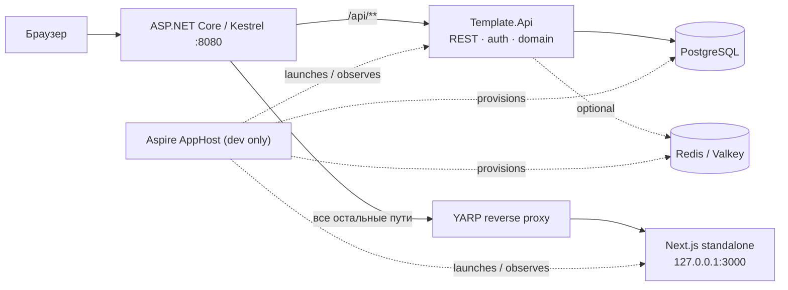

# Поэтапная миграция: Next.js template → ASP.NET Core 10 API + Next.js UI

**Статус:** активная дорожная карта.
**Текущая итерация:** 5 — organizations, membership и onboarding (функциональный scope завершён 2026-07-30; deterministic acceptance пройдена).
**Принцип:** это план серии независимых итераций, а не задача на единоразовый перенос всего приложения.

## 1. Границы и зафиксированные решения

- `template/` — неизменяемый референс прежнего full-stack Next.js приложения. Его можно читать, искать и сравнивать с ним поведение, но нельзя редактировать, перемещать или использовать как рабочую часть нового приложения.
- Новая система стартует **с чистой базы и чистой аутентификации**: production-окружения, пользователей, OAuth-связок и данных для миграции нет.
- ASP.NET Core 10 владеет всеми маршрутами `/api/**`, бизнес-логикой, доступом к данным, аутентификацией и внешним API.
- Next.js остаётся UI-приложением. После миграции он не содержит серверных действий, Prisma, Better Auth или прямого доступа к БД; он общается с API по REST.
- Production будет одним контейнером приложения: Kestrel принимает внешний трафик, локально запущенный Next.js обслуживает UI, а reverse proxy в ASP.NET Core направляет не-API запросы во frontend.
- Aspire применяется только для локальной разработки, интеграционных проверок и наблюдаемости. Он не является production-рантаймом и не заменяет Docker-образ с двумя процессами.
- OpenSpec в корне только инициализирован. На этой итерации активные OpenSpec-изменения и спеки не создаются.

## 2. Целевая архитектура



### Backend

- **`Template.Domain`** — сущности, value objects, доменные правила и контракты без зависимостей от HTTP/EF Core.
- **`Template.Application`** — use cases, команды/запросы, DTO и интерфейсы портов.
- **`Template.Infrastructure`** — EF Core/PostgreSQL, Identity, OAuth-адаптеры, кэш, файловое хранилище и реализации портов.
- **`Template.Api`** — minimal APIs или endpoint-модули, REST-политику, auth middleware, OpenAPI, health/readiness и reverse proxy.

Зависимости направлены только внутрь: `Api → Application`, `Infrastructure → Application/Domain`, `Application → Domain`. Domain не зависит от остальных слоёв.

### Frontend

- Будущий код живёт в `apps/web` и сохраняет подход feature slices для UI.
- Серверный рендеринг Next.js допустим только для представления UI; запросы данных идут к REST API через типизированный клиент.
- Контракт API публикуется как OpenAPI. Из него генерируются TypeScript-типы/клиент в `contracts/` или внутри `apps/web`.
- Browser использует один origin. Сессионная cookie остаётся `HttpOnly` и не читается JavaScript; frontend не хранит bearer-token в `localStorage`.

## 3. Целевая структура репозитория

```text
.
├── AGENTS.md                         # правила новой кодовой базы
├── CLAUDE.md -> AGENTS.md             # единый набор инструкций для агентов
├── Template.sln                       # корневой Rider/.NET entry point
├── global.json                        # .NET 10 SDK baseline
├── Directory.Build.props              # общие свойства C#-проектов
├── Directory.Packages.props           # централизованные версии NuGet
├── apps/
│   ├── api/
│   │   ├── src/
│   │   │   ├── Template.Api/
│   │   │   ├── Template.Application/
│   │   │   ├── Template.Domain/
│   │   │   └── Template.Infrastructure/
│   │   └── tests/
│   │       └── Template.Api.Tests/
│   └── web/                           # создаётся как чистый Next.js UI в итерации 2
├── contracts/
│   └── openapi/                       # экспорт спецификаций и generation config
├── deploy/                            # Docker, entrypoint, reverse-proxy конфигурация
├── docs/
│   └── aspnetcore-migration-plan.md   # этот документ
├── openspec/                          # только инициализация на текущем этапе
├── orchestration/                     # будущий Aspire AppHost и ServiceDefaults
└── template/                          # immutable reference, не изменять
```

Префикс `Template` — техническое имя bootstrap-проектов. Если будет утверждено продуктовое имя, переименование solution и namespace делается отдельной малой итерацией до появления доменного кода.

## 4. Общий протокол каждой будущей итерации

Каждая строка из раздела 6 выполняется отдельной веткой/PR и заканчивается полностью проверяемым вертикальным срезом. Нельзя начинать перенос следующей предметной области только потому, что предыдущая «почти готова».

### Definition of Ready

Перед началом итерации исполнитель обязан:

1. Найти в `template/` исходные routes, feature-модули, Server Actions/API handlers, Prisma-модели, тесты и пользовательские документы, относящиеся к срезу.
2. Зафиксировать таблицу соответствий «reference → новый API → новый UI» в PR/плане итерации.
3. Согласовать REST-контракт, права доступа, коды ошибок, pagination/filtering и необходимость транзакций до начала UI-работы.
4. Определить, нужны ли schema migration, seed, cache invalidation, аудит и фоновые задачи.
5. Выбрать проверяемые сценарии из `template/e2e/` и `template/test/`, которые должны быть воспроизведены в новом API/UI.

### Definition of Done

Итерация завершена только если:

1. Новый код создан вне `template/`; reference не изменён.
2. API имеет контракт, авторизацию и валидацию на границе HTTP, а бизнес-правила покрыты unit/integration тестами.
3. OpenAPI обновлён, а TypeScript-клиент сгенерирован и использован UI без hand-written дублирования DTO.
4. Соответствующий UI-сценарий работает через REST, не использует Server Actions/Prisma/Better Auth и имеет E2E-проверку.
5. Обновлены документы пользователя, если изменился видимый сценарий, маршрут, разрешение или API.
6. Пройдены `dotnet test`, сборка UI, contract checks и выбранные E2E-тесты; результаты приложены к PR.
7. В migration register этой страницы отмечены перенесённые routes/сценарии и оставшиеся расхождения.

## 5. Реестр исходного функционала

| Исходная область в `template/`                          | Основные маршруты/контракты                                                                      | Целевой срез                                  |
| ------------------------------------------------------- | ------------------------------------------------------------------------------------------------ | --------------------------------------------- |
| `src/features/accounts`, Better Auth                    | `/auth/*`, `/user/*`, сессии, OAuth connections                                                  | Identity и account lifecycle                  |
| `src/features/organizations`, `src/features/workspaces` | `/workspaces`, `/w/[organizationKey]/*`, роли, members                                           | organizations, membership, teams, invitations |
| `src/features/api-keys`                                 | personal/organization API keys, `/api/v1/**`                                                     | machine API and API-key management            |
| `src/features/documents-system`                         | `/docs/**`, search, OG endpoint                                                                  | public documentation and search               |
| `src/features/application`, `dashboard`                 | app shell, dashboard, theme, navigation                                                          | shared UI shell and dashboard                 |
| `prisma/schema.prisma`                                  | User, Session, Account, Verification, Organization, Member, Team, TeamMember, Invitation, ApiKey | EF Core schema, Identity, domain model        |
| `src/app/api/**`, `src/proxy.ts`                        | health, auth, local automation, v1 endpoints, route protection                                   | API modules, auth policies, BFF/proxy rules   |
| `e2e/**`, `test/**`                                     | reference behavior and acceptance evidence                                                       | new .NET, contract and Playwright test suites |

## 6. Очередь итераций

Порядок ниже определяет зависимости. Каждая итерация — самостоятельная поставка; оценка и детальный технический план уточняются только перед её началом.

### Итерация 0 — Bootstrap репозитория

**Цель:** создать безопасную стартовую точку, не мигрируя продуктовый функционал.

**Состав:**

- перенести прежнее содержимое репозитория в `template/` через Git rename;
- создать новую корневую структуру и пустые будущие области;
- создать .NET 10 solution и минимальный API с `GET /api/health`;
- добавить единые инструкции агента, SDK/package conventions и этот документ;
- инициализировать OpenSpec без активной спеки.

**Вход:** repository с исходным Next.js template.
**Выход:** `dotnet build Template.sln` и `dotnet test Template.sln` проходят; `template/` не менялся после переноса.
**Не входит:** БД, authentication, Next.js UI, Docker, Aspire AppHost, перенесённые routes.

### Итерация 1 — API foundation и контрактная дисциплина

**Цель:** сделать API предсказуемой платформой до появления предметных endpoints.

**Состав:** ProblemDetails/error envelope, validation pipeline, API versioning policy, endpoint modules, OpenAPI document, auth/authorization extension points, structured logging, correlation IDs, health/readiness, integration-test fixture.

**Вход:** итерация 0.
**Выход:** один демонстрационный protected/unprotected endpoint подтверждает единый формат ошибок и OpenAPI; API contract можно экспортировать и проверять в CI.
**Зависимости:** нет продуктовых данных.

### Итерация 2 — Чистый Next.js UI foundation

**Цель:** отделить UI от бывшего full-stack Next.js runtime.

**Состав:** новый `apps/web`, TypeScript/Tailwind/shadcn baseline, i18n/theme/navigation primitives, REST client generation from OpenAPI, error/loading conventions, browser E2E harness. UI показывает health/API-status только как технический smoke scenario.

**Вход:** итерация 1.
**Выход:** `apps/web` собирается standalone, использует только generated REST client для данных и проходит smoke test против API.
**Не входит:** перенос страницы логина или продуктовых компонентов.

### Итерация 3 — Persistence, Identity и базовая аутентификация **(функциональный scope завершён; dev-tooling audit blocker зафиксирован)**

**Цель:** заменить Prisma/Better Auth новым источником правды без переноса старых записей.

**Состав:** PostgreSQL 18.4, EF Core migration, ASP.NET Core Identity Core, чистая схема пользователя/сессии, persistent `ITicketStore`, current-session/logout REST, secure HttpOnly same-origin cookie, explicit CSRF, local-only automation scenario/sign-in/cleanup, rate limits/lockout, database readiness, OpenAPI/generated SDK и login/dashboard UI.

**Вход:** итерации 1–2; `ConnectionStrings:Postgres` и environment/user-secrets conventions.
**Выход:** в opted-in Development/Test одна кнопка создаёт local credential user и persistent browser session; credentials позволяют automation-вход во вторую независимую сессию; logout/cleanup/current-session работают только через REST; Production password auth недоступен.
**Отложено:** внешний OAuth и account/session management — итерация 4; API keys/`x-api-key` — итерация 7; реальный Bearer требует отдельного issuer/consumer contract.

### Итерация 4 — Accounts и внешний OAuth **(функциональный scope завершён; live authorization-screen smoke частичный; live callbacks не выполнялись)**

**Цель:** восстановить пользовательский lifecycle из `template/src/features/accounts`.

**Состав:** profile update; primary/secondary verified-email ownership;
active-session list with opaque cursor, revoke one/revoke all others; hard
account deletion; Google/GitHub/GitLab/VK/Yandex sign-in and
connect/disconnect; OpenIddict Client state/replay protection; PostgreSQL Data
Protection key ring with mandatory production RSA PFX; REST/OpenAPI/generated
SDK; `/auth/login`, `/auth/error` and `/user/{profile,connections,security,danger}`;
deterministic callback/browser E2E and opt-in authorization-screen smoke.

**Вход:** итерация 3.
**Выход:** согласованный lifecycle `/user/*` работает через REST без Better
Auth; browser auth остаётся secure HttpOnly cookie; mutations защищены CSRF,
authorization и safe audit telemetry; provider tokens не сохраняются.
Production password lifecycle намеренно не перенесён. Детерминированные
callbacks проверены fake-provider integration tests; live успешный callback не
выполнялся и не заявляется.
**Reference:** `template/src/features/accounts`, `template/src/app/(protected)/(global)/user/**`.

### Итерация 5 — Organizations, membership и onboarding **(функциональный scope завершён 2026-07-30)**

**Цель:** перенести core workspace behavior с новыми явными domain boundaries.

**Состав:** Organization, membership, roles/permissions, active organization context, create/update/delete organization, slug/key routing, zero-organization onboarding, users list, API and UI flows.

**Вход:** итерация 3; решения о role model и organization identifiers.
**Выход:** пользователь может создать/select organization и управлять членами в пределах разрешений; маршруты `/workspaces` и `/w/[organizationKey]/**` работают через API.
**Reference:** `template/src/features/organizations`, `template/src/features/workspaces` (organization-related actions and repositories).

### Итерация 6 — Teams и invitations

**Цель:** восстановить collaboration workflows как отдельный вертикальный срез.

**Состав:** teams, team membership, invitations, accept/reject lifecycle, role changes, invitation security/expiry, notifications/email adapter boundary, settings UI and E2E coverage.

**Вход:** итерация 5.
**Выход:** owner/admin может приглашать и управлять member/team composition с теми же видимыми правилами, что зафиксированы в reference tests.
**Reference:** `template/src/features/workspaces/actions/*invitation*`, `*team*`, `template/e2e/specs/workspace-*`.

### Итерация 7 — API keys и public `/api/v1`

**Цель:** отделить machine-to-machine API от browser session и воспроизвести существующую внешнюю поверхность осознанно.

**Состав:** secure key generation/storage/hash/reveal-once, scopes/permissions, personal and organization keys, revoke/rotate, API-key authentication handler, rate limiting/audit, versioned v1 endpoints, OpenAPI consumer documentation and contract tests.

**Вход:** итерации 3, 5 и при необходимости 6.
**Выход:** все поддерживаемые `/api/v1/**` scenarios проходят без cookie, а management UI работает через session-authenticated REST endpoints.
**Reference:** `template/src/features/api-keys`, `template/src/app/api/v1/**`.

### Итерация 8 — Public documentation system

**Цель:** перенести documentation surface и поиск, не смешивая его с account/workspace доменом.

**Состав:** MD/MDX content pipeline в `apps/web`, locale-aware rendering, documentation navigation, search API/indexing boundary, OG metadata route, publication state and link validation.

**Вход:** итерация 2; решение, где хранятся и индексируются documents.
**Выход:** `/docs/**` и public search воспроизводят нужные published страницы и локали; content validation включена в CI.
**Reference:** `template/src/features/documents-system`, `template/src/app/(public)/(documents-system)/docs/**`.

### Итерация 9 — Application shell, dashboard и frontend parity

**Цель:** закончить общие UI composition patterns и удалить остаточные зависимости нового UI от reference assumptions.

**Состав:** protected shell, sidebar, dashboard, settings navigation, responsive states, theme, localization messages, metadata, error/loading pages, route-by-route visual/behavioral parity review.

**Вход:** итерации 4–8 для соответствующих data sources.
**Выход:** все нужные UI routes работают с уже мигрированными API modules; нет Server Actions, Prisma или Better Auth в `apps/web`.
**Reference:** `template/src/features/application`, `template/src/features/dashboard`, `template/src/messages/**`.

### Итерация 10 — Aspire и локальная интеграционная среда

**Цель:** ускорить разработку и сделать локальный distributed application наблюдаемым.

**Состав:** `orchestration/` AppHost and ServiceDefaults, PostgreSQL/Redis resources, API and frontend launch wiring, OpenTelemetry dashboard, service discovery/configuration, local secrets and seeded developer data.

**Вход:** independently runnable API, Next.js UI, PostgreSQL; Redis only if a migrated slice needs it.
**Выход:** одна команда поднимает полный local stack с logs/traces/health. `AddNextJsApp` или custom executable integration выбирается после проверки актуальной версии Aspire и стабильности API.
**Не входит:** production hosting through Aspire.

### Итерация 11 — Один production container и reverse proxy

**Цель:** реализовать обещанную topology без изменения клиентских URL.

**Состав:** multi-stage Dockerfile, `next build` standalone output, Kestrel host, YARP rules (`/api/**` local, остальные пути → `127.0.0.1:3000`), process supervisor/entrypoint, signal handling, log streams, health/readiness probes, static assets and websocket/streaming validation.

**Вход:** итерации 2, 3 и минимум один migrated protected UI slice.
**Выход:** один image запускает оба процесса, браузер использует один origin, `/api/health` и UI probes стабильно работают, а test deployment проходит end-to-end suite.
**Rollback:** предыдущий tagged image; DB changes выполняются backward-compatible миграциями из отдельных релизных шагов.

### Итерация 12 — Parity audit, hardening и архивирование reference

**Цель:** доказать product parity и принять отдельное решение о судьбе `template/`.

**Состав:** route inventory reconciliation, API contract diff, permissions/security review, performance/load checks, accessibility/SEO review, backup/restore drill, documentation audit, license/dependency review, final E2E matrix.

**Вход:** все выбранные feature slices и production topology.
**Выход:** signed-off matrix не содержит необъяснённых gaps; только после этого отдельным решением `template/` может остаться как archive или быть удалён из рабочей ветки.
**Важно:** эта итерация не удаляет `template/` автоматически.

## 7. Контроль качества и безопасность

- **Unit tests:** domain and application behavior; no HTTP/database unless the test is integration.
- **Integration tests:** `WebApplicationFactory`, PostgreSQL test resource/containers, EF migrations, auth handlers and endpoint contracts.
- **Contract tests:** OpenAPI validation plus generation check; breaking REST changes require explicit versioning/deprecation decision.
- **E2E tests:** Playwright against the single-origin host; reference `template/e2e/specs/` supplies scenarios, but new tests are created outside `template/`.
- **Security gates:** authorization by default, role/policy tests, antiforgery for cookie mutations, no browser bearer storage, secure API-key hashing, secret scanning, dependency updates.
- **Data gates:** every persistent change has EF migration, rollback/compatibility note, index review and a test for tenant/organization isolation.

## 8. Журнал выполнения

| Итерация                                           | Состояние | Примечание                                                                                                                                                                                                               |
| -------------------------------------------------- | --------- | ------------------------------------------------------------------------------------------------------------------------------------------------------------------------------------------------------------------------ |
| 0 — bootstrap                                      | Завершена | Reference перенесён, .NET 10 solution и health probe созданы; продуктовый код не переносился.                                                                                                                            |
| 1 — API foundation                                 | Завершена | Problem Details, validation, cookie auth boundary, correlation/logging, live/ready health, OpenAPI 3.1 export и integration contract tests приняты.                                                                      |
| 2 — чистый Next.js UI foundation                   | Завершена | Standalone Next.js, fixed en/ru locale, theme/navigation/boundaries, generated REST SDK, isolated browser/SSR clients and full-stack smoke приняты.                                                                      |
| 3 — persistence, Identity и базовая аутентификация | Завершена | PostgreSQL 18.4, EF migration, Identity Core, persistent cookie sessions, CSRF, typed local-identity validation, local credential automation и login/dashboard/logout REST slice приняты.                                |
| 4 — accounts и внешний OAuth                       | Завершена | Functional scope принят; five-provider OAuth/account lifecycle, verified emails, sessions, hard delete, Data Protection, REST/UI/E2E реализованы; live screen smoke частичный, callbacks не выполнялись.                 |
| 5 — organizations, membership и onboarding         | Завершена | REST/OpenAPI/SDK, EF schema, persistent active context, role-aware workspace UI и deterministic multi-user acceptance приняты; Teams/Invitations — iteration 6, API keys — iteration 7, product dashboard — iteration 9. |
| 6–12                                               | Не начаты | Следующий dependency gate — Teams и invitations; API keys и `x-api-key` остаются итерацией 7.                                                                                                                            |

## Acceptance evidence: итерация 1

**Scope:** только `Template.Api`, `Template.Api.Tests`, корневая dependency/build
configuration (`Directory.Packages.props`), `contracts/openapi` и документация
(включая корневой `AGENTS.md`). `Template.Domain`, `Template.Application`,
`Template.Infrastructure`, `apps/web` и persistent schema не менялись.

| Reference                                                                      | Новый API                                              | Новый UI          | Test/evidence                                                                     |
| ------------------------------------------------------------------------------ | ------------------------------------------------------ | ----------------- | --------------------------------------------------------------------------------- |
| `template/src/app/api/health/route.ts`, `template/e2e/support/config.ts`       | `/api/health`, `/api/health/live`, `/api/health/ready` | N/A до итерации 2 | `HealthEndpointTests`                                                             |
| `template/src/features/routes.ts`, `template/src/proxy.ts`                     | public status и protected authenticated probe          | N/A               | `SystemEndpointTests`, `ProblemDetailsTests`                                      |
| `template/src/lib/actions.ts`, `template/src/types/actions.ts`, API-key errors | `{ data }`, validation и RFC Problem Details           | N/A               | 400/401/403/404/405/500 и incompatible-`Accept` contract cases                    |
| `template/src/lib/logger.ts`                                                   | `ILogger`, correlation scope, completion events        | N/A               | `ObservabilityTests`, including correlation parity for handled 400/500 exceptions |
| reference API auth tests                                                       | cookie/policy extension points без API-key domain      | N/A               | test-only authentication and deny policy                                          |
| `template/prisma/schema.prisma`                                                | schema отсутствует в scope                             | N/A               | нет EF packages/migrations                                                        |

**Проверки 2026-07-23:**

| Команда                                                                 | Результат                                       |
| ----------------------------------------------------------------------- | ----------------------------------------------- |
| `dotnet restore Template.sln`                                           | PASS                                            |
| `dotnet build Template.sln --no-restore`                                | PASS                                            |
| `dotnet test Template.sln --no-restore`                                 | PASS; 35/35 tests                               |
| OpenAPI export with `-p:OpenApiGenerateDocuments=true`                  | PASS; deterministic `contracts/openapi/v1.json` |
| OpenAPI semantic drift test                                             | PASS                                            |
| `git diff --exit-code -- contracts/openapi/v1.json` after second export | PASS                                            |
| `git diff -- template/`                                                 | empty                                           |
| UI build / Playwright E2E                                               | N/A: `apps/web` starts in iteration 2           |

**Известные расхождения с reference:** ошибки используют RFC Problem Details
вместо `{ "error": ... }`; health использует `{ "data": ... }`; live/ready,
system probes, correlation ID и OpenAPI являются новой foundation surface.
Product routes, user session projection and UI parity intentionally remain
outside iteration 1.

**Следующий gate:** iteration 2 may consume `/api/v1/system/status` and the
committed OpenAPI document. Identity, issuing the cookie, and
`GET /api/v1/auth/session` remain blocked on iteration 3; no iteration-2 code
may simulate them with browser bearer storage or direct database access.

## Acceptance evidence: итерация 2

**Scope:** `apps/web`, `docs/web-conventions.md`, design
`docs/superpowers/specs/2026-07-23-nextjs-ui-foundation-design.md`, plan
`docs/superpowers/plans/2026-07-24-nextjs-ui-foundation.md`, этот migration plan
и реестр итераций. API source, persistent schema и `template/` не менялись.
Committed OpenAPI contract и generated SDK остались byte-identical после
экспорта и регенерации.

| Reference                                                                           | Новый API                                       | Новый UI                                              | Test/evidence                                       |
| ----------------------------------------------------------------------------------- | ----------------------------------------------- | ----------------------------------------------------- | --------------------------------------------------- |
| `template/src/app/layout.tsx`, `globals.css`, `app-providers.tsx`                   | N/A                                             | root layout, providers, Tailwind/shadcn tokens        | layout/component tests, standalone production build |
| `template/src/i18n/**`, `common.{en,ru}.json`                                       | N/A                                             | fixed deployment locale with common/system bundles    | locale fallback and bundle-shape tests              |
| `template/src/components/application/theme/theme-switcher.tsx`                      | N/A                                             | hydration-safe theme switcher                         | SSR markup, click, and keyboard E2E                 |
| `template/src/features/application/application-routes.ts`, public header primitives | N/A                                             | typed `/` and minimal header                          | route/header tests                                  |
| `template/src/app/api/health/route.ts`, `template/e2e/support/config.ts`            | existing `/api/health`, `/api/v1/system/status` | SSR and browser status regions over one generated SDK | adapter tests and full-stack Playwright             |
| `template/src/app/global-error.tsx`, `not-found.tsx`, error components              | existing RFC Problem Details                    | loading/error/not-found/global boundaries             | boundary and intercepted-error tests                |
| reference public home account/workspace loaders                                     | outside scope                                   | not copied                                            | source/dependency guard                             |
| all reference Prisma models                                                         | no schema change                                | no data access                                        | source/dependency guard                             |

**Проверки 2026-07-24 (fresh clean-lock acceptance, final-review refresh):**

Результаты web/npm ниже заново получены после final-review hardening и заменяют
раннее наблюдение о 10 уязвимостях после `npm ci`. .NET/OpenAPI evidence
сохранён без изменения из исходной acceptance-проверки: эти команды не
перезапускались в final-review fix wave.

| Команда                                                                                                              | Наблюдаемый результат                                                                                                                                                                                   |
| -------------------------------------------------------------------------------------------------------------------- | ------------------------------------------------------------------------------------------------------------------------------------------------------------------------------------------------------- |
| `dotnet restore Template.sln`                                                                                        | PASS; все проекты up-to-date                                                                                                                                                                            |
| `dotnet build Template.sln --no-restore`                                                                             | PASS; 0 warnings, 0 errors                                                                                                                                                                              |
| `dotnet test Template.sln --no-restore`                                                                              | PASS; 35/35 tests, 0 failed, 0 skipped                                                                                                                                                                  |
| `dotnet build apps/api/src/Template.Api/Template.Api.csproj --no-restore -p:OpenApiGenerateDocuments=true`           | PASS; OpenAPI export build, 0 warnings, 0 errors                                                                                                                                                        |
| `git diff --exit-code -- contracts/openapi/v1.json`                                                                  | PASS; empty                                                                                                                                                                                             |
| `npm ci`                                                                                                             | PASS; 978 packages added, 979 audited, 0 vulnerabilities                                                                                                                                                |
| `npm audit --json`                                                                                                   | PASS; 0 total vulnerabilities (0 info/low/moderate/high/critical)                                                                                                                                       |
| `npm audit --omit=dev --json`                                                                                        | PASS; production tree has 0 total vulnerabilities                                                                                                                                                       |
| `npm run audit:prod`                                                                                                 | PASS; `npm audit --omit=dev` reported 0 vulnerabilities                                                                                                                                                 |
| `npm ls next postcss sharp js-yaml @hono/node-server shadcn --all`                                                   | PASS; Next 16.2.11 resolves PostCSS 8.5.22 and sharp 0.35.3; JavaScript YAML 4 consumers resolve js-yaml 4.3.0; shadcn 4.14.1 is development-only and its MCP stack resolves `@hono/node-server` 2.0.11 |
| `npx --no-install shadcn --help` and `shadcn info`                                                                   | PASS; CLI loads, recognizes Next 16.2.11/Tailwind v4/radix-lyra, and finds the four installed primitives                                                                                                |
| MCP/Hono HTTP adapter probe                                                                                          | PASS; SDK `StreamableHTTPServerTransport` with Hono 2.0.11 returned the expected HTTP 406 negotiation response and terminated                                                                           |
| `npm run api:check`                                                                                                  | PASS; generated REST tree deterministic and current (4 files)                                                                                                                                           |
| `npm run boundaries:check`                                                                                           | PASS; focused Node tests 2/2 and dependency/source boundaries clean for all eight enabled JS/TS forms                                                                                                   |
| `npm run format:check`                                                                                               | PASS; all matched files use Prettier style                                                                                                                                                              |
| `npm run lint`                                                                                                       | PASS; ESLint exited 0                                                                                                                                                                                   |
| `npm run typecheck`                                                                                                  | PASS; Next route types generated and `tsc --noEmit` exited 0                                                                                                                                            |
| `npm test -- --runInBand`                                                                                            | PASS; 15/15 suites, 46/46 tests, 0 snapshots                                                                                                                                                            |
| `node -e "require('node:fs').rmSync('.next', { recursive: true, force: true })"`                                     | PASS; prior build output removed                                                                                                                                                                        |
| `env -u API_INTERNAL_BASE_URL -u API_PROXY_TARGET PUBLIC_DEFAULT_LOCALE=en npm run build`                            | PASS; Next.js 16.2.11 compiled and completed the production build without a live API                                                                                                                    |
| `test -f .next/standalone/server.js`                                                                                 | PASS; standalone artifact exists                                                                                                                                                                        |
| Standalone runtime probe on `127.0.0.1:3130`                                                                         | PASS; HTTP 200 and expected heading; listener terminated                                                                                                                                                |
| `npm run e2e:install`                                                                                                | PASS; Chromium installation gate exited 0                                                                                                                                                               |
| `npm run e2e`                                                                                                        | PASS; Playwright 3/3 tests in 11.0s; API and Next E2E listeners terminated                                                                                                                              |
| Generated TypeScript metadata check                                                                                  | PASS; `next-env.d.ts` and `tsconfig.tsbuildinfo` regenerated, remained ignored/untracked, and typecheck/dev/E2E/build did not change tracked state                                                      |
| `git diff --exit-code HEAD -- template contracts/openapi apps/api apps/web/src/lib/api/generated` (checked per path) | PASS; all protected/reference/contract/API/generated trees empty                                                                                                                                        |

Final review originally identified `@hono/node-server` 2.0.5 as a patched
candidate, but the live audit now marks 2.0.0–2.0.9 vulnerable; exact 2.0.11 was
therefore selected and validated instead. The exact override policy and removal
gate are recorded in `docs/web-conventions.md`.

**Intentional differences from reference:** новый `/` — техническая smoke home,
а не product landing; data flow использует generated ASP.NET REST SDK вместо
Server Actions; failures используют RFC Problem Details; язык deployment
фиксирован через `PUBLIC_DEFAULT_LOCALE` (`en`/`ru`) и switcher отсутствует.
Authentication, account/workspace/product data и соответствующий UI не
переносились.

Browser обращается к `/api/**` same-origin с `credentials: "same-origin"`;
SSR использует только server-side absolute `API_INTERNAL_BASE_URL`. В dev/E2E
внешний Next rewrite включается через `API_PROXY_TARGET`, но это не production
proxy: конечная production topology с Kestrel/YARP остаётся отдельной итерацией.

В этом срезе нет данных, schema migrations, транзакций или pagination.
**Gate итерации 3:** PostgreSQL, EF Core migrations, ASP.NET Core Identity,
register/login/logout/current-user, выдача secure HttpOnly same-origin cookie и
antiforgery. До него persistence, Identity, cookie issuance, account/workspace/
product UI и auth-dependent parity остаются известными gaps.

## Acceptance evidence: итерация 3

**Scope:** `Template.Domain`, `Template.Application`,
`Template.Infrastructure`, `Template.Api`, Application/API integration tests и
`Template.E2EHost` как non-hosting E2E orchestrator; initial EF migration чистой
PostgreSQL `auth` schema;
OpenAPI и generated TypeScript SDK; `/auth/login` и временный `/dashboard`;
Jest/Testcontainers/Playwright acceptance; operations, API, web и migration
documentation. `template/` не менялся, Prisma/Better Auth data не переносились,
активный OpenSpec change/spec не создавался.

**Состояние:** функциональный scope реализован и повторно проверен. Полный
dev-dependency audit сейчас остаётся внешним blocker: опубликованный 2026-07-23
и обновлённый 2026-07-24 `GHSA-mh99-v99m-4gvg` помечает транзитивные ветви
ESLint/Jest, для которых
стабильные upstream-пакеты ещё не выпустили совместимый patched путь. Это не
ослабляет gate: мажорные несовместимые overrides намеренно не подменяются;
production dependency tree при этом остаётся без findings. Подробное решение и
повторная проверка зафиксированы в `docs/web-conventions.md` и финальной
матрице ниже.

| Reference                                                            | Новый API/данные                                             | Новый UI                                | Test/evidence                                                       |
| -------------------------------------------------------------------- | ------------------------------------------------------------ | --------------------------------------- | ------------------------------------------------------------------- |
| `prisma/schema.prisma`: `User`, `Session`, `Account`, `Verification` | Identity users/logins/tokens plus persistent session tickets | N/A                                     | migration, indexes, uniqueness and cascade tests against PostgreSQL |
| `src/server/auth.ts`, `/api/auth/[...all]` session lookup            | `GET /api/v1/auth/session`                                   | protected `/dashboard` session proof    | anonymous/authenticated API and Playwright cases                    |
| Better Auth `signOut`                                                | `POST /api/v1/auth/logout`                                   | logout control                          | current-session removal, cookie expiry and browser redirect         |
| `POST /api/local-auth/scenario`                                      | same route with new envelope/Problem Details                 | one-click automation panel              | API, component and E2E create cases                                 |
| `/api/auth/sign-in/email`                                            | `POST /api/local-auth/sign-in`                               | no visible form; automation helper only | second-browser-context sign-in                                      |
| `DELETE /api/local-auth/scenario`                                    | same route; user/session cleanup                             | no product control; E2E helper only     | local-user authorization and cross-context invalidation             |
| `/auth/login`, `LoginForm`, local automation panel                   | capabilities/session REST composition                        | reference-like `/auth/login`            | capability, rendering, navigation and failure tests                 |
| `proxy.ts` protected-page redirect                                   | session projection remains API-owned                         | `/dashboard` server-side auth gate      | safe redirect and anonymous navigation E2E                          |
| account session list/revoke actions and tests                        | persistent-session foundation only                           | no `/user/security`                     | explicitly deferred to iteration 4                                  |
| API key auth and `/api/v1/**` reference tests                        | no runtime implementation                                    | none                                    | future policies cannot be accidentally satisfied by browser cookie  |

**Проверки 2026-07-24 (fresh full matrix):**

Integration and E2E fixtures used disposable Testcontainers databases from
PostgreSQL image `postgres:18.4`. EF design-time commands intentionally use
`Template.Infrastructure.csproj` as both project and startup project because
its factory owns the private EF Design package; `Template.Api` remains the only
HTTP host.

| Команда                                                                                                                                                                                                                                                                           | Наблюдаемый результат                                                                                                                                                                                                                               |
| --------------------------------------------------------------------------------------------------------------------------------------------------------------------------------------------------------------------------------------------------------------------------------- | --------------------------------------------------------------------------------------------------------------------------------------------------------------------------------------------------------------------------------------------------- |
| `dotnet tool restore`                                                                                                                                                                                                                                                             | PASS; `dotnet-ef` 10.0.10 restored                                                                                                                                                                                                                  |
| `dotnet restore Template.sln`                                                                                                                                                                                                                                                     | PASS; all projects up-to-date                                                                                                                                                                                                                       |
| `dotnet build Template.sln --no-restore`                                                                                                                                                                                                                                          | PASS; 0 warnings, 0 errors                                                                                                                                                                                                                          |
| `dotnet test Template.sln --no-restore`                                                                                                                                                                                                                                           | PASS; Application 17/17 and API 93/93: 110/110 total, 0 failed, 0 skipped                                                                                                                                                                           |
| `dotnet build apps/api/src/Template.Api/Template.Api.csproj --no-restore -p:OpenApiGenerateDocuments=true`                                                                                                                                                                        | PASS; OpenAPI 3.1 export build, 0 warnings, 0 errors                                                                                                                                                                                                |
| `git diff --exit-code -- contracts/openapi/v1.json`                                                                                                                                                                                                                               | PASS; empty after export                                                                                                                                                                                                                            |
| `dotnet ef migrations has-pending-model-changes --project apps/api/src/Template.Infrastructure/Template.Infrastructure.csproj --startup-project apps/api/src/Template.Infrastructure/Template.Infrastructure.csproj --context AuthDbContext`                                      | PASS; no model changes since the migration                                                                                                                                                                                                          |
| `dotnet ef migrations script --idempotent --project apps/api/src/Template.Infrastructure/Template.Infrastructure.csproj --startup-project apps/api/src/Template.Infrastructure/Template.Infrastructure.csproj --context AuthDbContext --output /tmp/template-auth-idempotent.sql` | PASS; design-time build succeeded                                                                                                                                                                                                                   |
| `test -s /tmp/template-auth-idempotent.sql`                                                                                                                                                                                                                                       | PASS; non-empty, 6,199 bytes and 172 lines                                                                                                                                                                                                          |
| `cd apps/web`                                                                                                                                                                                                                                                                     | PASS; subsequent npm commands ran from `apps/web`                                                                                                                                                                                                   |
| `npm ci`                                                                                                                                                                                                                                                                          | PASS; 978 packages added, 979 audited, 0 vulnerabilities                                                                                                                                                                                            |
| `npm audit --json`                                                                                                                                                                                                                                                                | PASS; 0 info, 0 low, 0 moderate, 0 high, 0 critical, 0 total findings                                                                                                                                                                               |
| `npm run audit:prod`                                                                                                                                                                                                                                                              | PASS; production audit found 0 vulnerabilities                                                                                                                                                                                                      |
| `npm run api:check`                                                                                                                                                                                                                                                               | PASS; generated SDK deterministic and current, 4 files                                                                                                                                                                                              |
| `npm run boundaries:check`                                                                                                                                                                                                                                                        | PASS; 3/3 focused boundary tests and source/dependency guard                                                                                                                                                                                        |
| `npm run format:check`                                                                                                                                                                                                                                                            | PASS; all matched files use Prettier style                                                                                                                                                                                                          |
| `npm run lint`                                                                                                                                                                                                                                                                    | PASS; ESLint exited 0                                                                                                                                                                                                                               |
| `npm run typecheck`                                                                                                                                                                                                                                                               | PASS; route types generated and `tsc --noEmit` exited 0                                                                                                                                                                                             |
| `npm test -- --runInBand`                                                                                                                                                                                                                                                         | PASS; Jest 23/23 suites, 91/91 tests, 0 snapshots                                                                                                                                                                                                   |
| clean `.next` before the production build                                                                                                                                                                                                                                         | PASS; the Codex command policy rejected literal `rm -rf .next` before process launch, so the approved non-shell equivalent `node -e "require('node:fs').rmSync('.next', { recursive: true, force: true })"` removed it and `test ! -e .next` passed |
| `env -u API_INTERNAL_BASE_URL -u API_PROXY_TARGET PUBLIC_DEFAULT_LOCALE=en npm run build`                                                                                                                                                                                         | PASS; Next.js 16.2.11 production build completed without API/database configuration                                                                                                                                                                 |
| `test -f .next/standalone/server.js`                                                                                                                                                                                                                                              | PASS; standalone artifact exists                                                                                                                                                                                                                    |
| `npm run e2e:install`                                                                                                                                                                                                                                                             | PASS; Chromium installation gate exited 0                                                                                                                                                                                                           |
| `npm run e2e`                                                                                                                                                                                                                                                                     | PASS; Playwright 4/4 tests in 13.0s                                                                                                                                                                                                                 |
| `cd ../..`                                                                                                                                                                                                                                                                        | PASS; repository-root guards ran from the root                                                                                                                                                                                                      |
| `git diff --check`                                                                                                                                                                                                                                                                | PASS; no whitespace errors                                                                                                                                                                                                                          |
| `git diff --exit-code -- template/`                                                                                                                                                                                                                                               | PASS; working-tree reference diff empty                                                                                                                                                                                                             |
| `git diff --exit-code origin/main...HEAD -- template/`                                                                                                                                                                                                                            | PASS; branch-range reference diff empty                                                                                                                                                                                                             |
| `git status --short`                                                                                                                                                                                                                                                              | PASS; clean before evidence editing; final documentation pass contained only the four Task 15 docs                                                                                                                                                  |

**Post-review repairs 2026-07-24:** the final whole-branch audit added explicit
regressions for cookie-bearing liveness, SSR/browser sliding renewal, required
local credentials, and unsafe-operation `400` variants. The subsequent SSR
capability repair isolated anonymous capabilities from the browser cookie and
aligned the optional scenario request body, manual JSON reader, OpenAPI, and
generated SDK. The final strict-boundary repair rejects malformed UTF-8 before
JSON validation, publishes the normalized scenario-name/email constraints,
regenerates the SDK, and rejects case variants of protected `/api/**` and
`/auth/**` redirect targets. The final Identity-result classification repair
preserves the approved local namespace while classifying only non-empty,
homogeneous built-in Identity result sets: duplicate-only codes retain `409`,
and recognized input-validation-only codes use the transactional
`400 validation_failed` path. Unknown/custom codes and mixed categories,
including duplicate plus custom, remain non-disclosing `500 internal_error`
failures with no persisted user/session or issued cookie.

| Команда                                                                                                                                                                                                                                                                                                                                                                           | Наблюдаемый результат                                                                                                                                                   |
| --------------------------------------------------------------------------------------------------------------------------------------------------------------------------------------------------------------------------------------------------------------------------------------------------------------------------------------------------------------------------------- | ----------------------------------------------------------------------------------------------------------------------------------------------------------------------- |
| focused API health/sliding/OpenAPI RED                                                                                                                                                                                                                                                                                                                                            | FAIL as intended: 4/4 new regressions exposed ticket-store liveness access, invisible SSR renewal, and contract drift                                                   |
| focused Jest RED                                                                                                                                                                                                                                                                                                                                                                  | FAIL as intended: missing browser refresh plus SSR-marker and contract/SDK drift                                                                                        |
| focused SSR/API-body/OpenAPI RED                                                                                                                                                                                                                                                                                                                                                  | FAIL as intended: 3 failed and 28 passed; cookie-bearing capability reuse, runtime `415` for non-JSON auth bodies, and required scenario body were exposed              |
| focused SSR/generated-SDK Jest RED                                                                                                                                                                                                                                                                                                                                                | FAIL as intended: 3 failed and 5 passed; two direct contract/client failures plus one queued-mock cascade, which was removed by resetting the client mock between tests |
| `dotnet test apps/api/tests/Template.Api.Tests/Template.Api.Tests.csproj --no-restore --filter FullyQualifiedName~InvalidUtf8AuthJsonUsesStableInvalidRequest`                                                                                                                                                                                                                    | FAIL as intended: 2/2 malformed UTF-8 regressions returned `201`/`401` after replacement decoding rather than stable `400 invalid_request`                              |
| `dotnet test apps/api/tests/Template.Api.Tests/Template.Api.Tests.csproj --no-restore --filter FullyQualifiedName~ScenarioSchemaPublishesNormalizedInputConstraints`                                                                                                                                                                                                              | FAIL as intended: generated OpenAPI lacked the normalized scenario name/email constraints                                                                               |
| `npm test -- --runInBand test/features/sanitize-auth-redirect.test.ts -t "rejects case-variant protected path"`                                                                                                                                                                                                                                                                   | FAIL as intended: 4/4 case-variant `/api/**` and `/auth/**` targets remained redirectable                                                                               |
| `dotnet test apps/api/tests/Template.Api.Tests/Template.Api.Tests.csproj --no-restore --filter "FullyQualifiedName~AuthEndpointTests\|FullyQualifiedName~OpenApiContractTests"`                                                                                                                                                                                                   | PASS; 31/31 focused endpoint/OpenAPI tests                                                                                                                              |
| `npm test -- --runInBand test/lib/api/auth-api.test.ts test/contracts/generated-sdk.test.ts`                                                                                                                                                                                                                                                                                      | PASS; 2/2 suites and 8/8 focused SSR/SDK tests                                                                                                                          |
| `dotnet test apps/api/tests/Template.Api.Tests/Template.Api.Tests.csproj --no-restore --filter "FullyQualifiedName~HealthEndpointTests\|FullyQualifiedName~DatabaseReadinessTests\|FullyQualifiedName~BrowserSessionSlidingExpirationTests\|FullyQualifiedName~BrowserSessionCookieRotationTests\|FullyQualifiedName~AuthEndpointTests\|FullyQualifiedName~OpenApiContractTests"` | PASS; 48/48 focused API regressions                                                                                                                                     |
| focused strict UTF-8/normalized-contract API covering run                                                                                                                                                                                                                                                                                                                         | PASS; 6/6 focused malformed UTF-8, padded normalized runtime, OpenAPI, and committed-contract regressions                                                               |
| `npm test -- --runInBand test/features/sanitize-auth-redirect.test.ts`                                                                                                                                                                                                                                                                                                            | PASS; 30/30 redirect-policy tests                                                                                                                                       |
| `dotnet restore Template.sln && dotnet build Template.sln --no-restore && dotnet test Template.sln --no-restore`                                                                                                                                                                                                                                                                  | PASS; build 0 warnings/errors, Application 17/17 and API 110/110: 127/127 total                                                                                         |
| repeat OpenAPI export with `-p:OpenApiGenerateDocuments=true` and compare SHA-256                                                                                                                                                                                                                                                                                                 | PASS; deterministic OpenAPI 3.1 artifact, SHA-256 `0470424bdd4e1e942b5fddafd950f32b65321db7e35a45fd839fcf55896d80de`                                                    |
| `npm run api:check && npm run boundaries:check`                                                                                                                                                                                                                                                                                                                                   | PASS; deterministic generated SDK, 3/3 focused boundary tests, and clean dependency/source boundaries                                                                   |
| `npm run format:check && npm run lint && npm run typecheck && npm test -- --runInBand`                                                                                                                                                                                                                                                                                            | PASS; Prettier, ESLint, Next route generation, `tsc --noEmit`, Jest 24/24 suites and 98/98 tests                                                                        |
| targeted Prettier check for the updated durable Markdown files                                                                                                                                                                                                                                                                                                                    | PASS; `docs/api-conventions.md` and this migration plan use Prettier formatting                                                                                         |
| clean `.next`, `env -u API_INTERNAL_BASE_URL -u API_PROXY_TARGET PUBLIC_DEFAULT_LOCALE=en npm run build`, and standalone check                                                                                                                                                                                                                                                    | PASS; Next.js 16.2.11 production build and `.next/standalone/server.js`                                                                                                 |
| `npm run e2e`                                                                                                                                                                                                                                                                                                                                                                     | PASS; Playwright 4/4 tests                                                                                                                                              |
| `git diff --exit-code -- template/ && git diff --exit-code 9c39993 -- template/ && git diff --check`                                                                                                                                                                                                                                                                              | PASS; immutable reference and whitespace checks remained clean                                                                                                          |
| focused local Identity-validation Application/API RED                                                                                                                                                                                                                                                                                                                             | FAIL as intended: the typed condition was absent and actual `local-agent+foo!@local-agent.test` scenario creation returned `500 internal_error`                         |
| focused unknown Identity-result RED                                                                                                                                                                                                                                                                                                                                               | FAIL as intended: the injected custom validator code returned `400 validation_failed` rather than `500 internal_error`                                                  |
| focused mixed duplicate/custom Identity-result RED                                                                                                                                                                                                                                                                                                                                | FAIL as intended: a real API-host duplicate plus injected custom validator result returned `409 local_auth_user_exists` rather than `500 internal_error`                |
| focused local Identity-result GREEN and covering checks                                                                                                                                                                                                                                                                                                                           | PASS; recognized/default and injected/unknown 2/2; Application typed/duplicate 3/3; API creation/duplicate/unexpected 5/5                                               |
| final `dotnet restore Template.sln && dotnet build Template.sln --no-restore && dotnet test Template.sln --no-restore`                                                                                                                                                                                                                                                            | PASS; build 0 warnings/errors, Application 19/19 and API 112/112: 131/131 total                                                                                         |
| OpenAPI export, `npm --prefix apps/web run api:check`, targeted durable-doc Prettier, `git diff --check`, and working-tree/branch-range `template/` checks                                                                                                                                                                                                                        | PASS; contract/generated SDK unchanged, docs formatted, and immutable reference remained untouched                                                                      |
| focused mixed duplicate/custom API Identity regression                                                                                                                                                                                                                                                                                                                            | PASS; 1/1 returned non-disclosing `500`, issued no cookie, and preserved the seeded user with no session                                                                |
| covering endpoint and gateway Identity regressions                                                                                                                                                                                                                                                                                                                                | PASS; 34/34 preserved duplicate-only `409`, known-input `400`, and unexpected-result rollback                                                                           |
| final .NET verification after mixed-result repair                                                                                                                                                                                                                                                                                                                                 | PASS; build 0 warnings/errors, Application 19/19 and API 113/113: 132/132 total                                                                                         |

**Финальный refresh 2026-07-24:** эта матрица заменяет более ранние
same-date результаты там, где они расходятся. В частности, full npm audit
изменился после публикации нового advisory, без изменения application source или
lockfile.

| Команда / проверка                                                                                           | Наблюдаемый результат                                                                                                                                                                                                                                                                                                                                         |
| ------------------------------------------------------------------------------------------------------------ | ------------------------------------------------------------------------------------------------------------------------------------------------------------------------------------------------------------------------------------------------------------------------------------------------------------------------------------------------------------- |
| `dotnet tool restore`                                                                                        | PASS; `dotnet-ef` 10.0.10 restored                                                                                                                                                                                                                                                                                                                            |
| `dotnet restore Template.sln`                                                                                | PASS                                                                                                                                                                                                                                                                                                                                                          |
| `dotnet build Template.sln --no-restore`                                                                     | PASS; 0 warnings, 0 errors                                                                                                                                                                                                                                                                                                                                    |
| `dotnet test Template.sln --no-restore`                                                                      | PASS; Application 19/19 and API 113/113: 132/132 total                                                                                                                                                                                                                                                                                                        |
| OpenAPI export, committed-contract comparison, EF model-drift check and idempotent migration script          | PASS; `contracts/openapi/v1.json` SHA-256 `e319dd504210aa0eedabc8c710153e79f1f71fc9d320e5bdf449c44539f61a59`, no drift, script non-empty (6,199 bytes)                                                                                                                                                                                                        |
| `npm ci`                                                                                                     | PASS; 978 packages added; npm reported the currently known 26 high dev-only findings                                                                                                                                                                                                                                                                          |
| `npm audit --json`                                                                                           | **EXTERNAL BLOCKER**; 26 high, all dev-only transitive findings from `GHSA-mh99-v99m-4gvg` through the stable ESLint/Jest toolchain. `npm audit fix --dry-run --json` proposed 0 changes. `brace-expansion` 5.0.8 is the only published patched line; forcing it into old CJS `minimatch` consumers changes their callable API and is intentionally rejected. |
| `npm audit --omit=dev --json` and `npm run audit:prod`                                                       | PASS; 0 info/low/moderate/high/critical production findings                                                                                                                                                                                                                                                                                                   |
| `npm run api:check`, `npm run boundaries:check`, `npm run format:check`, `npm run lint`, `npm run typecheck` | PASS; generated SDK current, 3/3 boundary tests, formatting/lint/typecheck clean                                                                                                                                                                                                                                                                              |
| `npm test -- --runInBand`                                                                                    | PASS; 24/24 suites, 98/98 tests                                                                                                                                                                                                                                                                                                                               |
| clean `.next`, standalone build, `npm run e2e:install`, `npm run e2e`                                        | PASS; standalone server exists; Playwright 4/4                                                                                                                                                                                                                                                                                                                |
| `git diff --check`, working-tree and branch-range `template/` diffs                                          | PASS; whitespace clean and immutable reference untouched                                                                                                                                                                                                                                                                                                      |

**PR #4 review hardening 2026-07-25:** four unresolved review findings were
verified against the implementation and repaired without expanding iteration
scope. The API now consumes one originating client address only from the
trusted loopback Next.js proxy before auth rate limiting; browser session reads
complete a due sliding renewal before projecting timestamps; a definitively
invalid server-side ticket expires the corresponding browser cookie; and the
historically named `Template.E2EHost` now only orchestrates PostgreSQL and
launches `Template.Api`, which remains the sole HTTP host.

| Команда / проверка                                                                                           | Наблюдаемый результат                                                                                                                                                         |
| ------------------------------------------------------------------------------------------------------------ | ----------------------------------------------------------------------------------------------------------------------------------------------------------------------------- |
| focused architecture, stale-cookie, proxy-partition, renewal-projection and E2E-boundary RED tests           | FAIL as intended; each regression exposed the reviewed behavior before production changes                                                                                     |
| focused covering API run                                                                                     | PASS; 33/33 architecture, HTTP-boundary, ticket-store, cookie-rotation, cleanup and sliding-renewal tests                                                                     |
| changed-file `dotnet format --verify-no-changes`                                                             | PASS; every changed C# file uses configured formatting                                                                                                                        |
| `dotnet restore Template.sln`                                                                                | PASS; all seven solution projects restored or up-to-date                                                                                                                      |
| `dotnet build Template.sln --no-restore`                                                                     | PASS; 0 warnings, 0 errors                                                                                                                                                    |
| `dotnet test Template.sln --no-restore`                                                                      | PASS; Application 19/19 and API 117/117: 136/136 total                                                                                                                        |
| OpenAPI export build and `git diff --exit-code -- contracts/openapi/v1.json`                                 | PASS; build 0 warnings/errors and committed OpenAPI contract unchanged                                                                                                        |
| `npm ci`                                                                                                     | PASS; 978 packages added; reproduced the already documented 26 high dev-only findings                                                                                         |
| `npm run api:check`, `npm run boundaries:check`, `npm run format:check`, `npm run lint`, `npm run typecheck` | PASS; generated SDK deterministic, 3/3 boundary tests, formatting, lint and typecheck clean                                                                                   |
| `npm test -- --runInBand`                                                                                    | PASS; 24/24 suites and 98/98 tests                                                                                                                                            |
| `npm run e2e`                                                                                                | PASS; Playwright 4/4 in 20.5s; the orchestration process, child API, Next listener and disposable database terminated, leaving no listener on the configured API or web ports |

**PR #4 dashboard-renewal follow-up 2026-07-26:** the browser-owned session
read now applies a successful sliding-renewal result to the visible dashboard
through an App Router refresh. The refreshed Server Component performs its
uncached, renewal-suppressed read and projects the timestamps already committed
by the browser request; failed browser reads do not trigger a route refresh.

| Команда / проверка                                                                      | Наблюдаемый результат                                                                          |
| --------------------------------------------------------------------------------------- | ---------------------------------------------------------------------------------------------- |
| focused `browser-session-refresh` Jest RED                                              | FAIL as intended; the successful API response was discarded and `router.refresh()` had 0 calls |
| `npm test -- --runInBand test/components/browser-session-refresh.test.tsx`              | PASS; 2/2 success and failure-path component tests                                             |
| `npm ci`                                                                                | PASS; 978 packages added; reproduced the already documented 26 high dev-only findings          |
| `npm run boundaries:check`, `npm run format:check`, `npm run lint`, `npm run typecheck` | PASS; 3/3 boundary tests, formatting, lint and generated-route/type checks clean               |
| `npm test -- --runInBand`                                                               | PASS; 24/24 suites and 99/99 tests                                                             |
| `npm run build`                                                                         | PASS; Next.js 16.2.11 production build completed with `/`, `/auth/login`, and `/dashboard`     |
| `npm run e2e`                                                                           | PASS; Playwright 4/4 in 15.4s                                                                  |

`Template.Session.Selector` is the default authenticate scheme: it forwards
ordinary paths to the primary `Template.Session` handler and the canonical
liveness path plus its route-equivalent trailing-slash form to the process-only
no-result handler. The primary remains the default challenge, forbid, and
sign-out scheme and the sole scheme named by `Api.BrowserSession`; the internal
write-only issuer is `Template.Session.Issuer`. Both cookie handlers use the
same cookie/ticket-store format and Data Protection purpose for safe session
replacement and key rotation. Only `cookieAuth` is advertised in OpenAPI.
There is no Bearer or API-key runtime.

**Intentional differences from reference на момент acceptance итерации 3:**

- success uses the typed `{ "data": ... }` envelope and failures use RFC
  Problem Details with stable `code`/`traceId`;
- production password login is absent; the two-part-gated credential flow is
  local automation only;
- social/external login is deferred to iteration 4;
- persistence starts from a clean Identity Core `auth` schema rather than
  migrating Prisma/Better Auth records;
- `/dashboard` is a temporary session proof, not the product dashboard;
- cleanup reports zero deleted organizations because organization persistence
  starts in iteration 5;
- PostgreSQL tickets are authoritative and no session JWT cache exists;
- API-key/`x-api-key` remains iteration 7 and no API-key or Bearer scheme is
  registered.

**Исторический gate после итерации 3 закрыт:** provider set/callbacks,
email-verification mapping, persistent/encrypted Data Protection keys и точный
account/session scope были согласованы и реализованы в итерации 4 ниже.
Production password login остаётся намеренно недоступен; iteration-5/7 domains
не подтягивались вперёд.

Both immutable-reference checks were explicitly empty:
`git diff --exit-code -- template/` and
`git diff --exit-code origin/main...HEAD -- template/`.

## Acceptance evidence: итерация 4

**Scope:** account Domain/Application policies; additive EF account,
OpenIddict-state, Data Protection and session-method persistence; OpenIddict
Client for Google, GitHub, GitLab, VK and Yandex; versioned external-challenge
and account REST; stable unversioned protocol callbacks; OpenAPI/generated SDK;
external-login/error and protected account UI; Jest, PostgreSQL integration and
Playwright coverage; durable API/web/auth/migration documentation.
`template/` остался immutable. Prisma/Better Auth records, provider tokens и
secrets не переносились; активный OpenSpec change/spec не создавался.

**Состояние:** функциональный согласованный scope завершён 2026-07-29; live
authorization-screen smoke частичный, live callbacks не выполнялись.
Детерминированные callback/state/replay/provider-normalization сценарии
проверены integration tests; обычный full-stack E2E использует synthetic
provider configuration. Live authorization-screen smoke открыл официальные
hosts Google, GitHub и GitLab, не открыл его для Yandex в ограниченный timeout,
а VK был пропущен из-за incomplete local credential pair. Credentials не
отправлялись, callback не выполнялся, и live callback/login success не
заявляется.

### Реализованный contract и architecture

| Область            | Реализованное решение                                                                                                                                                                                                                                                               |
| ------------------ | ----------------------------------------------------------------------------------------------------------------------------------------------------------------------------------------------------------------------------------------------------------------------------------- |
| HTTP ownership     | ASP.NET Core остаётся единственным владельцем `/api/**`; Next.js использует generated REST SDK и не содержит Route Handlers, Server Actions, Prisma, Better Auth или direct database access                                                                                         |
| Browser auth       | только `__Host-template.session` secure HttpOnly same-origin cookie; no Bearer/browser token storage; все unsafe browser mutations и external challenge требуют fresh CSRF                                                                                                          |
| External start     | `POST /api/v1/auth/external/{provider}/challenge`; `signIn` только anonymous, `connect` только current session; unsafe path encodings fail closed while encoded query/fragment data survives; Production Google uses `prompt=select_account`                                        |
| Protocol callbacks | Google `/api/auth/callback/google`; GitHub `/api/auth/callback/github`; GitLab `/api/auth/callback/gitlab`; VK `/api/auth/callback/vk`; Yandex `/api/auth/oauth2/callback/yandex`; GET/POST, unversioned, excluded from OpenAPI/generated SDK                                       |
| Account REST       | `GET /account`, `PATCH /account/profile`, `GET/DELETE /account/connections`, `GET /account/sessions`, revoke one/others и `DELETE /account`, все под `/api/v1` и `Cache-Control: no-store`                                                                                          |
| Account UI         | `/user` → `/user/profile`; ровно Profile, Connections, Security, Danger; `/auth/error` отображает только allow-listed stable codes                                                                                                                                                  |
| Persistence        | global unique verified-email ownership, one primary/user, one provider/user, stable provider-subject ownership, anonymous implicit link only for a currently vouched email, relational session authentication method, OpenIddict client-state rows, PostgreSQL Data Protection keys |
| Layering           | Domain не зависит от HTTP/Infrastructure; Application владеет use cases/ports; Infrastructure реализует Identity/EF/OpenIddict; API валидирует/авторизует на boundary                                                                                                               |

Provider email mapping:

| Provider | Subject               | Email acceptance                                                        |
| -------- | --------------------- | ----------------------------------------------------------------------- |
| Google   | `sub`                 | ровно один `email_verified=true` и email                                |
| GitHub   | positive numeric `id` | ровно один primary+verified email из bounded `/user/emails` backchannel |
| GitLab   | `sub`                 | ровно один `email_verified=true` и email                                |
| VK       | `user_id`             | user-info email считается provider-confirmed по согласованной mapping   |
| Yandex   | string `id`           | `default_email` считается provider-confirmed по согласованной mapping   |

Anonymous sign-in с новым subject не создаёт duplicate user, если primary или
secondary normalized verified email уже принадлежит существующему user и хотя
бы один его remaining provider login всё ещё ссылается на этот exact email row.
Исторический primary email без текущего provider vouch не используется для
anonymous implicit linking и даёт email conflict. Explicit connect по-прежнему
может переиспользовать email текущего user или создать свободный secondary
email; чужой owner даёт conflict. Новая connection может обновить display
name/HTTPS avatar.

Для известного `(provider, subject)` changed email другого user даёт conflict
без перемещения login. Email того же user переиспользуется, а свободный
создаётся как secondary. Первый existing-login read блокирует actual
`(provider, subject)` row через `FOR UPDATE` и читает его текущий email в той же
authentication transaction. Поэтому ownership validation и reassociation
сериализуются от первого snapshot. Update path сохраняет defensive lock/reload,
а реально заменённый non-primary email удаляется только когда на него больше не
ссылается ни один login; primary/shared rows сохраняются. Повторный sign-in с
неизменным email обновляет только `lastUsedAt` и не применяет profile data
повторно. Connect, включая reassociation email, сохраняет прежний `lastUsedAt`.

Disconnect выполняется локально и атомарно. Он удаляет provider login и удаляет
его non-primary secondary email только когда ни одна remaining connection
больше не подтверждает этот row. Primary email сохраняется. Current provider не
отключается; после любого удаления должен остаться хотя бы один connected
provider с complete startup runtime configuration. Stored login
runtime-unconfigured provider остаётся видимым, но не считается usable
survivor. Один и тот же startup-stable configured set передаётся через
Application use-case/persistence port и проверяется под login locks без
Application → Infrastructure dependency. Provider-side consent/token не
отзывается, потому что provider access/refresh tokens нигде не сохраняются.
Production callback владеет mutable ephemeral token bag и очищает его в
`finally`; normalization дополнительно делает best-effort clear, если
`IReadOnlyDictionary` фактически mutable. Для immutable/read-only caller
остаётся владельцем cleanup.

OpenIddict state cleanup удаляет только expired/terminal redeemed records
bounded batches. Non-cancellation tick failure логируется без token material,
не останавливает hosted service и повторяется на следующем interval;
host-stop cancellation продолжает распространяться.

Session list сортируется `(lastSeenAt DESC, id DESC)`, default limit `20`,
границы `1..100`. Cursor — opaque versioned canonical base64url tuple с
checksum для format/corruption detection, а не MAC/authorization token.
Account listing не загружает protected ticket/hash. Single revoke использует
ownership-qualified delete и запрещает current id; revoke-others одним
set-based delete сохраняет current session.

После successful disconnect browser reload-ит и заменяет весь connections
projection через generated SDK, поэтому survivor-dependent permissions не
остаются stale. После revoke-others browser reload-ит fresh first session page
и сохраняет current session видимой, даже когда до mutation она не была
загружена.

External reconciliation использует одну transaction на попытку и один
bounded retry после classified unique race. Disconnect locks/revalidates
snapshot и rollback-ит login/email вместе. Hard delete commit-ит Identity user
transaction, database cascades удаляют verified emails, logins, Identity
children и все sessions, затем cookie expires. Organization/API-key cleanup
counts не фабрикуются, поскольку этих domains ещё нет.

External reconciliation commit-ится до того, как callback выпускает новую
provider-authenticated browser session для sign-in или rotates существующий
session principal для connect. Session issuance/rotation намеренно находится
вне account transaction.

Structured OAuth audit содержит только closed operation/provider, stable
outcome, correlation id и post-auth user id там, где он применим. Account audit
содержит closed operation, stable outcome, user id и optional closed provider
id или opaque session id; correlation приходит из существующего trace scope.
Оба контракта исключают email, subject, raw profile/provider error, code, state,
access/refresh token, cookie, protected ticket, lookup hash и credential
material. Производные metrics могут использовать только bounded
operation/outcome и closed provider labels; correlation/user/session ids не
являются metric labels. Отдельный metrics backend в итерации 4 не добавлен.

Data Protection key ring persist-ится в `auth.data_protection_keys` со stable
application discriminator `Template`. Production требует mounted RSA PFX path
и password, encrypts key XML at rest и fail-closed при invalid configuration.
Development может использовать shared database key ring без certificate.
Ignored `appsettings.Local.json` загружается последним только в Development,
имеет mode `0600`, не попадает в build/publish и вручную заполняется без runtime
чтения `template/.env`.

### Fresh verification 2026-07-30

| Команда / проверка                                                                                                                                                  | Наблюдаемый результат                                                                                                                                                                         |
| ------------------------------------------------------------------------------------------------------------------------------------------------------------------- | --------------------------------------------------------------------------------------------------------------------------------------------------------------------------------------------- |
| `dotnet restore Template.sln`                                                                                                                                       | PASS; все projects up-to-date                                                                                                                                                                 |
| `dotnet build Template.sln --no-restore`                                                                                                                            | PASS; 0 warnings, 0 errors                                                                                                                                                                    |
| `dotnet test Template.sln --no-restore`                                                                                                                             | PASS; Application 100/100, API 304/304, total 404/404, 0 failed/skipped; API suite применила migrations к disposable PostgreSQL и проверила transactions/state/Data Protection/callbacks      |
| `dotnet ef migrations has-pending-model-changes --project apps/api/src/Template.Infrastructure --startup-project apps/api/src/Template.Api --context AuthDbContext` | PASS; build succeeded, model changes отсутствуют                                                                                                                                              |
| exact OpenAPI export build, повторный export/hash и `git diff --exit-code -- contracts/openapi/v1.json`                                                             | PASS; 0 warnings/errors; SHA-256 до/после `05831e17145a9dcdb95cc725592ee45c6dff7ad8175997202102767c9de56cbb`; committed contract unchanged                                                    |
| `cd apps/web && npm run api:check`                                                                                                                                  | PASS; 4 generated files regenerated/byte-compared, SDK deterministic/current                                                                                                                  |
| clean `npm ci`                                                                                                                                                      | PASS; 978 packages added, 979 audited; reproduced known 26 high dev-only findings                                                                                                             |
| `npm audit --omit=dev`                                                                                                                                              | PASS; 0 production vulnerabilities                                                                                                                                                            |
| `npm audit --json`                                                                                                                                                  | expected external tooling blocker; 26 high, 0 other severities, all in documented development-only ESLint/Jest graph                                                                          |
| `dotnet list Template.sln package --vulnerable --include-transitive`                                                                                                | PASS; no vulnerable direct/transitive NuGet packages in seven projects                                                                                                                        |
| `npm run boundaries:check`                                                                                                                                          | PASS; 3/3 harness tests and full source/dependency scan                                                                                                                                       |
| `npm run format:check`, `npm run lint`, `npm run typecheck`                                                                                                         | PASS; Prettier, ESLint, Next route type generation and `tsc --noEmit`                                                                                                                         |
| `npm test -- --runInBand`                                                                                                                                           | PASS; Jest 34/34 suites, 162/162 tests, 0 snapshots                                                                                                                                           |
| clean `.next`; `env -u API_INTERNAL_BASE_URL -u API_PROXY_TARGET PUBLIC_DEFAULT_LOCALE=en npm run build`; standalone existence                                      | PASS; Next.js 16.2.11, 11/11 static generation units, all auth/account routes, `.next/standalone/server.js` present                                                                           |
| `npm run e2e`                                                                                                                                                       | PASS; 14 discovered, 9 deterministic passed, 5 opt-in live cases skipped, 0 failed                                                                                                            |
| exact local-value collision, private-key marker, runtime `template/.env`, ignored-overlay mode/artifact guards                                                      | PASS; 9 nonempty local OAuth values checked with values suppressed; no non-reference tracked collision/private key/runtime reference; local overlay ignored, `0600`, absent from build output |
| documentation Prettier, `git diff --check`, exact four-file scope, working-tree `template/` diff and `origin/main...HEAD -- template/`                              | PASS; docs formatted/whitespace-clean; only four durable docs changed before commit; immutable reference diffs empty                                                                          |

### PR #5 review round 1 verification 2026-07-30

Review hardening added deterministic coverage for cleanup tick failure
containment/cancellation, browser/API UTF-16 display-name parity, authoritative
post-disconnect and post-revoke-others reloads, Production-only Google account
selection, and safe encoded query/fragment OAuth return targets.

| Команда / проверка                                                                                                            | Наблюдаемый результат                                                                                                                                                                                    |
| ----------------------------------------------------------------------------------------------------------------------------- | -------------------------------------------------------------------------------------------------------------------------------------------------------------------------------------------------------- |
| focused API review regressions                                                                                                | PASS; 40/40 cleanup, return-target, Google challenge and provider-configuration tests                                                                                                                    |
| focused Jest account-component regressions                                                                                    | PASS; 24/24 profile, connections and sessions tests                                                                                                                                                      |
| `dotnet restore Template.sln`; `dotnet build Template.sln --no-restore`; `dotnet test Template.sln --no-restore`              | PASS; build 0 warnings/errors; Application 100/100, API 317/317, total 417/417                                                                                                                           |
| EF pending-model check and nonempty idempotent script                                                                         | PASS; no pending model changes; generated script 17,791 bytes                                                                                                                                            |
| two exact OpenAPI exports, hash comparison, committed-contract diff and `npm run api:check`                                   | PASS; both exports and committed artifact SHA-256 `05831e17145a9dcdb95cc725592ee45c6dff7ad8175997202102767c9de56cbb`; generated SDK deterministic/current                                                |
| clean `npm ci`; production/full npm audit; NuGet vulnerability audit                                                          | PASS production: 0 npm and 0 NuGet vulnerabilities; known full development audit remains 26 high and 0 other severities                                                                                  |
| `npm run boundaries:check`; web/docs Prettier; lint; typecheck; full Jest                                                     | PASS; boundaries harness 3/3; formatting/lint/types clean; Jest 34/34 suites, 167/167 tests                                                                                                              |
| clean production web build, standalone check and `npm run e2e`                                                                | PASS; Next.js 16.2.11 built 11/11 static generation units; standalone server present; Playwright 9 deterministic passed, 5 opt-in live skipped                                                           |
| credential collision, private-key marker, runtime `template/.env`, ignored overlay, whitespace and immutable-reference guards | PASS; 9 local values suppressed/no collision; no marker/runtime reference; overlay ignored, `0600`, absent from output; working-tree and `251382016e0534103443822dc5ca19d505877b32` template diffs empty |
| `dotnet format Template.sln --no-restore --verify-no-changes`                                                                 | pre-existing baseline blocker in unchanged `Template.Application.Tests/Accounts/ExternalIdentityServiceTests.cs:438`; all review-modified C# files pass the same scoped format guard                     |

### PR #5 review round 1b verification 2026-07-30

Partial-success recovery now distinguishes a committed account mutation from a
failed follow-up projection reload. Disconnect retains a conservative local
projection and recomputed survivor policy until generated-SDK retry succeeds.
Revoke-others suppresses stale rows and the normal empty state while first-page
recovery is pending, and retry never repeats either mutation.

| Команда / проверка                                                     | Наблюдаемый результат                                                                                                          |
| ---------------------------------------------------------------------- | ------------------------------------------------------------------------------------------------------------------------------ |
| deferred disconnect and revoke-others regressions                      | RED reproduced false mutation-failure copy and false session empty state; GREEN verifies conservative/pending state and retry  |
| focused account components plus en/ru path parity                      | PASS; 26/26 tests                                                                                                              |
| `npm run format:check`; `npm run lint`; `npm run typecheck`            | PASS                                                                                                                           |
| `npm run boundaries:check`                                             | PASS; harness 3/3 and generated-SDK/no-raw-transport source scan                                                               |
| `npm test -- --runInBand`                                              | PASS; Jest 34/34 suites, 169/169 tests                                                                                         |
| clean production `npm run build` and standalone existence              | PASS; Next.js 16.2.11, 11/11 static generation units, standalone server present                                                |
| .NET, EF and OpenAPI gates                                             | not rerun because round 1b changes only web/tests/docs; round 1 evidence above remains at 417/417 with deterministic contracts |
| documentation Prettier, `git diff --check` and both `template/` guards | PASS                                                                                                                           |

### PR #5 review round 2 verification 2026-07-30

Anonymous implicit linking now requires another login owned by the matched user
to reference the exact verified-email row. A retained historical primary email
without a current provider vouch returns the existing safe email-conflict
result; authenticated connect still reuses an email already owned by the
current user. Cookie-bearing account Server Component reads mark all three
account projections as non-renewing, so an internal API `Set-Cookie` cannot
silently extend only the PostgreSQL ticket. Unmarked browser GET requests keep
normal sliding expiration. The account-shell Suspense fallback is sourced from
the fixed en/ru message catalogue.

| Команда / проверка                                                               | Наблюдаемый результат                                                                                                                            |
| -------------------------------------------------------------------------------- | ------------------------------------------------------------------------------------------------------------------------------------------------ |
| stale-primary implicit-link regression                                           | RED linked a new anonymous subject through an unvouched historical primary; GREEN returns `external_email_conflict` without login/profile writes |
| marked account SSR renewal regressions                                           | RED emitted renewal cookies for profile, connections and sessions GET; GREEN preserves persisted timestamps and emits no session cookie          |
| account-shell locale regression                                                  | RED rendered English under the Russian catalogue; GREEN renders the localized fallback                                                           |
| `dotnet restore Template.sln`; `dotnet build Template.sln --no-restore`          | PASS; restore current; build has 0 warnings and 0 errors                                                                                         |
| `dotnet test Template.sln --no-restore`                                          | PASS; Application 101/101 and API 320/320                                                                                                        |
| `dotnet format Template.sln --no-restore --verify-no-changes`                    | PASS                                                                                                                                             |
| generated SDK check; Prettier; lint; typecheck; boundaries; full Jest            | PASS; deterministic SDK, harness 3/3, Jest 34/34 suites and 169/169 tests                                                                        |
| clean production `npm run build`; standalone check; deterministic Playwright E2E | PASS; Next.js 16.2.11 generated 11/11 units; standalone server present; Playwright 9 passed and 5 opt-in live-provider checks skipped            |
| `git diff --check` and both immutable `template/` guards                         | PASS                                                                                                                                             |

Live credentials were read only from the user-authorized ignored local JSON
into per-provider child-process environment in memory. Inherited
`ExternalAuthentication__*` values were scrubbed; only one complete pair ran at
a time; values and authorization query URLs were not printed or written.

| Provider | Live authorization-screen result                                                                                                                                   |
| -------- | ------------------------------------------------------------------------------------------------------------------------------------------------------------------ |
| Google   | PASS; official authorization host reached; callback not attempted                                                                                                  |
| GitHub   | PASS; official authorization host reached; callback not attempted                                                                                                  |
| GitLab   | PASS; official authorization host reached; callback not attempted                                                                                                  |
| VK       | **SKIP_INCOMPLETE**; local credential pair incomplete                                                                                                              |
| Yandex   | **FAIL_NOT_VERIFIED**; official host was not reached within the sanitized smoke timeout; local value/registration/provider/network cause intentionally not exposed |

### Intentional differences, known limitations, and next gate

- Reference implicit linking is disabled; the approved target intentionally
  enables linking by matching provider-confirmed normalized primary/secondary
  email.
- Target persists secondary verified emails; reference projects one user email.
- Production password registration/login/reset/change, 2FA, email delivery and
  manual verification are not implemented. Existing password flow is local
  automation only.
- Problem Details replaces Better Auth/Server Action error shapes. ASP.NET Core
  owns callbacks even though stable callback paths remain reference-compatible.
- Provider tokens, remote refresh/API calls and remote consent revocation are
  out of scope. The target stores only state-token bookkeeping. Immutable or
  read-only normalization callers retain in-memory token cleanup ownership;
  direct evidence for that caller contract is deferred.
- Invitations, organizations, teams and API keys are absent from account
  navigation and deletion until iterations 5–7. `/dashboard` remains the
  iteration-3 proof until iteration 9.
- KMS/Vault, certificate rotation orchestration, Redis, Aspire, YARP and final
  one-container topology remain later work.
- Full npm development audit remains blocked by the known 26-high upstream
  ESLint/Jest advisory graph; production npm and NuGet vulnerability gates are
  clean.
- Current readiness probes the required `auth.users` and
  `organizations.organizations` relations rather than the exact expected
  migration or Data Protection key table. Relative production certificate-path
  resolution is not specified; operators should use an explicit mounted path.
- The cursor checksum detects format/corruption but is not cryptographic
  tamper authorization. UI recovery after `invalid_cursor` retries the rejected
  cursor instead of refreshing page one.
- `VerifiedEmail` rejects an empty value, but its current Domain exception says
  only that email must contain at most 254 characters; validation-message
  precision is deferred.
- OpenAPI publishes the session `limit` min/max/default, but canonical
  cursor/`nextCursor` length/pattern and collection `maxItems` are not yet fully
  machine-readable.
- Direct PostgreSQL evidence remains incomplete for equal-`lastSeenAt`
  `id DESC` tie-breaking and several valid/foreign cursor boundary cases;
  ordering and validation are covered by the existing layers.
- Live Yandex authorization-host reachability and VK credential completeness
  remain external acceptance gaps. No successful live callback was attempted.

**Следующий product gate:** iteration 5 organizations, membership и onboarding:
согласовать organization identifiers, role/permission model, active
organization context, transaction/isolation rules и route/API contract. Перед
production deployment отдельно требуются operator secrets/PFX, exact provider
console callbacks, HTTPS same-origin/proxy configuration, backup/restore drill
и повторный provider smoke в целевой среде.

## Acceptance evidence: итерация 5

**Состояние:** functional scope завершён только после всех нижеследующих gates
2026-07-30. Новый код и документация находятся вне `template/`; обе проверки
immutable reference прошли.

### Reference → API → UI → test mapping

| Reference                                                             | Новый API                                                                                                                     | Новый UI                                                               | Test/evidence                                                                             |
| --------------------------------------------------------------------- | ----------------------------------------------------------------------------------------------------------------------------- | ---------------------------------------------------------------------- | ----------------------------------------------------------------------------------------- |
| `template/src/features/organizations`, workspace repositories/actions | `/api/v1/organizations`, detail-by-key, update/delete, active-session context                                                 | `/welcome`, `/workspaces`, `/dashboard`, `/w/[organizationKey]/**`     | organization Application/API tests; `organization-routing`; Playwright onboarding/routing |
| reference organization access guard and active-organization helper    | `POST /organizations` atomically creates/sets context; `GET .../by-key/{key}`, `PUT /api/v1/auth/session/active-organization` | canonical UUID→slug guard and explicit header switcher                 | API isolation/context tests; route/switcher Jest; organization E2E                        |
| workspace update/delete actions                                       | `PATCH`/`DELETE /api/v1/organizations/{id}`                                                                                   | workspace settings and exact-name delete dialog                        | persistence/concurrency/API tests; settings Jest; E2E last-workspace guard                |
| membership role/update actions                                        | member list, direct-add and role `PATCH` endpoints                                                                            | Users/roles settings, domain acknowledgement and read-only member view | membership/security tests; member Jest; multi-user E2E                                    |
| onboarding guard                                                      | paged accessible organization projection                                                                                      | zero-org `/welcome` and first-workspace create                         | route/component Jest and zero-org Playwright scenario                                     |

### Delivered contract, boundaries, and intentional differences

Organizations have UUID IDs and canonical non-UUID-shaped slugs in disjoint
namespaces. UUID keys resolve only by id, name generation prefixes a
UUID-shaped base, and both workspace-root and direct dashboard deep links
canonicalize to the slug UI route. The active organization is a nullable
FK-backed preference on the persistent `auth.sessions` row, not a ticket claim. `POST
/api/v1/organizations` atomically creates the organization and owner membership
and sets the actor's current session preference; `PUT
/api/v1/auth/session/active-organization` explicitly changes that preference
for an existing accessible organization. `DELETE /organizations/{id}` may clear
session preferences that reference the deleted organization through the FK
`SET NULL`; organization `PATCH` and membership mutations do not change active
context. The switcher persists an explicit routed selection whenever the
persistent session preference differs, so a later `/dashboard` resolves the
selection. Owner/admin/member is a closed role matrix: owner has all
organization/membership mutations, admin may update and assign member/admin roles,
and member is read-only; self edits, admin-to-owner mutation and loss of the last
owner are blocked. Missing and foreign resources share non-disclosing results.
Organization and member lists use opaque checksummed cursor continuation (`50`,
range `1..100`), not unbounded lists. `/workspaces` renders the authoritative
first page at its canonical URL and advances only through generated browser GETs;
refresh and old cursor bookmarks restart at page one without losing an
intermediate page from a misleading advanced URL.

The target intentionally strengthens the reference: checked single roles replace
CSV-compatible parsing, the active context has a real FK and transactional
create/update, collections are paged, locks/transactions prevent orphan owners,
and RFC Problem Details plus generated REST SDK replace Server Actions/Better
Auth shapes. The reference onboarding invitation CTA is intentionally omitted;
Teams and Invitations remain iteration 6. API Keys remain iteration 7. The
minimal organization context page is not the product dashboard, which remains
iteration 9.

Transactions serialize create through the actor, atomically create owner/context,
lock/recheck update/delete/member changes, use unique indexes for races, and
clear active FK references by `SET NULL`. Account deletion/local cleanup uses
the same transaction and lock order: delete sole-member organizations, remove
safe memberships, reject a sole owner of a multi-member organization, and return
the true cleanup count. Member-list reads use a non-locking repeatable-read
snapshot so concurrent GETs progress while delete/access races remain stable;
mutation locks remain unchanged. SSR organization projections suppress session
renewal; browser reads keep ordinary renewal. Client mutation recovery keeps
confirmed responses through a failed refresh and retries only the later GET.
Workspace settings validate the disjoint slug namespace before transport and
PATCH only normalized dirty fields against the latest confirmed response, so
stale administrators do not overwrite unrelated settings. Workspace list
reconciliation gives incoming server entries precedence over accumulated
duplicates while retaining confirmed deletion tombstones and local tail pages.
The account-deletion dialog gives localized promote/share-owner guidance only
for the exact ownership-transfer blocker and otherwise retains generic safe copy
plus any safe trace id.

### Final verification 2026-07-30

| Command / gate                                                       | Observed result                                                                                                                                                                 |
| -------------------------------------------------------------------- | ------------------------------------------------------------------------------------------------------------------------------------------------------------------------------- |
| `dotnet restore Template.sln`                                        | PASS; all projects up to date.                                                                                                                                                  |
| `dotnet build Template.sln --no-restore`                             | PASS; 0 warnings, 0 errors.                                                                                                                                                     |
| `dotnet test Template.sln --no-restore`                              | PASS; `Template.Application.Tests` 168/168, `Template.Api.Tests` 412/412; total 580/580, 0 failed/skipped.                                                                      |
| `dotnet format Template.sln --no-restore --verify-no-changes`        | PASS.                                                                                                                                                                           |
| EF pending-model command (`TemplateDbContext`)                       | PASS; “No changes have been made to the model since the last migration.”                                                                                                        |
| idempotent EF script + nonempty guard                                | PASS; `/tmp/template-iteration5-final.sql` is 22,799 bytes.                                                                                                                     |
| `dotnet list Template.sln package --vulnerable --include-transitive` | PASS; no vulnerable direct/transitive package in all 7 projects.                                                                                                                |
| two OpenAPI export builds + hash diff                                | PASS; 0 warnings/errors in both builds; deterministic SHA-256 `7f7088906c070f25d6067612ca5db24a705c2b0b0eaad12cd7d3fd5a6520b8d4`.                                               |
| `cd apps/web && npm run api:check`                                   | PASS; generated SDK reports 4 files and is deterministic/current.                                                                                                               |
| clean `npm ci`                                                       | PASS; 978 packages added, 979 audited; install reports the documented 26 high development-only findings.                                                                        |
| `npm audit --omit=dev`                                               | PASS; 0 production vulnerabilities.                                                                                                                                             |
| full `npm audit --json`                                              | Not clean by design: 26 high, 0 info/low/moderate/critical; development-only ESLint/Jest `minimatch`/`glob`/`brace-expansion` advisory graph.                                   |
| boundaries, Prettier, ESLint, typecheck                              | PASS; boundary harness 3/3, formatting/lint/types clean.                                                                                                                        |
| `npm test -- --runInBand`                                            | PASS; 51/51 suites, 319/319 tests, 0 snapshots.                                                                                                                                 |
| clean production build + standalone guard                            | PASS; Next.js 16.2.11; 19/19 static-generation units; `.next/standalone/server.js` exists.                                                                                      |
| `npm run e2e`                                                        | PASS; 12 passed, 5 opt-in live-provider tests skipped, 0 failed (17 discovered).                                                                                                |
| whitespace and reference guards                                      | PASS; `git diff --check`, `git diff --check origin/main...HEAD`, working-tree `template/`, `origin/main...HEAD -- template/`, and `git status --short -- template/` were empty. |

### PR #6 auto-review round 1 verification 2026-07-31

The four confirmed findings were repaired test-first without expanding iteration
5 scope. Slug and UUID namespaces are now disjoint across Domain, runtime,
OpenAPI, generated SDK, and store resolution. Member-list GETs use a non-locking
repeatable-read snapshot while mutation locks remain unchanged. Direct dashboard
deep links canonicalize after lookup. The account deletion UI maps only the
exact ownership-transfer Problem Details code to actionable localized guidance.
Task 14 final automatic-review steps remain pending until the controller pushes
this commit and receives the next review state.

| Command / gate                                                                                                        | Observed result                                                                                                               |
| --------------------------------------------------------------------------------------------------------------------- | ----------------------------------------------------------------------------------------------------------------------------- |
| finding 1 focused RED                                                                                                 | Expected 3 Domain failures plus store collision, HTTP 200-vs-400, and 3 OpenAPI contract failures                             |
| finding 1 focused GREEN                                                                                               | PASS; Domain 36/36 and API/store/contract 5/5                                                                                 |
| finding 2 focused RED                                                                                                 | Expected 3 integration failures: concurrent reads timed out and both delete/access races could not progress                   |
| finding 2 focused GREEN                                                                                               | PASS; 6/6 member-list pagination, exact-id, concurrency, and delete/access-race tests                                         |
| finding 3 focused RED → GREEN                                                                                         | Expected 2 dashboard canonicalization failures; then route suite PASS 23/23                                                   |
| finding 4 focused RED → GREEN                                                                                         | Expected component and i18n failures; then component/i18n suites PASS 17/17                                                   |
| consolidated focused Application/API/web                                                                              | PASS; organization Application 63/63, organization API/integration 80/80, route/account/i18n Jest 40/40                       |
| `dotnet restore Template.sln`                                                                                         | PASS; all projects up to date                                                                                                 |
| `dotnet build Template.sln --no-restore`                                                                              | PASS; 0 warnings, 0 errors                                                                                                    |
| `dotnet test Template.sln --no-restore`                                                                               | PASS; `Template.Application.Tests` 171/171, `Template.Api.Tests` 412/412; total 583/583, 0 failed/skipped                     |
| `dotnet format Template.sln --no-restore --verify-no-changes`                                                         | PASS                                                                                                                          |
| EF pending-model check and idempotent script                                                                          | PASS; no pending model changes; `/tmp/template-pr-review-round-1.sql` 22,799 bytes                                            |
| `dotnet list Template.sln package --vulnerable --include-transitive`                                                  | PASS; no vulnerable direct/transitive packages in all 7 projects                                                              |
| two OpenAPI export builds, SHA-256 comparison, and `npm run api:check`                                                | PASS; deterministic SHA-256 `dc2a10e2da80545c30e4e8db16bff86c3a285fc90da4abf1cb0c93fe4becc524`; generated SDK 4 files current |
| `npm audit --omit=dev`                                                                                                | PASS; 0 production vulnerabilities                                                                                            |
| boundaries, Prettier, ESLint, and typecheck                                                                           | PASS; boundary harness 3/3 and all source/format/type gates clean                                                             |
| `npm test -- --runInBand`                                                                                             | PASS; 51/51 suites, 322/322 tests, 0 snapshots                                                                                |
| clean production build and standalone guard                                                                           | PASS; Next.js 16.2.11, 19/19 static-generation units, `.next/standalone/server.js` exists                                     |
| focused `organizations.spec.ts account-settings.spec.ts account-security.spec.ts`                                     | PASS; 8/8 using 3 workers                                                                                                     |
| default full 5-worker `npm run e2e`                                                                                   | PASS; 12 passed, 5 opt-in live-provider tests skipped, 0 failed (17 discovered)                                               |
| final whitespace, generated-metadata, working-tree template, and `949a549... -- template/` immutable-reference guards | PASS; no whitespace errors, no generated metadata drift, and no `template/` changes (recorded after this evidence update)     |

### PR #6 auto-review round 2 verification 2026-07-31

All five confirmed UI findings were repaired test-first without adding a Route
Handler, Server Action, raw fetch, handwritten organization transport DTO, or
browser credential storage. Explicit deep-link selection now persists the active
preference; UUID-shaped slugs fail at the field boundary; `/workspaces`
continuations accumulate through the generated browser GET at a canonical URL;
settings PATCH contains only dirty fields and refreshes its response baseline;
and incoming list entries immediately replace stale identity/role/capability
duplicates. Task 14's final clean-review step remains pending until the controller
pushes this commit and receives the next automatic review state.

| Command / gate                                                        | Observed result                                                                                                                                                                                                     |
| --------------------------------------------------------------------- | ------------------------------------------------------------------------------------------------------------------------------------------------------------------------------------------------------------------- |
| five focused RED cycles                                               | Expected failures: routed-current selection skipped transport; UUID-shaped slug reached transport; stale cursor bookmark loaded only one continuation; PATCH sent all fields/no-op; incoming duplicate stayed stale |
| focused switcher/settings/list/route/i18n Jest                        | PASS; 5/5 suites, 68/68 tests                                                                                                                                                                                       |
| focused organization Playwright                                       | PASS after correcting the test's endpoint predicate; 5/5 scenarios, including deep-link selection, two-admin PATCH, and canonical three-page accumulation                                                           |
| `dotnet restore/build/test/format`                                    | PASS; build 0 warnings/errors; Application 171/171, API 412/412, total 583/583; format clean                                                                                                                        |
| two OpenAPI exports, committed-contract diff, and generated SDK check | PASS; deterministic SHA-256 `dc2a10e2da80545c30e4e8db16bff86c3a285fc90da4abf1cb0c93fe4becc524`; generated SDK 4 files current                                                                                       |
| boundaries, Prettier, ESLint, and typecheck                           | PASS; boundary harness 3/3 and all format/lint/type gates clean                                                                                                                                                     |
| `npm test -- --runInBand`                                             | PASS; 51/51 suites, 329/329 tests, 0 snapshots                                                                                                                                                                      |
| clean production build and standalone guard                           | PASS; Next.js 16.2.11, 19/19 static-generation units, `.next/standalone/server.js` exists                                                                                                                           |
| default full 5-worker E2E                                             | PASS; 14 passed, 5 opt-in live-provider tests skipped, 0 failed (19 discovered)                                                                                                                                     |

### PR #6 auto-review round 3 verification 2026-07-31

All four confirmed consistency findings were repaired test-first without
expanding iteration 5. Set-active no longer takes an exclusive organization
lock and maps only its exact deletion FK race to non-disclosing not-found.
Organization detail reads use one non-locking repeatable-read snapshot. Decoded
organization cursor names share the runtime Application name policy. One
fail-closed renewal component now belongs to the shared authenticated site
header guard; page-local dashboard copies are removed and the transient
`/dashboard` resolver defers to its protected destination. Task 14's final
clean-review step remains pending until the controller pushes this commit and
receives the next automatic review state.

| Command / gate                                                       | Observed result                                                                                                                                                                                       |
| -------------------------------------------------------------------- | ----------------------------------------------------------------------------------------------------------------------------------------------------------------------------------------------------- |
| four focused RED cycles                                              | Expected failures reproduced exclusive set-active blocking/exact-FK classification gaps, invalid decoded names reaching PostgreSQL, torn organization detail, and missing/duplicate protected renewal |
| focused organization Application/API/web                             | PASS; organization Application 71/71, API/integration 85/85, selected web suites 67/67; final browser-renewal regression 3/3                                                                          |
| focused organization Playwright                                      | PASS; 5/5 using one worker, including one unmarked session read per protected hard navigation and no redirect/refresh loop                                                                            |
| `dotnet restore/build/test/format`                                   | PASS; build 0 warnings/errors; Application 179/179, API 417/417, total 596/596; format clean                                                                                                          |
| EF pending-model check and idempotent script                         | PASS; no pending model changes; `/tmp/template-pr-review-round-3.sql` 22,767 bytes                                                                                                                    |
| `dotnet list Template.sln package --vulnerable --include-transitive` | PASS; no vulnerable direct/transitive package in all 7 projects                                                                                                                                       |
| two OpenAPI exports, reviewed-contract diff, and generated SDK check | PASS; deterministic unchanged SHA-256 `dc2a10e2da80545c30e4e8db16bff86c3a285fc90da4abf1cb0c93fe4becc524`; generated SDK 4 files current                                                               |
| clean `npm ci`, production and full audits                           | PASS install; 0 production vulnerabilities; known full development audit remains 26 high and 0 info/low/moderate/critical                                                                             |
| boundaries, Prettier, ESLint, and typecheck                          | PASS; boundary harness 3/3 and all format/lint/type gates clean                                                                                                                                       |
| `npm test -- --runInBand`                                            | PASS; 51/51 suites, 331/331 tests, 0 snapshots                                                                                                                                                        |
| clean production build and standalone guard                          | PASS; Next.js 16.2.11, 19/19 static-generation units, `.next/standalone/server.js` exists                                                                                                             |
| default full 5-worker E2E                                            | PASS; 14 passed, 5 opt-in live-provider tests skipped, 0 failed (19 discovered)                                                                                                                       |

### PR #6 round 3 local fix verification 2026-07-31

The remaining P2 renewal lifecycle defect was repaired test-first. The shared
browser refresh now keeps document-local state only for the current protected
pathname cycle: concurrent/same-path refresh remounts coalesce, different-path
soft navigation renews again, failure releases the marker for retry, stale
requests cannot act on a newer cycle, and `/dashboard` still defers to its final
destination. Visible-Link Playwright coverage exercises `/workspaces` →
workspace settings → account routes in one document. The mandatory .NET run
also exposed the sliding-expiration test's fixed 2026-07-24 fake issuance
crossing its real CookieContainer expiry at 2026-07-31 00:00 UTC; test-only fake
time now captures the current UTC second per test while all lifetime and
rotation assertions remain relative. Production cookie/session behavior is
unchanged. Task 14's controller-owned push and final clean-review step remain
pending.

| Command / gate                                                       | Observed result                                                                                                                                                            |
| -------------------------------------------------------------------- | -------------------------------------------------------------------------------------------------------------------------------------------------------------------------- |
| renewal component RED → GREEN                                        | Expected 2/5 failures for different-path soft navigation and failure retry; then PASS 6/6 including dashboard deferral, same-path remount, and concurrent-mount coalescing |
| focused related component/route Jest                                 | PASS; 4/4 suites, 36/36 tests                                                                                                                                              |
| visible-Link focused organization Playwright                         | Expected zero reads on the first same-document soft navigation before the fix; then PASS 1/1 with exactly seven sequential renewals and no same-path loop                  |
| UTC-midnight sliding-expiration RED → GREEN                          | Reproduced 4/4 failures after the fixed cookie expired in wall-clock time; current-UTC-relative per-test issuance then PASS 4/4                                            |
| `dotnet restore/build/test/format`                                   | PASS; build 0 warnings/errors; Application 179/179, API 417/417, total 596/596; format clean                                                                               |
| two OpenAPI exports, reviewed-contract diff, and generated SDK check | PASS; deterministic unchanged SHA-256 `dc2a10e2da80545c30e4e8db16bff86c3a285fc90da4abf1cb0c93fe4becc524`; generated SDK 4 files current                                    |
| boundaries, Prettier, ESLint, typecheck, and production audit        | PASS; boundary harness 3/3, formatting/lint/types clean, 0 production vulnerabilities                                                                                      |
| `npm test -- --runInBand`                                            | PASS; 51/51 suites, 334/334 tests, 0 snapshots                                                                                                                             |
| clean production build and standalone guard                          | PASS; Next.js 16.2.11, 19/19 static-generation units, `.next/standalone/server.js` exists                                                                                  |
| default full 5-worker E2E                                            | PASS; 14 passed, 5 opt-in live-provider tests skipped, 0 failed (19 discovered)                                                                                            |

**Next product gate:** iteration 6 may start only as its own planned vertical
slice for Teams and invitations: define invitation security/expiry,
accept/reject lifecycle, team membership, notifications/email boundary, and
E2E coverage. It must not add Teams/Invitations/API Keys/dashboard work under
iteration 5.

## 9. Правило обновления этого документа

Перед стартом очередной итерации уточняются только её scope, зависимости, risks и acceptance criteria. Изменение порядка или архитектурных решений фиксируется здесь отдельной записью с причиной; незавершённые задачи не «перепрыгивают» в следующую итерацию без явного решения.
