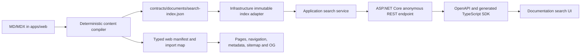

# Public Documentation System Design

**Iteration:** 8 — Public documentation system
**Status:** approved design
**Branch:** `codex/iteration-8-public-documentation`
**Date:** 2026-08-02

## 1. Goal

Migrate the public documentation surface from the immutable `template/`
reference into the target architecture:

- ASP.NET Core 10 owns `/api/**`, validation, the public search contract and
  search behavior;
- Next.js owns MD/MDX rendering, navigation, metadata, OG images and sitemap;
- browser search calls only the generated REST SDK;
- all 54 canonical documentation routes retain English and Russian variants;
- current product and developer content describes the ASP.NET Core + REST
  target rather than the legacy Prisma, Better Auth and Server Actions stack.

The iteration delivers a complete, independently verifiable vertical slice. It
does not start the application-shell, Aspire or production-container
iterations.

## 2. Sources and current constraints

The design was derived from:

- `AGENTS.md`;
- `docs/aspnetcore-migration-plan.md`;
- `docs/api-conventions.md`;
- `docs/web-conventions.md`;
- the current Application, Infrastructure, API, OpenAPI, generated-SDK, web,
  Jest and Playwright patterns outside `template/`;
- `template/src/features/documents-system/**`;
- `template/src/app/(public)/(documents-system)/**`;
- `template/src/app/api/v1/documents-system/search/route.ts`;
- `template/src/app/sitemap.ts`;
- `template/test/features/documents-system/**` and
  `template/test/app/sitemap.test.ts`;
- the installed Next.js 16.2.11 documentation under
  `apps/web/node_modules/next/dist/docs`, especially the MDX, metadata/OG,
  `generateMetadata` and `generateStaticParams` references;
- the current official Next.js documentation for
  [MDX](https://nextjs.org/docs/app/guides/mdx),
  [metadata and OG images](https://nextjs.org/docs/app/getting-started/metadata-and-og-images),
  [`generateStaticParams`](https://nextjs.org/docs/app/api-reference/functions/generate-static-params),
  and
  [programmatic OG images](https://nextjs.org/docs/app/api-reference/file-conventions/metadata/opengraph-image).

`template/` remains immutable. New content is copied and rewritten only under
`apps/web`; no reference file may be edited, formatted, moved or migrated.

## 3. Reference inventory

The reference contains 108 files: 54 canonical pages with `en` and `ru`
variants. One hundred files are Markdown and eight are MDX. Every current
variant is `published`, has `toc: true`, is not hidden, and supplies `author`,
`version` and `editedAt` metadata.

Canonical route groups are:

- `account`: four pages;
- `api`: four pages;
- `application`: six pages;
- `developers`: seven pages;
- `general/authoring`: three pages;
- `general/glossary` and `general/quick-start`: two pages;
- `history/change-logs`: seven pages;
- `history/releases`: twelve pages;
- the documentation root;
- `workspace`: eight pages.

There are no Prisma models, EF entities, migrations or persistent document
records. The reference reads repository-controlled files, builds an in-process
registry, validates links, compiles MDX and creates an in-process search index.

## 4. Scope and dependencies

### In scope

- deterministic Markdown/MDX content compiler;
- strict frontmatter, locale, publication, link, anchor, image and MDX
  validation;
- generated web content manifest/import map;
- generated neutral search-index contract artifact;
- Application search models and deterministic ranking;
- Infrastructure adapter for the immutable generated index;
- anonymous ASP.NET Core search endpoint;
- OpenAPI and generated TypeScript SDK update;
- public Next.js documentation route group, shell and page rendering;
- locale-aware navigation, search, metadata, sitemap and OG presentation;
- all 108 localized content variants rewritten for the target architecture;
- unit, integration, contract, component and browser acceptance coverage;
- durable authoring/API/web/migration documentation.

### Dependencies already present

- iteration 2 web foundation, fixed deployment locale and REST SDK pipeline;
- iteration 1 API conventions and OpenAPI export;
- the current API module and Application/Infrastructure dependency patterns.

Iterations 3–7 provide product behavior that the updated documentation may
describe, but the documentation runtime does not depend on their databases or
authenticated APIs.

## 5. Considered architectures

### A. Deterministic compiler plus neutral generated artifact — selected

MD/MDX under `apps/web` is the only authoring source. A deterministic compiler
validates it and produces:

1. a typed Next.js registry and exact module import map; and
2. a neutral JSON search index under `contracts/documents/`.

The JSON artifact is embedded into the .NET Infrastructure assembly and loaded
through an Application port. The API never reads the frontend filesystem at
runtime. Drift checks make both outputs reproducible.

This preserves ownership boundaries, works with the future standalone web/API
container, and leaves a narrow adapter seam for a later external index without
adding one now.

### B. API reads `apps/web` content at runtime — rejected

This initially removes a generated artifact, but couples the published API to
frontend source paths, requires source files beside the API process, and breaks
the planned production publish topology.

### C. Browser searches a static JSON file — rejected

This is operationally simple but removes the reference
`/api/v1/documents-system/search` contract and violates the decision that
ASP.NET Core owns `/api/**`.

## 6. Architecture



### Layer responsibilities

- **Domain:** unchanged. Documentation search has no durable domain entity or
  invariant that justifies a Domain dependency.
- **Application:** closed search models, normalization, query variants,
  ranking, result limits and an immutable-index port.
- **Infrastructure:** parses and validates the embedded generated JSON once,
  exposes the immutable index through the Application port and fails closed on
  malformed artifacts.
- **Api:** query validation, anonymous authorization metadata, response/error
  mapping, cache headers, observability and OpenAPI.
- **Web:** content authoring/compiler, static registry, page composition,
  generated-SDK search adapter and presentation metadata.

No reverse dependency is introduced. Application does not reference
Infrastructure or HTTP; Infrastructure does not reference Api; the API process
does not traverse `apps/web` at runtime.

## 7. Reference correspondence

| Reference | New API | New UI | Test/evidence |
| --- | --- | --- | --- |
| `docs/page.tsx`, `docs/[...slug]/page.tsx` | none | public `/docs` and `/docs/{**slug}` | registry/page Jest and Playwright |
| `documents-system-actions.ts` registry | immutable index port only | deterministic content manifest | compiler and drift tests |
| `documents-system-search-tools.ts` | Application search service | generated-SDK search dialog | Application, API, Jest and E2E |
| `/api/v1/documents-system/search` Route Handler | anonymous ASP.NET Core endpoint at the same path | browser adapter using generated operation | WebApplicationFactory, OpenAPI and E2E |
| `documents-system-sidebar.tsx` | none | localized responsive sidebar | component and browser tests |
| page metadata/TOC/prev-next components | none | localized article composition | component and browser tests |
| `/docs/og/{**slug}` | none | presentation-only Next Route Handler at the same path | route/build/browser tests |
| `docs/opengraph-image.tsx`, Twitter alias | none | Next metadata file conventions | metadata and build tests |
| `app/sitemap.ts` | none | published canonical docs entries | sitemap test |
| 108 localized source files | search index projection | 54 canonical routes, two locales | content and browser acceptance |

## 8. Content source and compiler contract

The target authoring source lives under:

```text
apps/web/src/features/documents/content/**/*.{en,ru}.{md,mdx}
```

The compiler uses repository-relative paths, stable locale/order comparisons,
stable JSON formatting and no current timestamp or filesystem-mtime fallback.
Existing explicit `editedAt` values remain authoritative. A second generation
must be byte-identical.

Every source name ends in an explicit supported `.en` or `.ru` locale suffix
before `.md` or `.mdx`; the compiler has no implicit-English fallback.

The compiler emits:

- a typed web registry containing metadata, canonical URL, slug, locale,
  publication data, navigation order, headings and exact import identifiers;
- an exact generated module map so every MD/MDX import is statically visible to
  Next.js;
- `contracts/documents/search-index.json`, keyed by supported locale and
  containing only safe public page/heading search fields plus stable order and
  normalized search text.

Generated files are never manually edited. `npm run content:generate` updates
them; `npm run content:check` regenerates in memory or a temporary directory
and byte-compares the complete output.

## 9. Metadata and publication rules

Required frontmatter fields are:

- non-empty `title`, `description`, `group` and `parentItem`;
- finite `order`;
- `status` in `draft|review|published|archived`;
- boolean `toc`;
- non-empty `author`, `version` and ISO date-only `editedAt` for the migrated
  production corpus.

Supported optional fields are `groupOrder`, `parentItemOrder`, `purpose`,
`hide`, `reading` and `source`. Unknown fields, invalid values or duplicate
canonical URL/locale variants are build errors rather than warnings.

Production-visible variants are `published` or `archived` with `hide != true`.
Every production-visible canonical URL must have both `en` and `ru` variants.
Draft/review content may temporarily lack one variant for local authoring; the
local UI may use the same stable fallback marker as the reference. Missing
production translations fail validation.

Navigation order remains:

1. group order descending, then group label;
2. parent order descending, then parent label;
3. document order descending, then title.

Previous/next navigation and empty-query search use that same order.

## 10. Link, anchor, MDX and asset validation

The compiler:

- validates canonical absolute `/docs/**` inline links, reference definitions
  and MDX `href` values;
- normalizes query/hash/trailing slash and treats `/docs/index` as `/docs`;
- ignores external HTTP(S) and non-document links; resolves hash-only links
  against the current localized document;
- ignores links and headings inside backtick or tilde fenced code blocks;
- distinguishes unpublished from broken targets;
- requires a production-visible source to link only to a production-visible
  matching-locale target;
- validates internal fragments against generated heading identifiers;
- extracts top-level and allowed-container headings in source order, excludes
  generated footnote-reference numbers and images from heading text, and
  creates stable duplicate anchors with `-2`, `-3`, and so on;
- rejects `h2`/`h3` inside GFM footnote definitions because rendering relocates
  referenced definitions and omits unreferenced definitions;
- resolves duplicate Markdown reference labels with renderer-equivalent
  first-definition-wins semantics;
- permits only explicit HTTP(S) images or repository-local `/img/**` paths that
  remain below `apps/web/public/img`, and rejects `srcSet` candidates;
- permits only the closed MDX component set implemented by this slice and
  an explicit safe intrinsic-element set; rejects executable elements, module
  syntax, flow/text expressions, JSX spread attributes and expression-valued
  JSX attributes, and reserves author-supplied `data-footnote-ref` for the GFM
  renderer;
- fails production builds for broken links, missing fragments, missing images,
  unsafe/unknown MDX components or generated drift.

The two branding assets actually referenced by the corpus are copied to
`apps/web/public/img/branding/` outside `template/`.

## 11. Content migration policy

Routes, section structure, metadata intent and locales remain recognizable, but
the prose is not copied as misleading current guidance.

- Product and account/workspace/API pages describe the already migrated target
  REST behavior and generated client.
- Developer pages describe `Domain → Application → Infrastructure → Api`,
  ASP.NET Core ownership, test-first work, OpenAPI generation and the
  Server-Component presentation boundary.
- Prescriptive Prisma, Better Auth and Server Actions guidance is removed from
  current pages.
- Historical release and changelog pages retain factual chronology, explicitly
  label the old full-stack Next.js implementation as legacy, and add enough
  migration context that readers cannot mistake it for the current runtime.
- English and Russian variants convey the same behavior; they are reviewed as
  pairs.

The content validator verifies structure and links, while focused content tests
and review verify that current-architecture pages do not reintroduce legacy
runtime instructions.

## 12. REST contract

### Operation

```http
GET /api/v1/documents-system/search?q={query}&locale={en|ru}
```

The operation is explicitly `AllowAnonymous`. It requires no browser session,
API key or CSRF token. An incidental credential does not change the result.

### Query validation

- `q` is optional, trimmed and limited to 120 UTF-16 code units;
- empty or whitespace-only `q` is valid;
- `locale` is optional and is the closed enum `en|ru`;
- missing locale uses the safely validated `Documents:DefaultLocale` API
  configuration value (`en` when absent or invalid);
- the web client always sends its resolved deployment locale explicitly;
- overlong `q` and unsupported explicit locale return
  `400 validation_failed`.

The default is deterministic and does not inspect a browser cookie. Deployment
sets `Documents__DefaultLocale` and `PUBLIC_DEFAULT_LOCALE` to the same
supported value; the browser still sends its resolved locale explicitly.

### Success response

Success follows the target envelope:

```json
{
  "data": {
    "pages": [
      {
        "type": "page",
        "title": "API v1 reference",
        "description": "...",
        "href": "/docs/api/api-v1",
        "group": "API",
        "parentItem": "Reference"
      }
    ],
    "headings": [
      {
        "type": "heading",
        "title": "Authentication",
        "href": "/docs/api/api-v1#authentication",
        "pageTitle": "API v1 reference",
        "group": "API",
        "parentItem": "Reference"
      }
    ]
  }
}
```

All arrays and fields are non-null and required in OpenAPI.

### Result bounds and pagination

- empty query: first 32 pages, no headings;
- non-empty query: at most 8 pages and 8 headings;
- there is no cursor, page number or caller-controlled result limit;
- there are no independent filters.

The fixed small response is already bounded, so adding pagination would not
serve a reference scenario and is intentionally omitted.

## 13. Search semantics

Search reproduces the reference behavior:

- invariant lowercase;
- `ё` is normalized to `е`;
- non-letter/non-number punctuation becomes whitespace;
- whitespace is collapsed and tokenized;
- a query written wholly on the wrong English/Russian keyboard layout produces
  one corrected variant;
- mixed-layout words are not guessed;
- title exact match scores 100;
- title prefix scores 90;
- title contains scores 80;
- full normalized metadata text contains scores 60;
- an all-token fuzzy match scores 40;
- allowed Damerau–Levenshtein distance is 0 for tokens of length 3 or less, 1
  for length 4–7, and 2 for length 8 or more;
- ties preserve generated navigation order.

Page search text contains title, description, group, parent and canonical URL.
Heading search text contains the `h2`/`h3` title plus the owning page metadata.
Document body paragraphs and fenced code are not indexed.

## 14. Errors, caching and observability

- search success returns `Cache-Control: no-store`, preserving reference cache
  behavior and current simple loader conventions;
- validation failures return target RFC Problem Details with stable
  `validation_failed` and field errors;
- unexpected index/search failures return safe `500 application/problem+json`;
- Problem Details and logs never include source body, query-derived exception
  text, filesystem paths or generated artifact contents;
- logs use the existing correlation scope and a bounded operation/outcome;
- successful anonymous searches are not audited as security events;
- no endpoint-specific rate limiter is added in this iteration.

The reference silently truncated long queries, defaulted unsupported locales and
returned an empty custom payload on a search failure. The target intentionally
uses strict boundary validation and standard Problem Details. Normal browser
input is length-limited and uses the supported locale, so the visible journey
remains compatible.

## 15. Persistence, schema and transactions

There is no database or Identity dependency, EF entity, migration, seed,
transaction, cache invalidation event, audit table, background job or data
migration. The generated index is immutable for the life of a deployed process
and changes only with a new application build.

Infrastructure loads and validates the embedded index exactly once. A malformed
or missing artifact prevents a successful search and is caught by build/tests;
the HTTP boundary still maps an unexpected runtime failure safely.

## 16. Next.js rendering and routes

Documentation uses a dedicated public route group rather than the protected
`(site)` layout. It never loads the session, account navigation or organization
switcher.

- `/docs` renders the canonical `index` document;
- `/docs/index` permanently redirects with HTTP `308` to `/docs`, and page plus
  metadata resolution retain the same canonical guard;
- `/docs/{**slug}` renders a generated published document;
- `generateStaticParams()` returns every production-visible canonical slug;
- `cacheComponents: true` remains enabled; Next.js 16.2.11 does not permit the
  former `dynamicParams = false` route export in that mode;
- metadata and page rendering perform an exact generated-registry lookup and
  call `notFound()` for every unknown/unpublished slug;
- because Cache Components can commit the streaming shell before that lookup
  completes, an unknown page has the framework's not-found UI and `noindex`
  marker but an observed initial HTTP `200`; this known partial-prerendering
  transport difference is covered by E2E and is not described as a 404;
- URLs never contain `.en`, `.ru` or a locale prefix;
- the fixed deployment locale selects the matching generated variant;
- page rendering, navigation and metadata require no live API.

`@next/mdx`, `@mdx-js/loader`, `@mdx-js/react`, `@types/mdx`,
`remark-frontmatter` and `remark-gfm` are exact-pinned. A root
`mdx-components.tsx` is provided as required by the installed Next.js 16.2.11
documentation. The generated exact module map keeps dynamic document imports
visible to the bundler.

## 17. Documentation UI

The slice implements the reference-visible documentation composition without
pulling in the final application shell:

- responsive collapsible sidebar with active-parent behavior and mobile close;
- documentation header, breadcrumb, home link, theme switcher and search;
- article title, description, metadata, top/bottom previous-next navigation;
- `h2` table of contents and scroll spy scoped to the docs scroll container;
- safe handling of malformed URL fragments;
- heading URL copy and code copy controls;
- localized status, visibility and local fallback-language markers;
- GFM tables, task lists and footnotes;
- `Callout`, `Steps`/`Step`, `Files`/`Folder`/`File`, `Tabs`/`Tab`, and
  `DocumentLinkGrid`/`Group`/`Card` MDX components;
- responsive local and remote images with accessible alternate text.

The global application-shell documentation shortcut remains iteration 9 work.
The docs header itself provides the required navigation in this slice.

## 18. Browser search data flow

1. The user opens search by button or `Ctrl/⌘+K`.
2. The client resolves the fixed `next-intl` locale.
3. Input is limited to the contract maximum and debounced by 250 ms.
4. A browser adapter calls the generated search operation with explicit locale
   and same-origin credentials behavior.
5. Opening a newer request aborts the older one; a stale completion cannot
   overwrite newer state.
6. Safe typed data populates page and heading groups.
7. Selecting a result navigates to its canonical page or heading URL.

The component exposes localized idle, loading, empty and unavailable states. It
does not use raw `fetch`, redefine transport DTOs, render arbitrary Problem
Details text, retain credentials, or use browser storage.

## 19. Metadata, OG and sitemap

- page `generateMetadata` reads title/description from the generated registry;
- nested document metadata references `/docs/og/{**slug}?locale=...`;
- the exact reference OG path is preserved by one presentation-only Next Route
  Handler;
- that handler is the only explicit boundary-checker exception and is not
  under `/api/**`;
- `/docs/opengraph-image` and Twitter image use Next metadata file conventions;
- valid images return PNG with the established 1200×630 dimensions;
- unknown/unpublished document images return 404;
- `sitemap.ts` includes only production-visible canonical document URLs,
  de-duplicates `/docs`, uses `editedAt`, weekly frequency, priority 0.8 for the
  root and 0.6 for articles.

The boundary guard continues to forbid every Next handler below `/api/**` and
does not turn the OG exception into a general BFF permission.

## 20. OpenAPI and generated client

The canonical OpenAPI 3.1 contract documents:

- the exact path and GET verb;
- no security requirement;
- optional bounded `q` and optional closed `locale`;
- the required success envelope and non-null result fields;
- typed `400`, `406` and `500` Problem Details;
- no cursor, API-key or cookie scheme on the operation.

The contract is exported deterministically to `contracts/openapi/v1.json`.
`apps/web` regenerates the TypeScript SDK and uses the generated operation and
types. Boundary checks assert that the operation exists, application code has
no handwritten search DTO, and no raw search `fetch` or Next `/api` handler was
introduced.

## 21. Test-first strategy

Every production behavior begins with an observed failing focused test.

### Content compiler tests

- required/unknown metadata and date/status validation;
- canonical slug and locale parsing;
- duplicate locale/slug rejection;
- production visibility and required published locale pair;
- ordering and previous/next projections;
- broken/unpublished links, fragments, images and fenced-code exclusions;
- heading uniqueness and MDX component allow-list;
- 54 routes, 108 variants and complete MDX compilation;
- deterministic manifest/search artifact drift.

### Application tests

- normalization and tokenization;
- keyboard-layout correction and mixed-layout rejection;
- exact/prefix/contains/fuzzy scoring;
- Damerau–Levenshtein thresholds;
- page/heading index projections and fenced-code exclusion;
- empty 32-page and typed 8-page/8-heading bounds;
- stable tie ordering.

### API integration and contract tests

- anonymous access without cookie or API key;
- incidental credentials do not alter the public result;
- empty, typed, English, Russian, keyboard-layout and fuzzy requests;
- invalid locale and overlong query validation;
- envelope shape, required fields and no-store;
- injected index failure produces safe Problem Details;
- exact OpenAPI security/query/response semantics;
- deterministic OpenAPI and generated-SDK drift.

### Web Jest tests

- registry, locale, static params and 404 lookup;
- sidebar transitions/mobile close;
- metadata dates/status/fallback marker;
- TOC, unique headings, scroll spy and malformed fragment safety;
- MDX components and copy controls;
- generated-SDK adapter and safe normalization;
- search debounce, abort, stale completion, empty/error states and navigation;
- OG and sitemap projections;
- source/dependency/boundary guards.

### Playwright acceptance

- anonymous `/docs` and a nested canonical page;
- fixed-locale content with no locale URL suffix;
- sidebar, previous/next and TOC navigation;
- `Ctrl/⌘+K` search and page/heading result navigation;
- unknown document not-found UI plus `noindex` on the observed streamed HTTP
  `200` response;
- valid document OG PNG and unknown OG 404;
- no authentication requirement or protected-layout dependency.

## 22. Verification gates

Required .NET gates:

```bash
dotnet restore Template.sln
dotnet build Template.sln --no-restore
dotnet test Template.sln --no-restore
dotnet format Template.sln --no-restore --verify-no-changes
```

Also run:

- focused RED/GREEN commands throughout implementation;
- deterministic double content generation and `npm run content:check`;
- deterministic OpenAPI export and `npm run api:check`;
- web boundary, Prettier, ESLint, typecheck and full Jest checks;
- clean Next.js standalone production build and standalone artifact check;
- production npm audit and documented development-tool audit state;
- focused and full Playwright Chromium suites;
- `git diff --check`;
- working-tree and branch-range guards proving no `template/` change;
- guard proving no active OpenSpec change/spec;
- final ready-PR review loop until the exact current head has no unresolved
  actionable automatic-review comments.

## 23. Subagent implementation boundaries

After the design and implementation plan are approved, subagent-driven
development proceeds in dependency order:

1. compiler rules and generated content contracts;
2. Application/Infrastructure search;
3. API/OpenAPI/generated SDK;
4. documentation UI, MDX and metadata;
5. paired English/Russian content update;
6. E2E and complete acceptance evidence;
7. independent code/content review and fix pass.

Subagents work on bounded tasks with explicit file ownership. A controller
reviews every result, runs the required focused tests, and prevents overlapping
edits from being accepted without reconciliation.

## 24. Intentional differences from reference

- target `{ data }` success envelope replaces the raw search payload;
- target RFC Problem Details replaces the empty custom failure payload;
- invalid locale and overlong query return strict 400 instead of silent
  normalization/truncation;
- strict compiler errors replace skipped invalid documents;
- production-visible documents require both supported locales;
- current prose describes ASP.NET Core + REST rather than the legacy runtime;
- the API uses an embedded neutral generated artifact and never reads web
  source files at runtime;
- exact generated artifacts and drift checks replace runtime git/mtime
  enrichment.
- Next.js 16 Cache Components preserve exact unknown-page UI and `noindex`
  semantics but stream the initial shell with HTTP `200`; the presentation-only
  unknown OG response remains a true `404`.

These differences follow the established target conventions while preserving
the normal public routes, localized content, navigation, search ranking and
presentation journeys.

## 25. Out of scope

- CMS/editor, database-backed documents or content mutation APIs;
- user-selected locale or locale-prefixed routes;
- external search provider, Redis or background indexing;
- authenticated/personalized documentation;
- iteration 9 global application shell/dashboard parity;
- Aspire and local distributed orchestration;
- production reverse proxy, container and deployment topology;
- active OpenSpec artifacts;
- any next product domain.

## 26. Completion criteria

Iteration 8 is complete only when:

1. all 54 canonical routes render production-valid English and Russian content;
2. current content accurately describes the target architecture and historical
   content clearly labels legacy behavior;
3. the compiler deterministically validates and generates both web and search
   artifacts;
4. the anonymous ASP.NET search operation matches the specified ranking,
   bounds, errors, OpenAPI and no-store policy;
5. the web uses only the generated SDK for search and retains no forbidden
   server/data/auth dependency;
6. navigation, TOC, metadata, sitemap and OG behavior pass the listed tests;
7. all .NET, content, OpenAPI, generated-client, web, build, audit and browser
   gates pass;
8. `template/` is unchanged and OpenSpec remains inactive;
9. `docs/aspnetcore-migration-plan.md`, API/web conventions and focused
   authoring guidance record the implemented decisions and acceptance evidence;
10. the ready PR's exact current head has no unresolved actionable automatic
    review comments.
